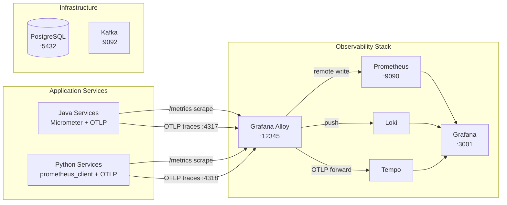

# MariaAlpha

Full-stack algorithmic trading engine — see [Technical Design Document](docs/technical-design-document.md) for architecture and details.

<p align="center">
  
</p>

> The walkthrough above is generated automatically from a [Playwright tour](ui/demo/README.md) of the live UI — regenerate it with `just demo`.

## Capabilities

MariaAlpha is a working, end-to-end algorithmic trading engine:

- **Live market data ingestion** — simulated CSV replay (default) or Alpaca IEX WebSocket, with auto-reconnect and per-symbol in-memory order book.
- **Six execution algorithms + RFQ pricing** — VWAP, TWAP, Momentum/trend-following, Implementation Shortfall, POV (Percentage of Volume), Close (Market-on-Close benchmark), and a two-way RFQ engine with inventory-skewed, vol- and ADV-relative pricing. Every signal is gated by an ML confirm/veto (LightGBM signal model + Random Forest regime classifier called over gRPC with a Resilience4j circuit breaker). Strategy hot-swap at runtime via REST, plus a programmatic [algo execution API](docs/strategies/algo-execution-api.md) (`POST /api/algo/orders` + `/ws/algo` progress WebSocket) for external clients.
- **Multi-market trading hours** — per-market session calendars (NYSE/NASDAQ, TSE with lunch break, holidays) gate strategy evaluation so closed-market ticks never pollute indicator state.
- **Options pricing** — Black-Scholes-Merton pricer with full Greeks (delta, gamma, vega, theta, rho) and an implied-volatility solver, exposed over REST and a dedicated UI page.
- **Ten pre-trade risk checks** — max notional, max position, max portfolio exposure, max open orders, daily loss limit, sector / beta / ADV-participation checks driven by per-symbol reference data, plus [intraday parametric VaR](docs/strategies/intraday-var.md) and [correlated-position cluster limits](docs/strategies/correlated-positions.md). Composable chain that short-circuits on first failure; daily-loss trip halts trading and is resumable via REST.
- **Smart Order Router** with scored multi-criteria venue selection across LIT, DARK, and INTERNAL venues, plus an in-process **internal crossing engine** that matches offsetting BUY/SELL interest at the NBBO midpoint.
- **Eight order types** — MARKET, LIMIT, STOP, IOC, FOK, GTC, Iceberg (with a dedicated coordinator that slices parents into LIMIT children), and [Pegged](docs/strategies/pegged-orders.md) (midpoint/primary/market peg that re-prices its working child as the NBBO moves).
- **Dual exchange routing** — simulated exchange (configurable fill latency + slippage) or Alpaca paper trading (REST + `trade_updates` WebSocket with reconnect), switchable via `EXECUTION_PROFILE`.
- **Program/basket trading** — submit a multi-leg [basket](docs/strategies/program-basket-trading.md) in one call (`POST /api/execution/baskets`); every leg is fanned out through the full risk → SOR → venue pipeline and tracked as one aggregate with per-leg status.
- **Inbound FIX gateway** — optional QuickFIX/J [FIX 4.4 acceptor](docs/strategies/fix-gateway.md) for programmatic order entry (`NewOrderSingle` / `OrderCancelRequest` → `ExecutionReport`), the protocol sibling of the REST order-entry path; disabled by default.
- **Real-time position and P&L tracking** — mark-to-market unrealized P&L, portfolio aggregates, [per-currency exposure](docs/strategies/currency-exposure.md), fill history persisted in PostgreSQL with a Redis hot-path cache for sub-millisecond pre-trade reads.
- **Transaction Cost Analysis + PnL attribution + flow toxicity + axe matching** — slippage, implementation shortfall, VWAP benchmark, spread cost per order; Kissell-Glantz five-component PnL decomposition; per-counterparty markout-based toxicity; client-interest axe matcher.
- **Trade allocation** — post-trade splitting of filled parents across sub-accounts (pro-rata with remainder handling, or FIFO waterfall), persisted as the per-account book of record.
- **End-of-day reconciliation** — scheduled comparison of internal fills against the external venue's activity log, with four break categories (MISSING / EXTRA / QUANTITY / PRICE) published to `analytics.risk-alerts`.
- **React UI** — Dashboard, Order Entry, RFQ, Options, Strategy Control, Analytics, Reconciliation, Allocations, all driven by live WebSocket streams. Served via nginx in Docker Compose; via an init-container config-render under Helm.
- **Full observability** — Grafana LGTM stack (Alloy, Prometheus, Loki, Tempo, Grafana 11) with three provisioned dashboards: Trading Pipeline, Portfolio & Risk, Post-Trade & Quality.
- **Production-grade CI** — Spotless / Checkstyle / SpotBugs / ESLint / Prettier / ruff / mypy, JUnit unit + Testcontainers integration tests + Docker-Compose-driven end-to-end suite, mutation testing (PITest + mutmut), CodeQL and Snyk security scans, multi-arch Docker image publish, Helm lint + kubeconform.
- **Two deployment targets** — Docker Compose for local development, an umbrella Helm chart for Kubernetes (validated against OrbStack, Docker Desktop, minikube, kind).
- **Importable API collection** — [`api-collection/`](api-collection/) is a Bruno collection covering the gateway-routed REST surface (health, strategies, RFQ, options, orders, positions, portfolio, execution, pegged, routing, TCA, recon, allocations, analytics) plus direct-to-service health/admin calls.

The end-to-end acceptance suite under `e2e-tests/` boots the full Docker Compose stack and traverses the complete Tick-to-Trade pipeline on every CI run.

See [§11 of the Technical Design Document](docs/technical-design-document.md#11-roadmap) for the roadmap of additional capabilities not yet built (backtesting, multi-broker integration via IBKR, Tokyo Stock Exchange microstructure, OAuth/RBAC, ML-driven SOR, and others).

## Prerequisites

- [just](https://github.com/casey/just) — command runner used for all project tasks

  ```
  brew install just   # macOS
  ```

- [Docker](https://www.docker.com/products/docker-desktop/) — required for infrastructure services

## Quickstart

A clean-checkout walkthrough. Tested on macOS 14 (Apple Silicon) and Ubuntu 22.04
with Docker Desktop ≥ 25.0 and 8 GB RAM allocated.

### 1. Clone and configure

```bash
git clone https://github.com/drag0sd0g/MariaAlpha.git
cd MariaAlpha
cp .env.example .env
# .env defaults are fine for local dev. For docker-compose, changing
# MARIAALPHA_API_KEY requires rebuilding the UI image
# (`docker compose build ui && docker compose up -d ui`) because Vite bakes the
# value into the bundle at build time. The Helm chart avoids this — the UI's
# init container renders the key into /config.js at pod start, so secret
# rotation is a `helm upgrade` + pod restart with no image rebuild.
```

### 2. Build everything

```bash
just build
```

This compiles every Java module, builds the React UI bundle, runs static checks
(Spotless, Checkstyle, SpotBugs, ESLint, Prettier, ruff, mypy), and runs every unit
and Testcontainers integration test except `e2e`. Expected runtime: ~5 minutes on a
warm Gradle cache.

### 3. Bring up the stack

```bash
just run
```

Runs `docker compose up -d` and starts 15 long-running containers plus a
one-shot `kafka-init` container that creates topics and exits. First-time runs
build all service images (~3 minutes); subsequent runs reuse the cache. Wait
~90 seconds after `just run` returns for every service to become healthy.

### 4. Verify

```bash
just verify
```

Expected output:
```
Polling /actuator/health on every service...
  ✓ market-data-gateway
  ✓ strategy-engine
  ✓ execution-engine
  ✓ order-manager
  ✓ post-trade
  ✓ api-gateway
  ✓ ml-signal-service
  ✓ analytics-service
  ✓ ui
  ✓ grafana
```

### 5. Open the UI

| URL | What |
|---|---|
| <http://localhost:5173/> | MariaAlpha UI — Dashboard + Order Entry |
| <http://localhost:3001/> | Grafana (anonymous admin, no login) |
| <http://localhost:9090/> | Prometheus |
| <http://localhost:8080/actuator/health> | API Gateway aggregate health |

## Kubernetes Quickstart (Helm on OrbStack)

An alternative to docker-compose: deploy the same stack (minus the analytics-service, which has no subchart yet) to a local Kubernetes cluster via the umbrella Helm chart in [`charts/mariaalpha/`](charts/mariaalpha/README.md).

```bash
brew install helm                            # one-time
orb start k8s                                # OrbStack ships a single-node cluster
just k8s-up                                  # build images, helm dep update, helm install (≈3 min cold)
just k8s-test                                # helm test: actuator-health + iceberg-parent → FILLED
open http://mariaalpha.orb.local             # UI
open http://grafana.mariaalpha.orb.local     # Grafana dashboards
just k8s-down                                # uninstall + drop PVCs (dev-cluster only)
```

Detailed install/upgrade/rollback recipes live in [`docs/runbooks/helm-install.md`](docs/runbooks/helm-install.md). Secret rotation is documented in [`docs/runbooks/helm-rotate-secrets.md`](docs/runbooks/helm-rotate-secrets.md).

### 6. Try the API

Every API call requires the `X-API-Key` header. The default key is `local-dev-key`.

```bash
# List all available strategies.
curl -fsS -H "X-API-Key: local-dev-key" \
    http://localhost:8080/api/strategies

# Bind VWAP to AAPL.
curl -X PUT -H "X-API-Key: local-dev-key" \
    -H "Content-Type: application/json" \
    -d '{"strategyName":"VWAP"}' \
    http://localhost:8080/api/strategies/AAPL

# Configure VWAP — 100 shares spread evenly between 14:30 and 16:00 NY time.
curl -X PUT -H "X-API-Key: local-dev-key" \
    -H "Content-Type: application/json" \
    -d '{
          "targetQuantity": 100,
          "side": "BUY",
          "startTime": "14:30:00",
          "endTime": "16:00:00",
          "volumeProfile": [
            {"startTime":"14:30:00","endTime":"16:00:00","volumeFraction":1.0}
          ]
        }' \
    http://localhost:8080/api/strategies/VWAP/parameters

# Alternatively, bind & configure TWAP — 100 shares in 6 equal slices between 14:30 and 16:00 NY time.
curl -X PUT -H "X-API-Key: local-dev-key" \
    -H "Content-Type: application/json" \
    -d '{"strategyName":"TWAP"}' \
    http://localhost:8080/api/strategies/AAPL

curl -X PUT -H "X-API-Key: local-dev-key" \
    -H "Content-Type: application/json" \
    -d '{
          "targetQuantity": 100,
          "side": "BUY",
          "startTime": "14:30:00",
          "endTime": "16:00:00",
          "numSlices": 6
        }' \
    http://localhost:8080/api/strategies/TWAP/parameters

# Or bind & configure Momentum/trend-following — long-only 20/50 EMA crossover on GOOGL,
# 100-share clips, RSI + volume confirmation, 2% stop-loss.
curl -X PUT -H "X-API-Key: local-dev-key" \
    -H "Content-Type: application/json" \
    -d '{"strategyName":"MOMENTUM"}' \
    http://localhost:8080/api/strategies/GOOGL

curl -X PUT -H "X-API-Key: local-dev-key" \
    -H "Content-Type: application/json" \
    -d '{
          "fastPeriod": 20,
          "slowPeriod": 50,
          "rsiPeriod": 14,
          "rsiOverbought": 70,
          "rsiOversold": 30,
          "volumeMultiplier": 1.5,
          "tradeQuantity": 100,
          "side": "BUY",
          "stopLossPct": 2.0
        }' \
    http://localhost:8080/api/strategies/MOMENTUM/parameters

# Or bind & configure Implementation Shortfall — front-loaded execution of 100 shares in 6 slices
# between 14:30 and 16:00 NY time, urgency 0.5 (urgency 0 == TWAP; higher == more front-loaded).
curl -X PUT -H "X-API-Key: local-dev-key" \
    -H "Content-Type: application/json" \
    -d '{"strategyName":"IS"}' \
    http://localhost:8080/api/strategies/AAPL

curl -X PUT -H "X-API-Key: local-dev-key" \
    -H "Content-Type: application/json" \
    -d '{
          "targetQuantity": 100,
          "side": "BUY",
          "startTime": "14:30:00",
          "endTime": "16:00:00",
          "numSlices": 6,
          "urgency": 0.5
        }' \
    http://localhost:8080/api/strategies/IS/parameters

# Or bind & configure POV (Percentage of Volume) — participate at 10% of TSLA's traded tape,
# 50,000-share parent over the full session, defer clips below 200 shares, cap each at 5,000.
curl -X PUT -H "X-API-Key: local-dev-key" \
    -H "Content-Type: application/json" \
    -d '{"strategyName":"POV"}' \
    http://localhost:8080/api/strategies/TSLA

curl -X PUT -H "X-API-Key: local-dev-key" \
    -H "Content-Type: application/json" \
    -d '{
          "targetQuantity": 50000,
          "side": "BUY",
          "startTime": "09:30:00",
          "endTime": "16:00:00",
          "participationRate": 0.10,
          "minClipSize": 200,
          "maxClipSize": 5000
        }' \
    http://localhost:8080/api/strategies/POV/parameters

# Or bind & configure Close (Market-on-Close benchmark) — work 30 % of a 10,000-share parent
# across 6 LIMIT slices in the last 25 minutes; fire the remaining 7,000 as a MARKET MOC at
# the 5-min-before-close cutoff (15:55 ET).
curl -X PUT -H "X-API-Key: local-dev-key" \
    -H "Content-Type: application/json" \
    -d '{"strategyName":"CLOSE"}' \
    http://localhost:8080/api/strategies/NVDA

curl -X PUT -H "X-API-Key: local-dev-key" \
    -H "Content-Type: application/json" \
    -d '{
          "targetQuantity": 10000,
          "side": "BUY",
          "windowStart": "15:30:00",
          "closeTime": "16:00:00",
          "mocOffsetMinutes": 5,
          "preCloseFraction": 0.30,
          "numPreCloseSlices": 6
        }' \
    http://localhost:8080/api/strategies/CLOSE/parameters

# Or skip the bind+configure two-step entirely: the algo execution API creates and
# starts a parent algo order in one POST, returning a UUID you can poll, cancel,
# and follow over the /ws/algo WebSocket. See docs/strategies/algo-execution-api.md.
curl -X POST -H "X-API-Key: local-dev-key" \
    -H "Content-Type: application/json" \
    -d '{
          "symbol": "MSFT",
          "side": "BUY",
          "targetQuantity": 50,
          "strategyName": "TWAP",
          "parameters": {
            "targetQuantity": 50,
            "side": "BUY",
            "startTime": "14:30:00",
            "endTime": "16:00:00",
            "numSlices": 6
          }
        }' \
    http://localhost:8080/api/algo/orders

# Place a manual LIMIT order.
curl -X POST -H "X-API-Key: local-dev-key" \
    -H "Content-Type: application/json" \
    -d '{"symbol":"AAPL","side":"BUY","orderType":"LIMIT","quantity":10,"limitPrice":180.00}' \
    http://localhost:8080/api/execution/orders

# Read positions, portfolio summary, and per-currency exposure.
curl -fsS -H "X-API-Key: local-dev-key" http://localhost:8080/api/positions
curl -fsS -H "X-API-Key: local-dev-key" http://localhost:8080/api/portfolio/summary
curl -fsS -H "X-API-Key: local-dev-key" http://localhost:8080/api/portfolio/currency-exposure
```

### 7. Tear down

```bash
just stop
```

To wipe all state (Postgres, Kafka logs, Grafana dashboards):
```bash
docker compose down -v
```

### Troubleshooting

| Symptom | Likely cause | Fix |
|---|---|---|
| `MARIAALPHA_API_KEY must be set` on `just run` | `.env` not copied | `cp .env.example .env` |
| `port 5432 already in use` | local Postgres already running | stop it or change `POSTGRES_PORT_HOST` in `.env` |
| `ui` container restarting | stale build args (e.g. API key changed) | `docker compose build --no-cache ui` |
| UI loads but API calls return 401 | UI bundle built with a different key than the gateway expects | rebuild: `docker compose build ui && just run` |
| `tradingHalted: true` immediately | daily-loss limit tripped from a prior run | `curl -X POST -H "X-API-Key: $KEY" http://localhost:8080/api/execution/resume` |
| No data on UI dashboard | strategy-engine has no symbols routed yet | `PUT /api/strategies/AAPL` (see step 6) |

## Infrastructure Services

| Service | Port | Notes |
| --- | --- | --- |
| PostgreSQL 16 | 5432 | Credentials via `.env` |
| Kafka (KRaft) | 9092 | Single-node, no ZooKeeper |
| Redis 7 | 6379 | Distributed position cache; `allkeys-lru` eviction |
| Prometheus | 9090 | Metrics storage, remote-write enabled |
| Grafana | 3001 | Dashboards — anonymous admin access |
| Alloy | 12345 | Telemetry collector UI; OTLP on 4317/4318 |
| UI (nginx) | 5173 | Static SPA + reverse-proxy to api-gateway |

Loki (logs) and Tempo (traces) run within the Docker network, reachable by Alloy and Grafana.

### API Gateway (port 8080)

Single front door for the React UI and external clients. Implements:
- REST routing to all backend services (`/api/...`).
- API key authentication via `X-API-Key` header (or `?apiKey=` query parameter for browser WebSocket clients).
- Real-time WebSocket fan-out from Kafka to UI clients.

#### Configuration

| Env var | Required | Description |
|---|---|---|
| `MARIAALPHA_API_KEY` | yes | Shared secret. Without it the gateway rejects every request with HTTP 401. |
| `KAFKA_BOOTSTRAP_SERVERS` | yes | Kafka cluster (default `localhost:9092`). |
| `STRATEGY_ENGINE_URL` | optional | Default `http://localhost:8082`. |
| `ORDER_MANAGER_URL` | optional | Default `http://localhost:8086`. |
| `EXECUTION_ENGINE_URL` | optional | Default `http://localhost:8084`. |
| `POST_TRADE_URL` | optional | Default `http://localhost:8088`. |
| `ANALYTICS_SERVICE_URL` | optional | Default `http://localhost:8095`. |
| `MARKET_DATA_GATEWAY_URL` | optional | Default `http://localhost:8079`. |

#### Quickstart

```bash
export MARIAALPHA_API_KEY=local-dev-key
just run
./gradlew :api-gateway:bootRun
```

### React UI (port 5173 in dev)

The web UI is a Vite + React 18 + TypeScript single-page app with nine pages: Dashboard (live positions, P&L, exposure), Order Entry (manual order submission, active orders, fills), RFQ, Options (Black-Scholes pricing + Greeks), Strategy Control, Analytics, Reconciliation, Allocations, and a Market Data placeholder reserved for a future page.

#### Quickstart

```bash
just run                    # bring up infra + backend services
cp ui/.env.example ui/.env.local
echo "VITE_MARIAALPHA_API_KEY=local-dev-key" >> ui/.env.local
just ui-install             # one-time: npm install
just ui-dev                 # opens http://localhost:5173
```

The dev server proxies `/api/*` and `/ws/*` to `http://localhost:8080` (the API Gateway), so no CORS configuration is needed.

#### Configuration

| Env var (in `ui/.env.local`) | Required | Description |
|---|---|---|
| `VITE_MARIAALPHA_API_KEY` | yes | Must match the key in repo-root `.env`. |
| `VITE_API_BASE_URL` | no | Leave blank for dev (uses Vite proxy). Set to `http://localhost:8080` only when running `vite preview` against a built bundle. |

#### Production-ish build

```bash
just ui-build               # static assets in ui/dist/
cd ui && npm run preview    # serves dist/ on http://localhost:4173
```

For docker-compose deployments the UI runs as an nginx container exposed on port 5173 (see [docker-compose.yml](docker-compose.yml)). The image is built from [ui/Dockerfile](ui/Dockerfile).

#### Manual order API surface

Manual orders submitted via the Order Entry page hit **`POST /api/execution/orders`** (not `/api/orders`). The distinction matters for external clients:

| Method | Path | Backend | Notes |
|---|---|---|---|
| `POST` | `/api/execution/orders` | execution-engine | Submit a manual order; returns `{orderId, status, acceptedAt}` |
| `DELETE` | `/api/execution/orders/{orderId}` | execution-engine | Cancel a manual order; 204 on success, 404 if unknown/terminal |

## Database

Liquibase migrations run automatically on Spring Boot service startup. Verify schema:

```bash
docker compose exec postgres psql -U mariaalpha -c '\dt'
```

## Observability

The Grafana LGTM stack (Loki, Grafana, Tempo, Mimir/Prometheus) starts with `just run`. Grafana is pre-configured with all datasources and available at [http://localhost:3001](http://localhost:3001).



Alloy is the unified telemetry collector — it scrapes Prometheus-format metrics endpoints and forwards them to Prometheus via remote write, receives OTLP traces (gRPC `:4317`, HTTP `:4318`) and forwards to Tempo, and pushes logs to Loki. Grafana queries all three backends and supports cross-linking between traces, logs, and metrics.

## CI/CD

GitHub Actions workflows run on every push and PR to `main`:

| Workflow | File | What it checks |
| --- | --- | --- |
| **CI** | `ci.yml` | Java: Spotless, Checkstyle, SpotBugs, tests + JaCoCo. Python: ruff, mypy, pytest. UI: ESLint, Prettier, tsc. Plus Helm lint + kubeconform and the Docker Compose e2e suite. |
| **CodeQL** | `codeql.yml` | Security analysis for Java, Python, TypeScript (also runs weekly). |
| **Snyk** | `snyk.yml` | Dependency vulnerability scanning (requires `SNYK_TOKEN` secret). |
| **PR Metadata** | `pr-metadata.yml` | Auto-populates labels, milestone, assignee, and project from linked issues. |

Python and UI jobs skip automatically when no source files exist yet. JaCoCo and test reports are uploaded as build artifacts. Snyk requires a `SNYK_TOKEN` repository secret — obtain one from [snyk.io](https://snyk.io).

Two workflows run outside the per-PR critical path:

| Workflow | File | Trigger | What it does |
| --- | --- | --- | --- |
| **Docker Publish** | `docker-publish.yml` | push to `main`, `v*.*.*` tags, manual | Multi-arch (amd64/arm64) build of every service image, push to GHCR (`ghcr.io/<owner>/mariaalpha/<svc>`), and — on a version tag — open a PR bumping the Helm chart's image tag. PRs build the images without pushing. |
| **Mutation Testing** | `mutation.yml` | weekly (Mon 03:00 UTC), manual | PITest (Java services) + mutmut (Python ML service). Advisory only — no score gate; HTML/XML reports are uploaded as artifacts. |

**Cutting a release:** push a `vX.Y.Z` tag. `docker-publish.yml` publishes `:X.Y.Z`, `:X.Y`, and `:latest` for every service, then opens a `chore/helm-image-tag-X.Y.Z` PR repointing `charts/mariaalpha/values.yaml` `global.images` at the GHCR registry and new tag. To deploy from GHCR instead of locally built images, merge that PR (or set `global.images.registry`/`tag` via `-f`/`--set`).

### Branch rules

Direct pushes to `main` are not allowed — all changes go through pull requests. The `Java (lint + test)` and `CodeQL (java-kotlin)` checks must pass before merging. Branches are auto-deleted after merge.
