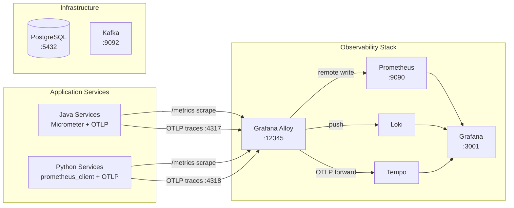

# MariaAlpha

Full-stack algorithmic trading engine — see [Technical Design Document](docs/technical-design-document.md) for architecture and details.

## Prerequisites

- [just](https://github.com/casey/just) — command runner used for all project tasks

  ```
  brew install just   # macOS
  ```

- [Docker](https://www.docker.com/products/docker-desktop/) — required for infrastructure services

## Quick Start

```bash
cp .env.example .env      # configure database credentials
just run                   # start all infrastructure services
just                       # list available recipes
```

## Infrastructure Services

| Service | Port | Notes |
| --- | --- | --- |
| PostgreSQL 16 | 5432 | Credentials via `.env` |
| Kafka (KRaft) | 9092 | Single-node, no ZooKeeper |
| Prometheus | 9090 | Metrics storage, remote-write enabled |
| Grafana | 3001 | Dashboards — anonymous admin access |
| Alloy | 12345 | Telemetry collector UI; OTLP on 4317/4318 |

Loki (logs) and Tempo (traces) run within the Docker network, reachable by Alloy and Grafana.

### API Gateway (port 8080)

Single front door for the React UI and external clients. Implements:
- REST routing to all backend services (`/api/...`).
- API key authentication via `X-API-Key` header (or `?apiKey=` query parameter for browser WebSocket clients).
- Real-time WebSocket fan-out from Kafka to UI clients.

#### Configuration

| Env var | Required | Description |
|---|---|---|
| `MARIAALPHA_API_KEY` | yes | Shared secret. Without it the gateway rejects every request with HTTP 401. |
| `KAFKA_BOOTSTRAP_SERVERS` | yes | Kafka cluster (default `localhost:9092`). |
| `STRATEGY_ENGINE_URL` | optional | Default `http://localhost:8082`. |
| `ORDER_MANAGER_URL` | optional | Default `http://localhost:8086`. |
| `EXECUTION_ENGINE_URL` | optional | Default `http://localhost:8084`. |
| `POST_TRADE_URL` | optional | Default `http://localhost:8088`. |
| `ANALYTICS_SERVICE_URL` | optional | Default `http://localhost:8095`. |
| `MARKET_DATA_GATEWAY_URL` | optional | Default `http://localhost:8079`. |

#### Quickstart

```bash
export MARIAALPHA_API_KEY=local-dev-key
just run
./gradlew :api-gateway:bootRun

## Database

Liquibase migrations run automatically on Spring Boot service startup. Verify schema:

```bash
docker compose exec postgres psql -U mariaalpha -c '\dt'
```

## Observability

The Grafana LGTM stack (Loki, Grafana, Tempo, Mimir/Prometheus) starts with `just run`. Grafana is pre-configured with all datasources and available at [http://localhost:3001](http://localhost:3001).



Alloy is the unified telemetry collector — it scrapes Prometheus-format metrics endpoints and forwards them to Prometheus via remote write, receives OTLP traces (gRPC `:4317`, HTTP `:4318`) and forwards to Tempo, and pushes logs to Loki. Grafana queries all three backends and supports cross-linking between traces, logs, and metrics.

## CI/CD

GitHub Actions workflows run on every push and PR to `main`:

| Workflow | File | What it checks |
| --- | --- | --- |
| **CI** | `ci.yml` | Java: Spotless, Checkstyle, SpotBugs, tests + JaCoCo. Python: ruff, mypy, pytest. UI: ESLint, Prettier, tsc. |
| **CodeQL** | `codeql.yml` | Security analysis for Java, Python, TypeScript (also runs weekly). |
| **Snyk** | `snyk.yml` | Dependency vulnerability scanning (requires `SNYK_TOKEN` secret). |
| **PR Metadata** | `pr-metadata.yml` | Auto-populates labels, milestone, assignee, and project from linked issues. |

Python and UI jobs skip automatically when no source files exist yet. JaCoCo and test reports are uploaded as build artifacts. Snyk requires a `SNYK_TOKEN` repository secret — obtain one from [snyk.io](https://snyk.io).

### Branch rules

Direct pushes to `main` are not allowed — all changes go through pull requests. The `Java (lint + test)` and `CodeQL (java-kotlin)` checks must pass before merging. Branches are auto-deleted after merge.