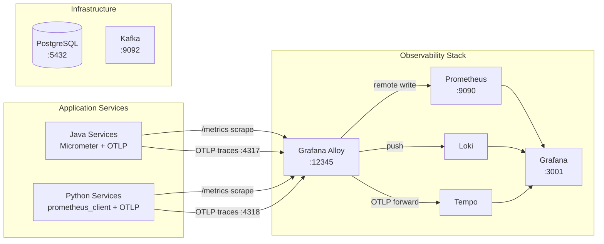

# MariaAlpha

Full-stack algorithmic trading engine — see [Technical Design Document](docs/technical-design-document.md) for architecture and details.

## Prerequisites

- [just](https://github.com/casey/just) — command runner used for all project tasks

  ```
  brew install just   # macOS
  ```

- [Docker](https://www.docker.com/products/docker-desktop/) — required for infrastructure services

## Quick Start

```bash
cp .env.example .env      # configure database credentials
just run                   # start all infrastructure services
just                       # list available recipes
```

## Infrastructure Services

| Service | Port | Notes |
| --- | --- | --- |
| PostgreSQL 16 | 5432 | Credentials via `.env` |
| Kafka (KRaft) | 9092 | Single-node, no ZooKeeper |
| Prometheus | 9090 | Metrics storage, remote-write enabled |
| Grafana | 3001 | Dashboards — anonymous admin access |
| Alloy | 12345 | Telemetry collector UI; OTLP on 4317/4318 |

Loki (logs) and Tempo (traces) run within the Docker network, reachable by Alloy and Grafana.

## Database

Liquibase migrations run automatically on Spring Boot service startup. Verify schema:

```bash
docker compose exec postgres psql -U mariaalpha -c '\dt'
```

## Observability

The Grafana LGTM stack (Loki, Grafana, Tempo, Mimir/Prometheus) starts with `just run`. Grafana is pre-configured with all datasources and available at [http://localhost:3001](http://localhost:3001).



Alloy is the unified telemetry collector — it scrapes Prometheus-format metrics endpoints and forwards them to Prometheus via remote write, receives OTLP traces (gRPC `:4317`, HTTP `:4318`) and forwards to Tempo, and pushes logs to Loki. Grafana queries all three backends and supports cross-linking between traces, logs, and metrics.
