# MariaAlpha — Finance Mental Map

A reference for engineers. Every financial concept used anywhere in MariaAlpha appears here at least once, with a short definition, a software-engineering analogue when useful, and a pointer to where it lives in the codebase.

The goal is **not** to teach quantitative finance from first principles — it's to give an experienced engineer a map they can refresh in 5 minutes and immediately re-grok where in the system a concept matters.

> **How to use this document.** When you encounter a financial term in code review, jump here first. The top-level diagram (§1) tells you which domain to navigate to. Each domain section (§2 onward) has its own diagram + concept table + a "where in code" pointer.

---

## 1. Top-level domains

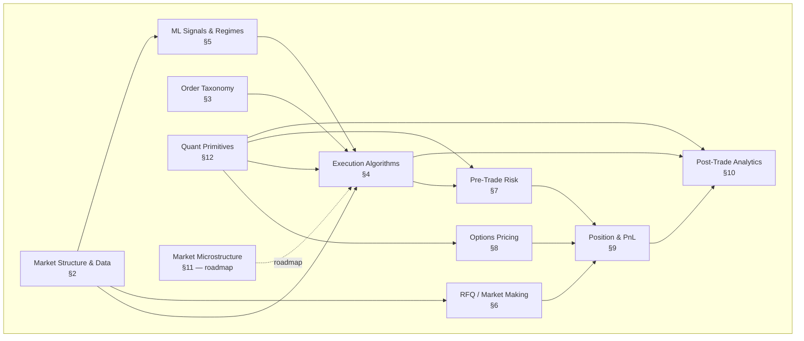

The flow follows the **life of a trade**: market data arrives → signal/strategy decides → order type chosen → risk checks → execution → fills update position → post-trade analytics. Options pricing (§8) and RFQ (§6) are parallel pricing surfaces that ultimately produce the same kind of `OrderSignal` for the execution pipeline.

---

## 2. Market structure & data

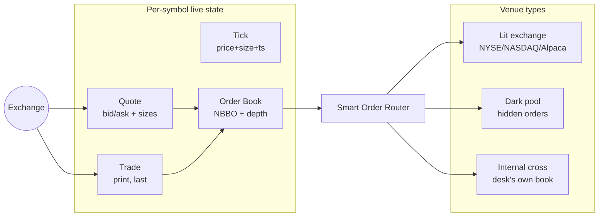

| Concept | Definition | Engineer's lens |
| --- | --- | --- |
| **Tick** | Smallest market-data update — a quote change or a print. | Cell update in a stream; the "event" in event-sourcing. |
| **NBBO** | National Best Bid and Offer — the highest bid + lowest ask across all venues. | The "consensus view" merged from multiple sources of truth. |
| **Bid / Ask** | Best price someone is willing to **buy** / **sell** at. | Two priority queues; bids sorted high→low, asks low→high. |
| **Spread** | `ask − bid`. Wider on illiquid names. | The "tax" on round-trip trading; the spread is the market-maker's gross margin. |
| **Mid** | `(bid + ask) / 2`. | The arithmetic centre — used as a fair-value reference. |
| **Depth** | Number of shares offered at each price level. | Like reading the next N items at each priority level rather than just the top. |
| **Last trade price** | Price of the most recent print. | Newest commit to the immutable history. |
| **Cumulative volume** | Shares traded so far today. | Append-only counter; reset at session boundary. |
| **Stale data** | Quote we haven't refreshed in too long; mark as suspect. | Cache TTL expiry — serve with a "STALE" header. |
| **Lit vs dark** | Lit = order book is public; dark = hidden order book, prints only after match. | Public API vs private API. |
| **Internal cross** | Matching your own buy & sell orders inside the firm at the NBBO midpoint. | Local in-memory match before hitting the network — capture the spread. |
| **SOR** | Smart Order Router. Picks which venue to send each child order to. | Load balancer with weighted scoring across price, fees, latency, leakage. |
| **Adverse selection** | Getting picked off — your resting order fills right before the market moves against you. | Stale-data race condition; somebody had newer information than you. |
| **Flow toxicity** | How often a counterparty's flow is adversely selective. | Statistical signal-to-noise on the counterparty channel. |
| **Internalization rate** | `internal_crosses / total_fills`. | Cache hit rate for the desk's own offsetting flow. |

**In code:** `market-data-gateway`, `execution-engine/.../adapter/{Simulated{Lit,DarkPool,InternalCrossing}Adapter, AlpacaExchangeAdapter}`, `execution-engine/.../router/ScoredSmartOrderRouter`, `execution-engine/.../crossing/InternalCrossingEngine`.

---

## 3. Order taxonomy

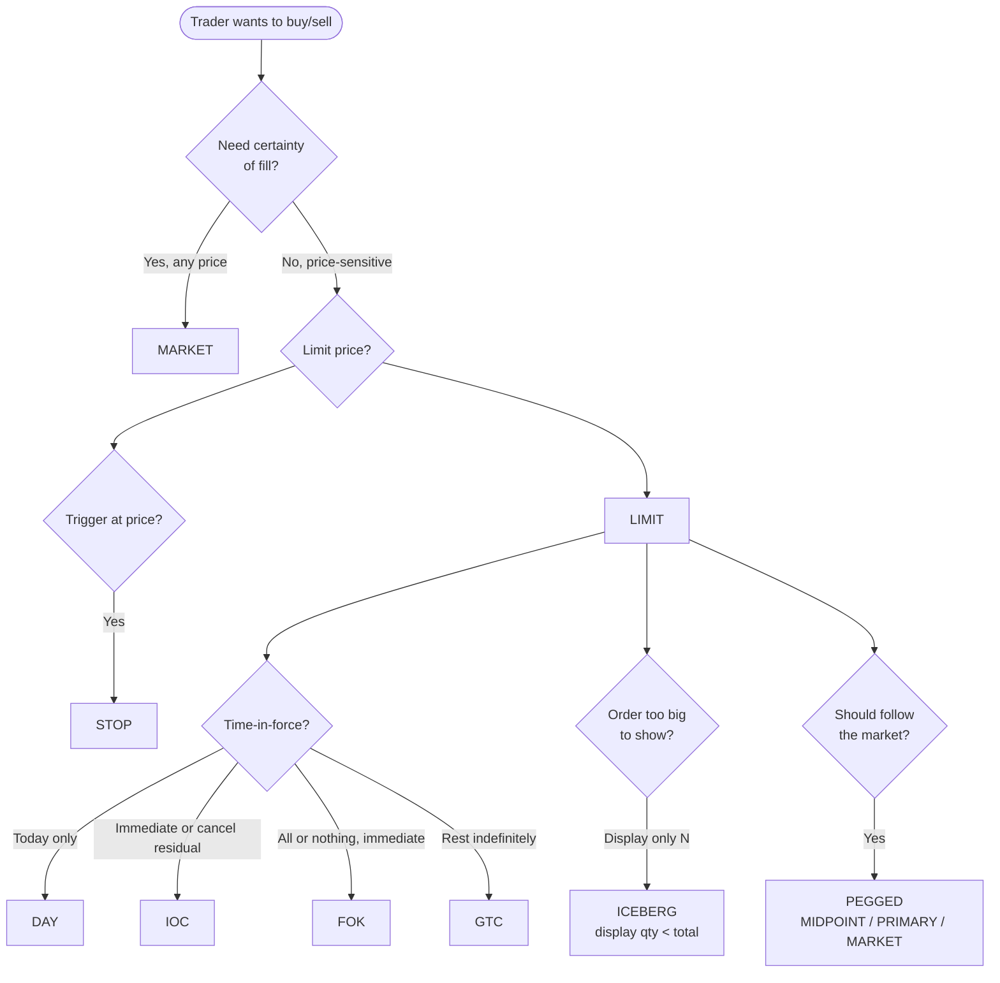

| Type | Behaviour | Use case |
| --- | --- | --- |
| **MARKET** | Take whatever liquidity exists right now. | "I need out, now." |
| **LIMIT** | Don't pay more than X (BUY) / accept less than X (SELL). | Price discipline. |
| **STOP** | Becomes a MARKET when the price crosses a trigger. | Stop-loss; momentum entries. |
| **IOC** | Immediate-or-Cancel: fill what's available, cancel the rest. | Partial fills OK; no residual rest. |
| **FOK** | Fill-or-Kill: all-or-nothing, instantly. | Atomic transactions — don't half-fill. |
| **GTC** | Good-till-Cancel: stays alive across sessions. | Long-horizon resting orders. |
| **DAY** | Default TIF; cancels at session end. | The 90% case. |
| **ICEBERG** | Hide most of the size; display only `displayQuantity` at a time. | Avoid signalling the full size; don't move the market. |
| **PEGGED** | Working price tracks the NBBO. `MIDPOINT` = (bid+ask)/2; `PRIMARY` = join side (passive); `MARKET` = opposite side (aggressive). | "Sit at the mid"; "follow the market"; the desk doesn't want to re-price by hand. |

**`pegOffsetBps`** — signed bps from the reference. Positive = toward fill (BUY higher, SELL lower). **`priceCap`** — never re-peg past it (max for BUY, min for SELL).

**In code:** `execution-engine/.../model/OrderType.java`, `handler/{Market,Limit,Stop,Ioc,Fok,Gtc,Iceberg,Pegged}OrderHandler`, `iceberg/IcebergCoordinator`, `pegged/PeggedCoordinator`. Design docs in [`strategies/pegged-orders.md`](strategies/pegged-orders.md).

---

## 4. Execution algorithms

The order types above are **single shots**. Execution algorithms are **schedulers** that slice a big parent order into many smaller children over time.

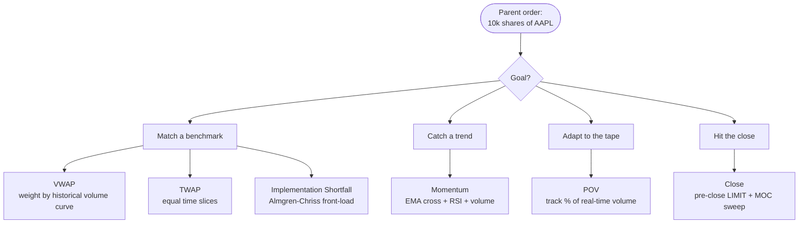

| Strategy | Schedule | Benchmark | "When you'd want it" |
| --- | --- | --- | --- |
| **VWAP** | Slices proportional to a U-shaped intraday volume curve (heavier at open and close). | The day's volume-weighted avg price. | Big institutional flow; you'll be judged against VWAP. |
| **TWAP** | Equal slices across equal time intervals. | Flat: the day's simple average. | When you don't trust the volume profile (illiquid name). |
| **Implementation Shortfall (IS)** | Front-loads (Almgren-Chriss optimal trajectory): execute more early when prices are close to your decision, less late when timing risk accumulates. `urgency=0` collapses to TWAP. | Decision-time mid (arrival price). | When the decision price matters more than the average. |
| **Momentum** | Reactive: enters when fast EMA crosses slow EMA AND RSI not extreme AND volume > 1.5× avg. | None — directional alpha. | Trend-following alpha capture, not benchmark matching. |
| **POV (Percent of Volume)** | Watches real-time TRADE prints; emits children sized so `Σ child_qty ≈ participationRate × cumulative_volume`. End-of-window: MARKET sweep of remainder. | Volume participation rate (e.g. 10%). | "Don't be more than 10% of the tape" — discretion-bounded. |
| **Close** | Splits parent into a pre-close LIMIT schedule + a single MOC (Market-On-Close) sweep at `closeTime − offset`. | Closing auction price. | When you need the closing print specifically (index rebalancing, ETF NAV). |

### 4.1 Why front-load (Implementation Shortfall)

Almgren-Chriss models the trader's dilemma:
- **Execute fast** → high market impact (your buying pushes the ask up) but low timing risk.
- **Execute slow** → low impact, but the market may drift away from your decision price.

The optimal trajectory is a **convex exponential decay** — more shares early, fewer later. The `urgency` parameter `κ` tunes the curvature; `κ=0` → TWAP; `κ→∞` → all at once (MARKET).

**In code:** `strategy-engine/.../strategy/{vwap,twap,momentum,shortfall,pov,close}`. Each strategy is a `TradingStrategy` implementation registered with `StrategyRegistry`. Design docs in `docs/strategies/*.md`.

---

## 5. ML signals & regimes

Two ML services live alongside the rule-based strategies. They don't *make* trading decisions — they **gate** them.

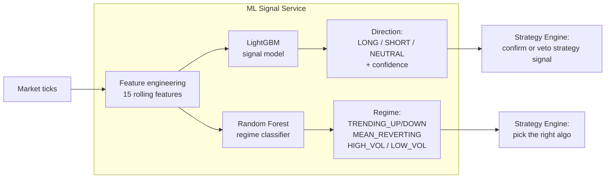

| Feature | Definition | Why it's used |
| --- | --- | --- |
| **EMA** (Exponential Moving Avg) | Recent prices weighted more than old. `EMA_t = α·price_t + (1-α)·EMA_{t-1}`. | Trend direction without lag spikes. |
| **SMA** (Simple Moving Avg) | Arithmetic mean over a window. | Baseline smoother. |
| **RSI** (Relative Strength Index) | Momentum oscillator in `[0, 100]`. RSI > 70 = overbought; < 30 = oversold. | "Has the move gone too far?" |
| **MACD** | Difference between 12- and 26-period EMAs + 9-period signal line. Sign change = trend change. | Trend strength & direction in one number. |
| **ATR** (Avg True Range) | Average of recent (high − low) ranges. | Position sizing / stop-loss spacing. |
| **Realised volatility** | Stdev of recent log-returns, annualised. | Risk scaling. |
| **Volume ratio** | `current_volume / rolling_avg_volume`. | Confirmation: real moves come with volume. |

### 5.1 The ML gate (`MlSignalClient`)

```
if signal.confidence ≥ 0.7 and signal.direction == strategy.direction: PROCEED  (maybe upscale qty)
if signal.confidence ≥ 0.7 and signal.direction != strategy.direction: VETO    (suppress)
if signal.confidence  < 0.7:                                          PROCEED  (no ML input)
```

Modes: `STRICT` (veto), `PERMISSIVE` (warn + proceed), `OFF`. Configurable via `strategy-engine.ml.veto-mode`.

### 5.2 Regime → algorithm

| Regime | Default algorithm |
| --- | --- |
| TRENDING_UP / TRENDING_DOWN | Momentum |
| MEAN_REVERTING / LOW_VOLATILITY | VWAP or TWAP |
| HIGH_VOLATILITY | (operator decision; default keeps the configured strategy) |

**In code:** `ml-signal-service/` (Python), `strategy-engine/.../ml/MlSignalClient.java`, `strategy-engine/.../routing/SymbolStrategyRouter.java`.

---

## 6. RFQ / Market making

The desk's voice/manual side: a client (or a UI-side trader) asks *"what would you bid me and offer me for N shares of X?"* — the desk produces a two-way quote that captures the spread.

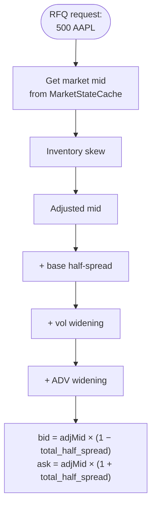

| Concept | Logic | Sign convention |
| --- | --- | --- |
| **Inventory skew** | Long inventory → push mid *down* (offload). Short → push mid *up* (cover). | `λ × (inventory_notional / neutral_notional)` clamped at `±max_skew_bps`. |
| **Base half-spread** | Symmetric `baseSpreadBps / 2` on each side. | Always positive. |
| **Vol widening** | `volScalar × realised_vol_bps`. Higher vol → wider quote. | "Don't get picked off on a jump." |
| **ADV widening** | `advScalar × (qty / ADV) × 10000`. Bigger order → wider quote. | "Sourcing this much liquidity costs more." |
| **Quote validity** | TTL on the quote (default 10s); accept must arrive within window. | Cache TTL. |
| **Last look** | (Not used here) — desk's right to reject an accept after seeing the market. | We **do not** do this; tolerance is purely for JSON round-trip noise. |
| **Spread capture** | What the desk earns: `(ask − bid)/2` per round-trip filled trade. | Profit centre for the market-making book. |
| **Two-way quote** | Both bid and ask, simultaneously. | Bid-side fills SELL flow; ask-side fills BUY flow. |
| **Axe** | A position the desk *wants* flow on (because it would flatten inventory). | Like a "promoted" item in an inventory clearance. |
| **Client tiering** (roadmap) | Different spreads for different clients based on flow quality. | Per-tenant pricing. |

**In code:** `strategy-engine/.../rfq/{RfqPricingEngine, RfqPricingConfig, RfqMetrics, RfqController}`, `analytics-service` for axe matching. Design doc: [`strategies/rfq-pricing.md`](strategies/rfq-pricing.md).

---

## 7. Pre-trade risk checks

The **chain**: every order, before submission, runs through this gate. Short-circuits on the first failure.

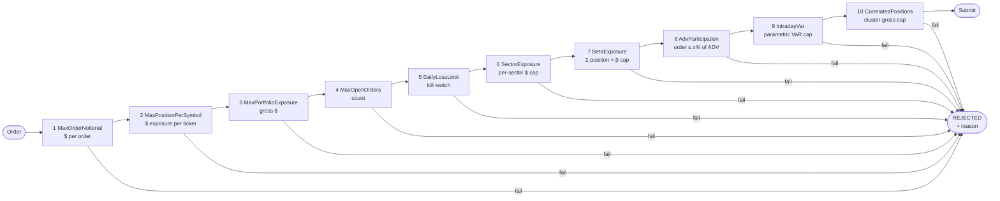

| # | Check | What it measures | "When you'd want it" |
| --- | --- | --- | --- |
| 1 | **MaxOrderNotional** | `price × qty ≤ limit` | Fat-finger protection. |
| 2 | **MaxPositionPerSymbol** | Total $ in a single ticker. | Idiosyncratic concentration. |
| 3 | **MaxPortfolioExposure** | Σ |position| across the book. | Gross leverage cap. |
| 4 | **MaxOpenOrders** | Count of live orders. | Don't flood the venue. |
| 5 | **DailyLossLimit** | If realized + unrealized losses cross threshold → halt all trading for the day. | "Stop the bleeding" kill switch. |
| 6 | **SectorExposure** | Σ |position| within a sector (TECH, AUTOMOTIVE, …) | Don't go all-in on semis. |
| 7 | **BetaExposure** | `|Σ position × beta|` — how much you move per 1% market move. | Hidden market-beta concentration even when sector limits pass. |
| 8 | **AdvParticipation** | `order_qty / ADV(symbol) ≤ x` | Don't be too large for the symbol's liquidity. |
| 9 | **IntradayVar** | Parametric Gaussian VaR. `Σ |notional_i| × σ_i / √252 × z(conf)`. Sum-of-absolutes (conservative). | Tail-risk cap. |
| 10 | **CorrelatedPositions** | Operator-defined symbol clusters (e.g. `AI_TRADE = {NVDA, MSFT, GOOGL}`) with $ caps. | "Same narrative, different sectors" risk that sector + beta miss. |

### 7.1 The math behind VaR

Daily parametric VaR for one position:

```
var_i = |position_notional_i| × σ_annualized_i / √trading_days × z(confidence)
```

Where `z(0.95) ≈ 1.645`, `z(0.99) ≈ 2.326` — these are quantiles of the standard normal.

Portfolio VaR (our choice) = `Σ var_i` — **sum of absolutes**, no diversification credit. This is the conservative reading: assumes returns are perfectly tail-correlated. A "real" VaR uses a covariance matrix `√(w' Σ w)`; that's a future iteration.

### 7.2 Beta-weighted exposure

`beta` measures a stock's sensitivity to the market: β=1.5 means the stock moves 1.5% for every 1% market move. **Beta-weighted exposure** = `Σ (position_notional × β_symbol)`. A $1M long position in NVDA (β≈1.6) carries more market risk than a $1M long in MSFT (β≈0.95), even though the gross dollars are the same.

### 7.3 Why a "cluster" check on top of sector + beta?

The classic 2023-2024 "AI trade" — NVDA + MSFT + GOOGL — spans two GICS sectors but moves as one narrative. Sector caps say "fine, MSFT is its own basket from GOOGL" (wrong in practice). Beta caps say "fine, the gross β is moderate" (also wrong — they're all the same trade). `CorrelatedPositionsCheck` lets you declare the narrative directly.

**In code:** `execution-engine/.../risk/{RiskCheck, RiskCheckChain, MaxOrderNotionalCheck, MaxPositionPerSymbolCheck, MaxPortfolioExposureCheck, MaxOpenOrdersCheck, DailyLossLimitCheck, SectorExposureCheck, BetaExposureCheck, AdvParticipationCheck, IntradayVarCheck, CorrelatedPositionsCheck}`. Design: [`strategies/intraday-var.md`](strategies/intraday-var.md), [`strategies/correlated-positions.md`](strategies/correlated-positions.md).

---

## 8. Options pricing

European call/put valuation via Black-Scholes-Merton, plus the five first-order Greeks.

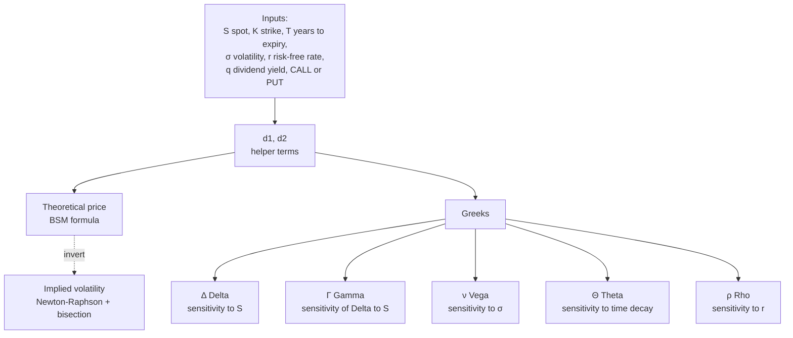

### 8.1 Black-Scholes-Merton formulas

```
d1 = (ln(S/K) + (r − q + σ²/2)·T) / (σ·√T)
d2 = d1 − σ·√T

Call = S·e^(−qT)·Φ(d1) − K·e^(−rT)·Φ(d2)
Put  = K·e^(−rT)·Φ(−d2) − S·e^(−qT)·Φ(−d1)
```

`Φ` is the standard normal CDF; `S·e^(−qT)` is the **dividend-discounted forward spot**; `K·e^(−rT)` is the **present-value strike**.

### 8.2 The Greeks

| Greek | Meaning | Sign for long call | Sign for long put |
| --- | --- | --- | --- |
| **Δ Delta** | dPrice / dS — option moves per $1 in underlying | 0 to +1 | −1 to 0 |
| **Γ Gamma** | dΔ / dS — convexity of P&L | ≥ 0 | ≥ 0 |
| **ν Vega** | dPrice / dσ — exposure to volatility shifts | ≥ 0 | ≥ 0 |
| **Θ Theta** | dPrice / dt — decay per day | typically < 0 | typically < 0 |
| **ρ Rho** | dPrice / dr — exposure to rate changes | > 0 | < 0 |

**Reporting conventions:** vega and rho are quoted **per 1% move** (`/100`); theta is quoted **per day** (`/365` calendar or `/252` trading).

### 8.3 Put-call parity

A no-arbitrage relationship that must hold:

```
C − P = S·e^(−qT) − K·e^(−rT)
```

If parity is broken, you can construct a riskless arbitrage. Useful as a unit-test invariant (and we do — see `BlackScholesPricerTest#putCallParityHoldsWithDividendYield`).

### 8.4 Implied volatility

Inverse problem: given a market premium, what σ makes the model match? Newton-Raphson seeded at σ=0.20 using analytic vega as derivative; bisection fallback when vega collapses (deep-OTM or near-expiry).

**No-arbitrage band:**
```
Call: max(0, S·e^(−qT) − K·e^(−rT))  ≤  C  ≤  S·e^(−qT)
Put:  max(0, K·e^(−rT) − S·e^(−qT))  ≤  P  ≤  K·e^(−rT)
```

Premiums outside this band have no implied σ — the solver throws.

**In code:** `strategy-engine/.../options/{BlackScholesPricer, GreeksCalculator, ImpliedVolatilityCalculator, NormalDistribution, OptionContract, OptionsController}`. Design: [`strategies/options-pricing.md`](strategies/options-pricing.md).

---

## 9. Position & PnL

The book-of-record per symbol. Updated on every fill.

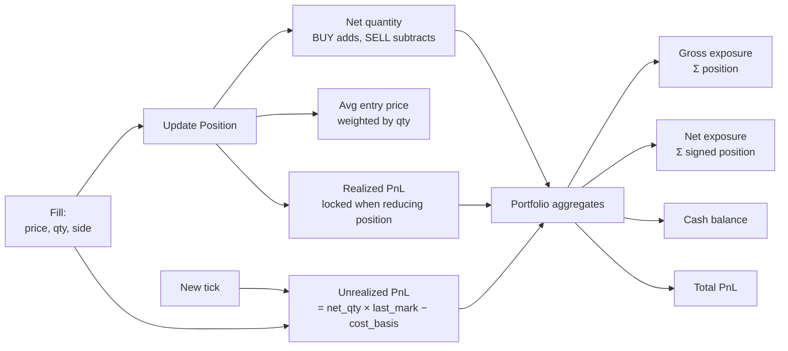

| Concept | Definition | Note |
| --- | --- | --- |
| **Net quantity** | Σ buys − Σ sells. Positive = long, negative = short. | Position equals zero is "flat". |
| **Avg entry price** | Weighted average price of cumulative buys (for longs). | Recomputed on every fill that adds to the position. |
| **Realized PnL** | Locked-in profit/loss from position-reducing fills. | Reducing a long crystallizes profit/loss; adding doesn't. |
| **Unrealized PnL** | Mark-to-market: `(last_mark − avg_entry) × net_qty`. | Floats with the tape; not yet locked. |
| **Mark-to-market** | Revalue open positions at the latest tick. | Like recomputing a derived view on every change. |
| **Cost basis** | Total cash spent (for longs) acquiring the position. | Average × quantity. |
| **Gross exposure** | Σ |position_notional|. | Total directional risk regardless of long/short. |
| **Net exposure** | Σ signed_position_notional. | Long minus short. |
| **Cash balance** | Cash left after all fills + commissions. | Simulated in MariaAlpha (paper-trading). |
| **Total PnL** | Realized + Unrealized. | What you "made today". |

**Position cache:** PostgreSQL is the system of record; Redis pub-sub provides sub-millisecond cross-service position visibility for the pre-trade risk checks running in execution-engine.

**In code:** `order-manager/.../service/PositionService`, `execution-engine/.../service/PositionTracker`, `execution-engine/.../cache/RedisPositionCache{Client,Publisher}`.

---

## 10. Post-trade analytics

After fills happen — was the execution any good? Did we capture the right alpha?

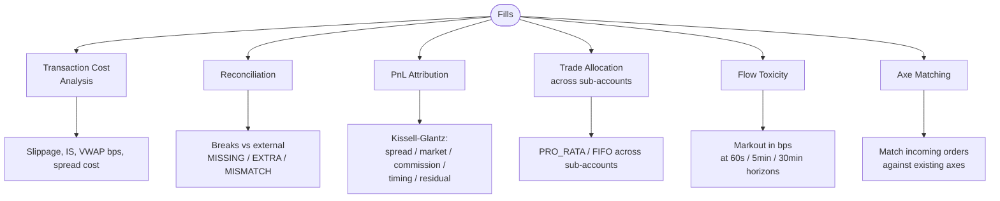

### 10.1 Transaction Cost Analysis (TCA)

| Metric | Formula | Meaning |
| --- | --- | --- |
| **Slippage** | `(realized_avg − arrival_mid) / arrival_mid × 10000` | bps of price drift from the moment you decided to trade. Positive = paid up. |
| **Implementation Shortfall (IS)** | `(realized_avg − decision_price) / decision_price × 10000` | bps lost vs. the "infinite liquidity" baseline. Includes timing + market impact. |
| **VWAP benchmark** | `realized_avg vs day's VWAP, in bps` | Did you beat the day? |
| **Spread cost** | `(realized − arrival_mid) / arrival_mid × 10000` on the BUY side; mirror for SELL. | What the market-maker (or you) lost to the spread. |
| **Arrival price** | Mid at the moment the parent order was created. | The decision-time benchmark. |

### 10.2 Reconciliation

Compares internal fills (what we *think* happened) to the venue's account-activity feed (what the venue *recorded*).

| Break type | When it fires |
| --- | --- |
| **MISSING_FILL** | External says fill happened, we have no record. |
| **EXTRA_FILL** | We have a fill the external doesn't. |
| **QUANTITY_MISMATCH** | Same order, different qty. |
| **PRICE_MISMATCH** | Same order, different price (beyond tolerance). |

Severity scales with notional: HIGH ≥ $10k, CRITICAL ≥ $100k. Breaks become `RECON_BREAK` events on `analytics.risk-alerts`.

### 10.3 PnL Attribution (Kissell-Glantz framework)

Decomposes realized PnL of a parent into:

| Component | Definition |
| --- | --- |
| **Spread** | Capture of the bid-ask spread (positive if buying near bid, selling near ask). |
| **Market** | Movement of the market between decision and execution. |
| **Commission** | Venue/broker fees. |
| **Timing** | Did we choose the right moment within the window? (Placeholder in MariaAlpha MVP.) |
| **Residual** | Everything else — slippage from impact, opportunistic crosses. |

### 10.4 Flow toxicity (markout)

Pick a horizon (60s / 5min / 30min after fill). Compute:

```
markout_bps = (mid_at_horizon − fill_price) / fill_price × 10000 × side_sign
```

Positive markout for a BUY = the price went up after we bought → we got a *good* fill. Persistent **negative** markout = adverse selection, the counterparty knew something.

### 10.5 Trade allocation

Split a parent fill across sub-accounts (house book + multiple hedge fund clients):

| Method | Logic |
| --- | --- |
| **PRO_RATA** | Each sub-account gets `weight / Σ weights × parent_qty`; rounding remainder goes to the heaviest. |
| **FIFO** | Sub-accounts filled in declaration order until parent qty is exhausted (waterfall). |

Both algorithms guarantee `Σ allocations == parent_quantity`. Re-running is idempotent (delete-then-insert on `orderId`).

### 10.6 Axe matching

An **axe** is a position the desk *wants* to find a counterparty for (because it would flatten inventory). When an opposite-side order comes in, match it against active axes ranked by `confidence × remaining_size`.

**In code:** `post-trade/.../{tca, recon, allocation}`, `analytics-service/...{flow_toxicity, pnl_attribution, axes}`. Design: [`strategies/trade-allocation.md`](strategies/trade-allocation.md).

---

## 11. Market microstructure (roadmap)

Concepts that aren't built yet but appear in the TDD / roadmap. Useful context when reading future-facing comments.

| Concept | What it is | Why it matters |
| --- | --- | --- |
| **Tick size** | Minimum price increment at a given price level (e.g. $0.01 below $1, $0.05 above $50 on TSE). | A LIMIT order at an off-tick price is rejected by the venue. |
| **Itayose** (Japan opening auction) | Single-price call auction that matches all unmatched orders at the open. | Orders submitted before the open compete for the auction print. |
| **Closing auction** | Same as Itayose but at the close. | 10-15% of daily volume in Japan executes here. |
| **MOC** (Market-On-Close) | An order that promises to execute at the closing auction print. | The Close algorithm uses MOC for the residual sweep. |
| **Daily price limit** | Maximum % move per day on regulated exchanges (e.g. TSE: ±15% to ±30% depending on price band). | Order at a price beyond the limit is rejected. |
| **Uptick rule** | Short sales must be on an uptick / zero-plus-tick (varies by jurisdiction). | A short LIMIT at a downtick is illegal. |
| **Currency exposure** | Σ position_notional_per_currency in $-equivalents. | Multi-currency risk that the per-symbol limits miss. |
| **Trading hours / sessions** | Pre-open, continuous, lunch break (TSE), close, after-hours. | Many strategies behave differently per session. |
| **Program / basket trading** | Simultaneous execution of 15+ securities. | Index rebalancing, ETF creation, statistical arbitrage. |
| **FIX protocol** | Industry-standard message format for buy/sell-side comms. | The next inbound channel after the REST API. |

**In code (planned):** `execution-engine/.../microstructure/{TseTickSize, AuctionSessionHandler, DailyPriceLimit, UptickRule}`, `order-manager/.../currency`, `execution-engine/.../program`, `api-gateway/.../fix`. See TDD §11 Phase 3.

---

## 12. Quant primitives

Math you'll see across the codebase. Not strategy logic — building blocks.

### 12.1 Standard normal distribution

```
φ(x) = (1/√(2π)) · exp(−x²/2)    PDF — symmetric bell curve, peak at 0
Φ(x) = ∫_{−∞}^x φ(t) dt          CDF — "probability X ≤ x"

Φ(0) = 0.5
Φ(1.645) ≈ 0.95           (one-tail 95%)
Φ(1.96)  ≈ 0.975          (two-tail 95%)
Φ(2.326) ≈ 0.99           (one-tail 99%)
```

Implemented analytically using **Abramowitz & Stegun 26.2.17** (rational approximation; ~7.5×10⁻⁸ accuracy). Used by Black-Scholes (§8) and VaR z-scores (§7).

### 12.2 Z-score (quantile function)

Inverse of `Φ`: given a probability `p`, return the `x` such that `Φ(x) = p`.

```
z(0.95) = 1.6448...
z(0.99) = 2.3263...
```

Used in VaR to convert "% confidence" into "how many standard deviations". A&S 26.2.23 rational approximation.

### 12.3 Annualised volatility ↔ daily / horizon scaling

Stdev of returns scales with `√T` under the random-walk assumption:

```
σ_daily = σ_annual / √252            (252 trading days/year)
σ_T_day  = σ_annual × √(T_days / 252)
```

`√252 ≈ 15.87`. So a 25%/yr σ corresponds to a ~1.6%/day σ. This is *the* most-used quant identity in the codebase — VaR, options pricing, RFQ vol widening all use it.

### 12.4 Log returns vs simple returns

```
simple_return = (p_t − p_{t-1}) / p_{t-1}
log_return    = ln(p_t / p_{t-1})  ≈ simple_return  for small moves
```

Log returns are **additive across time** (useful for VaR scaling) and **symmetric** (a +5% then −5% sequence ends below start in simple returns but at start in log returns over small windows). Volatility-as-stdev assumes log returns.

### 12.5 Bps (basis points)

`1 bp = 0.0001 = 0.01%`. 100 bps = 1%. Half a percent move = 50 bps. The currency of trader-talk: TCA, spread widening, slippage, peg offsets all live in bps.

```
diff_bps = (price_after − price_before) / price_before × 10000
```

### 12.6 Almgren-Chriss optimal execution

Trade-off between **market impact** (executing fast moves the market against you) and **timing risk** (executing slow lets the market drift). Optimal trajectory minimises `E[impact] + κ · Var[timing]` for a risk-aversion parameter `κ`.

Closed-form trajectory for liquid equity:

```
x(t) / X_0 = sinh(κ · (T − t)) / sinh(κ · T)
```

`κ=0` ⇒ linear (TWAP); `κ→∞` ⇒ all at `t=0` (MARKET). MariaAlpha's IS strategy implements the convex front-loaded slice schedule from this.

### 12.7 Newton-Raphson + bisection

Generic root-finding combo MariaAlpha uses for implied volatility:

- **Newton-Raphson** — `x_{n+1} = x_n − f(x_n) / f'(x_n)`. Quadratic convergence near the root, but unstable when `f'(x)` is small.
- **Bisection** — narrow `[lo, hi]` by halving whenever the sign of `f(mid)` matches one of the endpoints. Linear but always converges if the root is bracketed.

The IV solver uses Newton (vega as `f'`) with bisection fallback whenever Newton overshoots the bracket or vega goes to zero.

### 12.8 Random walk / Brownian motion

Prices in BSM are modelled as **geometric Brownian motion**:

```
dS = μ·S·dt + σ·S·dW
```

`dW` is a Wiener-process increment (`~ N(0, dt)`). Translating: in a small time `dt`, the price changes by a drift term `μ·S·dt` plus a noise term proportional to `σ·S·√dt`. This is the model under which BSM's no-arbitrage formula falls out.

The same assumption underlies parametric VaR and the vol scaling identity in §12.3.

---

## 13. Worked walkthrough — life of a trade

To tie it together: a single VWAP BUY of 1000 AAPL.

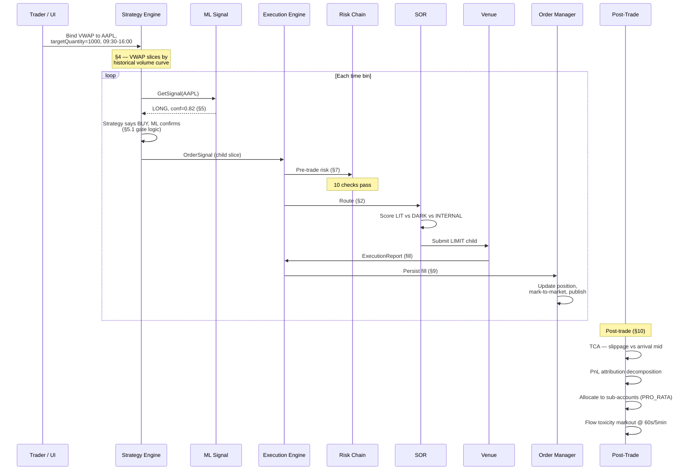

**Concepts touched** (in order): VWAP scheduling, market data (§2), ML signal gate (§5), order signal → child order (§3), pre-trade risk chain (§7), smart order routing (§2), venue submission (§2), fill processing, position update + mark-to-market (§9), TCA (§10.1), PnL attribution (§10.3), allocation (§10.5), flow toxicity (§10.4).

That's most of the financial vocabulary in MariaAlpha across one trade.

---

## 14. Cross-reference — "where do I find X in code?"

| Concept | Module / package |
| --- | --- |
| NBBO, bid/ask, last trade | `market-data-gateway/.../book/OrderBookManager`, `execution-engine/.../service/MarketStateTracker` |
| Order types | `execution-engine/.../{model/OrderType, handler/*OrderHandler, iceberg/, pegged/}` |
| Execution algos | `strategy-engine/.../strategy/{vwap, twap, momentum, shortfall, pov, close}` |
| ML signals & regimes | `ml-signal-service/` (Python), `strategy-engine/.../ml/MlSignalClient` |
| RFQ pricing | `strategy-engine/.../rfq/{RfqPricingEngine, RfqPricingConfig, VolatilityTracker}` |
| Pre-trade risk chain | `execution-engine/.../risk/{RiskCheck, RiskCheckChain, *Check}` |
| Options pricing + Greeks | `strategy-engine/.../options/{BlackScholesPricer, GreeksCalculator, ImpliedVolatilityCalculator}` |
| Position + PnL | `order-manager/.../service/PositionService`, `execution-engine/.../service/PositionTracker` |
| TCA | `post-trade/.../tca/TcaService` |
| Reconciliation | `post-trade/.../recon/EodReconciliationService` |
| PnL attribution | `analytics-service/.../pnl_attribution/` |
| Flow toxicity | `analytics-service/.../flow_toxicity/` |
| Axe matching | `analytics-service/.../axes/` |
| Trade allocation | `post-trade/.../allocation/{AllocationCalculator, AllocationService, SubAccountRegistry}` |
| SOR / venue scoring | `execution-engine/.../router/{SmartOrderRouter, ScoredSmartOrderRouter}` |
| Internal crossing | `execution-engine/.../crossing/InternalCrossingEngine` |
| Symbol reference data (sector, β, ADV, σ) | `execution-engine/.../risk/SymbolReferenceData` |
| Normal CDF / PDF | `strategy-engine/.../options/NormalDistribution` |
| Z-score for VaR | `IntradayVarCheck.zscore(...)` |

---

## 15. Reading list (when you have an afternoon)

These are the things the project assumes but does not teach:

- **Hull**, *Options, Futures and Other Derivatives* — Chapters 13 (Black-Scholes), 19 (Greeks). The Hull textbook examples are our test fixtures; if a `BlackScholesPricerTest` value confuses you, it's because Hull's worked example uses those exact inputs.
- **Almgren & Chriss**, *Optimal Execution of Portfolio Transactions* (2000 paper) — for IS / Almgren-Chriss.
- **Kissell**, *The Science of Algorithmic Trading and Portfolio Management* — for PnL attribution decomposition.
- **Jorion**, *Value at Risk* — for the parametric / historical / Monte Carlo VaR taxonomy.
- **Abramowitz & Stegun**, *Handbook of Mathematical Functions* §26.2 — the source of our Φ and z-score approximations.

For the parts MariaAlpha does *not* yet model (path-dependent options, jump-diffusion, regime-switching, transaction-cost-aware portfolio optimisation), the TDD §11 roadmap is the place to look.
