# FIX Protocol Gateway

> **Roadmap:** [3.4.3 — FIX protocol gateway (QuickFIX/J) for inbound algo orders](https://github.com/drag0sd0g/MariaAlpha/issues/99).
> **TDD reference:** §5.2.8 (API Gateway).

## 1. What this is

An inbound **FIX 4.4** acceptor that lets external buy-side systems send orders into MariaAlpha over
the industry-standard wire protocol, in parallel to the REST `/api/execution/orders` and
`/api/algo/orders` surfaces. It is a thin translation layer: a FIX `NewOrderSingle (35=D)` is decoded,
mapped to MariaAlpha's order model, and forwarded to execution-engine's REST endpoint; the resulting
order id (or rejection) comes back as a FIX `ExecutionReport (35=8)`.

It lives in the **api-gateway** — the single front door for external clients — and is built on
[QuickFIX/J](https://www.quickfixj.org/) 2.3.2.

## 2. Scope

The gateway handles plain order entry and cancellation:

| Inbound (client → gateway) | Outbound (gateway → client) |
| --- | --- |
| `NewOrderSingle (35=D)` | `ExecutionReport (35=8)` — `ExecType=NEW`/`REJECTED` |
| `OrderCancelRequest (35=F)` | `ExecutionReport` — `ExecType=CANCELED`, or `OrderCancelReject (35=9)` |

**Algorithmic parent orders (VWAP/TWAP/POV/…) are intentionally not driven from FIX here.** Their
per-strategy parameter shapes — volume profiles, participation rates, slice windows — are not
expressible in standard FIX tags, so the REST [`/api/algo/orders`](algo-execution-api.md) surface
remains the algo entry point. The FIX gateway covers the plain order types that map cleanly: MARKET,
LIMIT, STOP, and the IOC/FOK/GTC time-in-force variants.

## 3. Architecture

```mermaid
graph LR
    CLIENT[FIX client] -->|NewOrderSingle / OrderCancelRequest| ACC[FixGatewayServer<br/>SocketAcceptor]
    ACC --> APP[FixApplication<br/>MessageCracker]
    APP -->|translate| TR[FixOrderTranslator]
    APP -->|forward| CL[FixGatewayClient<br/>WebClient]
    CL -->|POST /api/execution/orders<br/>DELETE /api/execution/orders/&#123;id&#125;| EE[execution-engine]
    APP -->|ExecutionReport / OrderCancelReject| CLIENT
```



| Component | Responsibility |
| --- | --- |
| `FixGatewayServer` | `SmartLifecycle` bean that builds the QuickFIX/J `SessionSettings` programmatically (no `.cfg` file), starts a `SocketAcceptor` with an in-memory message store, and stops it on shutdown. **No-op unless `mariaalpha.fix.enabled=true`** — so unit tests and CI never open a socket. |
| `FixApplication` | The QuickFIX/J `Application` + `MessageCracker`. Cracks inbound messages and dispatches to handler methods that **return** the response message (testable without a live session); the `onMessage` overrides are thin: handle, then `Session.sendToTarget`. Maintains a `ClOrdID → internal order id` map so a cancel (which carries the client's `OrigClOrdID`) resolves to the downstream order. |
| `FixOrderTranslator` | Pure mapping from `NewOrderSingle` to a normalised `FixOrderSubmission`. Switches on FIX wire chars directly (not QuickFIX field constants, whose generated names drift between dictionary versions). Throws `IllegalArgumentException` for unsupported side / order type / TIF or a missing required price. |
| `FixGatewayClient` | Forwards to execution-engine over `WebClient`. Called from QuickFIX worker threads, so the reactive calls are `block()`ed (never on a Netty event loop). These are internal service-to-service calls and carry no API key — the gateway is the auth edge. |
| `FixGatewayMetrics` | Micrometer counters, scraped at the api-gateway metrics endpoint. |

## 4. Field mapping

| FIX tag | MariaAlpha field | Notes |
| --- | --- | --- |
| `Side (54)` | `side` | `1`→BUY, `2`→SELL; anything else rejected |
| `OrdType (40)` | `orderType` | `1`→MARKET, `2`→LIMIT, `3`→STOP |
| `OrderQty (38)` | `quantity` | must be positive |
| `Price (44)` | `limitPrice` | required for LIMIT |
| `StopPx (99)` | `stopPrice` | required for STOP |
| `TimeInForce (59)` | `tif` | `0`→DAY, `1`→GTC, `3`→IOC, `4`→FOK |
| `ClOrdID (11)` | `clientOrderId` | echoed back; used as the cancel key |

A translation failure (unsupported value, missing required price/field) produces a rejecting
`ExecutionReport` (`ExecType=REJECTED`, `OrdStatus=REJECTED`, `Text` = the reason) **without** calling
execution-engine.

## 5. Configuration

Disabled by default. Enable and tune via `mariaalpha.fix.*` (env-overridable):

```yaml
mariaalpha:
  fix:
    enabled: ${FIX_GATEWAY_ENABLED:false}
    host: ${FIX_GATEWAY_HOST:0.0.0.0}
    port: ${FIX_GATEWAY_PORT:9878}
    sender-comp-id: ${FIX_SENDER_COMP_ID:MARIAALPHA}   # our (venue) side
    target-comp-id: ${FIX_TARGET_COMP_ID:CLIENT}       # expected client
    heartbeat-seconds: ${FIX_HEARTBEAT_SECONDS:30}
    execution-engine-url: ${EXECUTION_ENGINE_URL:http://localhost:8084}
```

The FIX 4.4 data dictionary (`FIX44.xml`) is loaded from the `quickfixj-messages-fix44` jar on the
classpath; the message store is in-memory (no disk).

## 6. Metrics

| Metric | Type | Labels | Description |
| --- | --- | --- | --- |
| `mariaalpha_fix_orders_total` | Counter | `outcome` = `accepted` \| `rejected` | Inbound `NewOrderSingle` outcomes |
| `mariaalpha_fix_cancels_total` | Counter | — | Successful cancels |

## 7. Limitations and roadmap notes

- **One static session.** A single `SenderCompID`/`TargetCompID` pair is configured. Multi-session /
  dynamic acceptor templates (one venue, many clients) are a follow-up.
- **No order-status (`35=H`) or mass-cancel.** Only single-order new/cancel are handled; other
  message types fall through `MessageCracker` as unsupported.
- **No FIX-driven algo parents** — see §2. Standard FIX `TargetStrategy (847)` codes don't carry the
  per-strategy parameters MariaAlpha's algos need; the REST algo API stays the entry point.
- **Fills are not streamed back over FIX yet.** The gateway acks order acceptance; execution fills
  flow on the `orders.lifecycle` Kafka topic and the `/ws/orders` WebSocket. Streaming asynchronous
  fill `ExecutionReport`s back to the FIX session would require subscribing the gateway to that topic
  and is a natural next step.

## 8. Test coverage

| Test | What it asserts |
| --- | --- |
| `FixOrderTranslatorTest` | Limit/market/stop field mapping; TIF mappings; missing-price and unsupported side/ord-type/TIF rejections. |
| `FixApplicationTest` | Accepted order → `NEW` ExecutionReport with the downstream id; downstream rejection → `REJECTED` report; missing field → reject without calling downstream; cancel of a known order → `CANCELED` report; cancel of an unknown `OrigClOrdID` → `OrderCancelReject`. |

The acceptor socket itself is config-gated off in tests; the message-handling logic is exercised
directly by constructing FIX messages, so no port is opened during the build.
