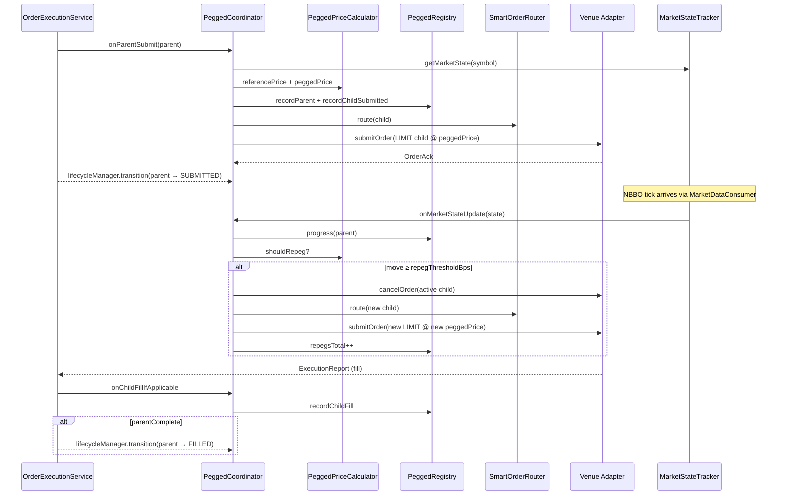

# Pegged Orders

> **Roadmap:** [3.2.3 — Pegged order type handler](https://github.com/drag0sd0g/MariaAlpha/issues/92).
> **TDD reference:** §5.3.2 (Order Type Handler Registry), FR-22.

## 1. What this is

A **pegged order** is an order whose working limit price is tied to a live market reference and re-prices itself when that reference moves. Pegging lets a trader express intent like *"sit at the midpoint"* or *"track the ask"* without manually cancelling and re-submitting on every NBBO tick — the execution engine does that for them.

Pegged is the seventh order type to ship in MariaAlpha (after MARKET, LIMIT, STOP, IOC, FOK, GTC, and ICEBERG). Like ICEBERG, it does **not** map cleanly onto a single `OrderTypeHandler` instruction because the parent has to react to ongoing market events — so it follows the same handler+coordinator split: a thin `PeggedOrderHandler` validates the request and a `PeggedCoordinator` owns the runtime lifecycle.

## 2. Peg types

Three industry-standard variants. The choice determines which side of the NBBO the order tracks:

| `pegType` | BUY reference | SELL reference | Posture |
| --- | --- | --- | --- |
| `MIDPOINT` | (bid + ask) / 2 | (bid + ask) / 2 | Neutral — common in dark pools and internalisation |
| `PRIMARY` | bid | ask | Passive — joins the same side, posts to add liquidity |
| `MARKET` | ask | bid | Aggressive — tracks the opposite side, primed to cross |

## 3. Pricing pipeline

For each NBBO snapshot:

```
reference   = referencePriceFor(pegType, side, marketState)        ← PeggedPriceCalculator
multiplier  = side == BUY  ? 1 + offsetBps/10_000
                            : 1 - offsetBps/10_000                   ← positive offset = toward fill
working_px  = reference × multiplier
working_px  = clamp(working_px, priceCap)                            ← optional safety stop
              ├─ BUY:  working_px = min(working_px, priceCap)
              └─ SELL: working_px = max(working_px, priceCap)
```

`pegOffsetBps` is a signed integer (default 0). The convention is **aggressive-toward-fill**: positive offset moves a BUY higher (pay up) and a SELL lower (give up), so traders read it as "how aggressive am I willing to be relative to the peg." Negative offsets pull the order further from fill. The configured ceiling `execution-engine.pegged.max-offset-bps` (default 100 bps = 1%) rejects typos.

`priceCap` re-uses the existing `Order.limitPrice` field as the price safety net. For a BUY it's the **maximum** price the parent will ever pay; for a SELL it's the **minimum** acceptable price. Without a cap, the order will follow the reference wherever it goes; in volatile markets that exposes the desk to running through stale liquidity. The handler rejects caps that are wildly off the current reference (BUY cap < 50% of reference, SELL cap > 200% of reference) as almost-certain typos.

## 4. Coordinator runtime

`PeggedCoordinator` is wired into `OrderExecutionService.processOrder` the same way `IcebergCoordinator` is — when the dispatcher encounters `OrderType.PEGGED`, it hands the parent off to `PeggedCoordinator.onParentSubmit` instead of submitting it to a venue directly.



Key properties:

- **One open child at a time.** A pegged parent never has multiple simultaneous LIMIT children — the previous child is cancelled before the next one is submitted. (This is the simpler version of iceberg, where the parent has one child per slice that can co-exist sequentially.)
- **Threshold-gated re-pegs.** `execution-engine.pegged.repeg-threshold-bps` (default 5 bps) sets the minimum move in the reference price (measured against the previously-submitted child price) that justifies a cancel-and-resubmit. A naive design that re-pegs on every tick would generate cancel/place storms at the venue and waste exchange-fee budget.
- **Symbol-scoped subscription.** The coordinator subscribes to `MarketStateTracker` once at startup and filters each update by symbol before consulting its tracked parents. An NBBO tick for an unrelated symbol is a no-op.
- **Cancel cascade.** Cancelling a pegged parent (via `DELETE /api/execution/orders/{id}` → `ManualOrderService.cancel`) cascades the cancel to the currently-active child, transitions the parent to `CANCELLED`, and removes the registry entry.

## 5. REST surface

| Endpoint | Returns |
| --- | --- |
| `POST /api/execution/orders` (with `orderType=PEGGED`, `pegType`, optional `pegOffsetBps` and `limitPrice` cap) | `202 Accepted` + `{ orderId, status, submittedAt }` |
| `GET /api/execution/orders/{parentId}/pegged-progress` | `200 OK` + `PeggedProgressView` while the parent is open; `404` once it terminates and the registry has dropped it |
| `DELETE /api/execution/orders/{parentId}` | Cascading cancel (existing endpoint, parent + active child) |

### 5.1 PeggedProgressView

```json
{
  "parentOrderId":    "5a3b…",
  "totalQuantity":    100,
  "filledQuantity":   40,
  "remainingQuantity": 60,
  "repegsTotal":      3,
  "lastReferencePrice":   100.10,
  "lastSubmittedPrice":   100.10,
  "activeChildOrderId":   "9c2f…",
  "parentComplete":   false
}
```

`activeChildOrderId` is null between re-pegs (briefly, while the cancel is in flight before the next submit) and after the parent fills or is cancelled.

### 5.2 Validation

`SubmitOrderRequestConstraints` enforces field-level rules at the gateway boundary:

- `pegType` is **required** iff `orderType=PEGGED`, **forbidden** for any other type.
- `pegOffsetBps` is allowed only for PEGGED orders. Null on a PEGGED request defaults to 0 inside the coordinator.
- `limitPrice` is treated as the optional price cap for PEGGED (not the working limit, which the coordinator computes).
- The compact constructor on `OptionContract`-style coverage isn't needed here — `PeggedOrderHandler.validate` runs the runtime-tier checks (peg type present, offset within `max-offset-bps`, market data available, cap not absurd).

## 6. Configuration

```yaml
execution-engine:
  pegged:
    # Minimum bps move in the reference vs the previously-submitted child price that
    # triggers a cancel + resubmit. 0 = re-peg on every tick (chatty + expensive).
    repeg-threshold-bps: 5
    # Hard cap on |pegOffsetBps| — protects against typo-induced runaway pricing.
    max-offset-bps: 100
```

Both values are validated in `PeggedConfig`'s compact constructor and snap to safe defaults if a non-positive value is supplied.

## 7. Metrics

| Metric | Type | Labels | Description |
| --- | --- | --- | --- |
| `mariaalpha_execution_pegged_parents_submitted_total` | Counter | `symbol`, `pegType` | PEGGED parents accepted |
| `mariaalpha_execution_pegged_parents_filled_total` | Counter | `symbol`, `pegType` | PEGGED parents fully filled |
| `mariaalpha_execution_pegged_children_submitted_total` | Counter | `symbol`, `pegType` | LIMIT children submitted on behalf of a PEGGED parent (includes re-pegs) |
| `mariaalpha_execution_pegged_repegs_total` | Counter | `symbol`, `pegType` | Cancel-and-resubmit cycles triggered by NBBO movement |

The natural Grafana follow-up is a panel showing `rate(repegs_total) / rate(children_submitted_total)` per symbol — high ratios on a volatile name flag a too-tight `repeg-threshold-bps` setting.

## 8. Why not just push it to Alpaca?

Some venues (Alpaca included for certain paper-trading variants, Interactive Brokers natively) support "peg-to-midpoint" as a venue-side order type. The `AlpacaOrderTypeMapper` explicitly **rejects** PEGGED at the wire boundary — the orders never reach Alpaca as a peg request. Two reasons:

1. **Venue heterogeneity.** Some venues understand pegged orders, others don't. Implementing peg behaviour in the coordinator means it works against every adapter we already ship (`SIMULATED_DARK`, `SIMULATED_PRIMARY`, `INTERNAL_CROSS`, `ALPACA`) without per-venue special cases.
2. **Visibility.** The coordinator owns the re-peg log, so every cancel/place cycle shows up in metrics, TCA inputs, and the order lifecycle topic. A native venue peg is a black box — you see the eventual fill but not the working journey.

The trade-off is the cancel-and-place pattern: more API calls, slightly higher chance of crossing in flight. The `repeg-threshold-bps` knob exists to tune that cost.

## 9. Limitations and roadmap notes

- **No discretion range.** Real venues often offer a *pegged with discretion* variant — a working price plus a hidden room to step up/down by N ticks if a passing match becomes available. We don't model that here.
- **Single-child only.** A pegged parent has one open child. Splitting a pegged parent into multiple displayed children with independent peg behaviour (peg + iceberg combo) is a future concern.
- **No Alpaca peg wire mapping.** When real Alpaca/IBKR pegged-order support lands, the mapper would be extended to delegate to the venue rather than running the coordinator path — likely behind a per-venue flag.

## 10. Test coverage

| Test | What it asserts |
| --- | --- |
| `PeggedPriceCalculatorTest` | Each peg type's reference selection; signed offset semantics for BUY and SELL; priceCap clamping; the shouldRepeg threshold logic |
| `PeggedOrderHandlerTest` | All validation rules: missing pegType, offset above max, missing NBBO, absurd priceCap, one-sided book |
| `PeggedRegistryTest` | Parent registration, child submission, repeg counter, fill progress, removal cleanup |
| `PeggedCoordinatorTest` | onParentSubmit happy path for every peg type; re-peg trigger on NBBO move past threshold; no-op on sub-threshold wobble; child fill → parent partial/filled transitions; cancel cascade; unrelated-symbol tick ignored |
| `PeggedCoordinatorIntegrationTest` (integration) | Real Spring context + Testcontainers Kafka — happy path fill via the simulated dark pool, and a re-peg triggered by a follow-up NBBO update |
| `PeggedOrderE2ETest` (e2e) | Full docker-compose stack: PEGGED submit + pegged-progress through the gateway, validation errors for missing pegType and stray pegType on non-PEGGED |
| UI `OrderForm.Pegged.test.tsx` | Pegged controls appear only for PEGGED; default MIDPOINT submission; PRIMARY SELL with offset + cap; error surface on rejection |
