# Program / Basket Trading

> **Roadmap:** [3.4.1 — Program / basket trading engine](https://github.com/drag0sd0g/MariaAlpha/issues/97).
> **TDD reference:** §5.2.4 (Execution Engine).

## 1. What this is

A *basket* (or *program*) order is a set of independent legs — typically 15+ names — submitted and
worked as one unit: index rebalances, portfolio transitions, ETF create/redeem, and stat-arb
baskets all arrive this way. The basket engine accepts the whole list in one call, fans every leg
out through the **standard single-order pipeline** (risk → SOR → venue), and tracks the aggregate so
the desk can watch one number instead of N orders.

It is deliberately **broker- and market-agnostic**: a basket is just a convenience layer on top of
the execution pipeline that already ships. Every leg is an ordinary order — it gets the full ten-check
risk chain, smart-order routing, and emits its own `orders.lifecycle` events — so a basket needs no
new venue integration and works today against the simulated exchange and Alpaca alike.

## 2. Design

The engine mirrors the existing **coordinator + registry + progress** shape used by the
[iceberg](pegged-orders.md) and pegged order types, adapted for a one-to-many fan-out rather than a
sequential parent→child slice:

```mermaid
graph TD
    REQ[POST /api/execution/baskets] --> SVC[BasketTradingService]
    SVC -->|validate all legs first| SVC
    SVC -->|register state + link each leg| REG[(BasketRegistry)]
    SVC -->|submitOrder per leg| OES[OrderExecutionService]
    OES -->|risk → SOR → venue| VEN[Venue adapters]
    VEN -->|ExecutionReport| OES
    OES -->|onExecutionReport hook| COORD[BasketCoordinator]
    COORD -->|recordLegFill| REG
    REG --> VIEW[BasketView snapshot]
    GET[GET /api/execution/baskets/&#123;id&#125;] --> VIEW
```



| Component | Responsibility |
| --- | --- |
| `BasketTradingService` | Validates every leg up front (all-or-nothing), then fans the legs out via `OrderExecutionService.submitOrder`. Registers the basket and links each leg **before** submitting it, so a fill that races ahead of the synchronous submit return is still attributed. |
| `BasketRegistry` | Thread-safe forward map (`basketId → BasketState`) and reverse map (`legOrderId → basketId`), mirroring `ParentChildOrderRegistry`. Routes a leg fill to its owning basket in O(1). |
| `BasketState` / `BasketLeg` | Per-basket aggregate guarded by a single monitor. Derives `BasketStatus` from the legs and renders an immutable `BasketView`. |
| `BasketCoordinator` | Hooked into `OrderExecutionService.onExecutionReport` alongside the iceberg/pegged coordinators. No-op for any order that is not a tracked basket leg; otherwise records the fill and the basket-completion metric. |

### 2.1 Status derivation

`BasketStatus` is computed from the legs, never stored:

| Status | Condition |
| --- | --- |
| `REJECTED` | Every leg was rejected at submission (risk/validation) — nothing is working at any venue. |
| `SUBMITTED` | At least one leg accepted; no fills yet. |
| `PARTIALLY_FILLED` | Some quantity has filled but the accepted legs are not all complete. |
| `FILLED` | Every accepted leg is fully filled. |

Rejected legs are excluded from the basket's `targetQuantity`, so a basket of nine good legs and one
risk-rejected leg still reaches `FILLED` when those nine complete — the rejected leg is reported but
doesn't strand the aggregate.

### 2.2 Ordering and races

The simulated adapter can fill a marketable order *before* `submitOrder` returns. To avoid losing
that fill, the service:

1. registers the (empty) `BasketState` in the registry,
2. adds the leg to the state and links `legOrderId → basketId`,
3. **then** calls `submitOrder`.

The leg's submission outcome (`SUBMITTED`/`REJECTED`) is applied afterwards but **never downgrades a
leg that has already started filling** — `BasketLeg.applySubmissionOutcome` only promotes a `NEW`
leg, leaving a raced `PARTIALLY_FILLED`/`FILLED` leg untouched.

## 3. REST surface

Reachable through the api-gateway's existing `/api/execution/**` route — no gateway change.

| Endpoint | Body | Returns |
| --- | --- | --- |
| `POST /api/execution/baskets` | `BasketOrderRequest` | `202 Accepted` + `BasketView` |
| `GET /api/execution/baskets/{basketId}` | — | `BasketView`, or `404` if unknown |
| `GET /api/execution/baskets` | — | `BasketView[]` (all tracked baskets) |

### 3.1 `POST /api/execution/baskets` example

```json
{
  "name": "SP500-rebalance-2026-06-14",
  "legs": [
    { "symbol": "AAPL", "side": "BUY",  "orderType": "LIMIT",  "quantity": 100, "limitPrice": 151.00 },
    { "symbol": "MSFT", "side": "BUY",  "orderType": "MARKET", "quantity": 50 },
    { "symbol": "TSLA", "side": "SELL", "orderType": "LIMIT",  "quantity": 25,  "limitPrice": 240.00 }
  ]
}
```

→ `202 Accepted`

```json
{
  "basketId": "f1c0…",
  "name": "SP500-rebalance-2026-06-14",
  "status": "SUBMITTED",
  "totalLegs": 3,
  "acceptedLegs": 3,
  "rejectedLegs": 0,
  "filledLegs": 0,
  "targetQuantity": 175,
  "filledQuantity": 0,
  "legs": [
    { "legOrderId": "…", "symbol": "AAPL", "side": "BUY", "targetQuantity": 100, "filledQuantity": 0, "status": "SUBMITTED", "reason": null }
  ]
}
```

### 3.2 Validation

Validation is **all-or-nothing**: the whole request is rejected (`400`) before any leg is sent to a
venue if any leg is malformed.

- `400 Bad Request` — empty `legs`; a `LIMIT` leg without `limitPrice`; a `STOP` leg without
  `stopPrice`; a leg using a parent-managed order type (`ICEBERG`, `PEGGED`) — those carry their own
  per-order coordinator state a basket does not model.
- Per-leg risk/validation failures are **not** request errors: the basket is still created and the
  failing leg is reported as a `REJECTED` leg in the `BasketView`.

## 4. Metrics

| Metric | Type | Labels | Description |
| --- | --- | --- | --- |
| `mariaalpha_execution_basket_submitted_total` | Counter | — | Baskets submitted |
| `mariaalpha_execution_basket_legs_total` | Counter | — | Legs submitted (Σ legs / Σ baskets ≈ average basket width) |
| `mariaalpha_execution_basket_legs_rejected_total` | Counter | `symbol` | Legs rejected at submission |
| `mariaalpha_execution_basket_legs_filled_total` | Counter | `symbol`, `side` | Legs fully filled |
| `mariaalpha_execution_basket_duration_ms` | Timer | — | Submit → fully-filled wall time |

## 5. Limitations and roadmap notes

- **No basket-level cancel yet.** Individual legs can be cancelled via
  `DELETE /api/execution/orders/{legOrderId}`; a single `DELETE /api/execution/baskets/{id}` that
  cascades to all working legs is a natural follow-up.
- **Allocation is a separate step.** A filled basket is the natural input to
  [trade allocation (3.4.2)](trade-allocation.md) — one allocation run per leg. Wiring the two
  together end-to-end is left as an integration follow-up.
- **No netting / crossing across legs.** Offsetting BUY/SELL legs in the same name are submitted
  independently; internal crossing happens (if at all) at the venue/SOR layer, not in the basket.

## 6. Test coverage

| Test | What it asserts |
| --- | --- |
| `BasketStateTest` | Status derivation for submitted / rejected / mixed / partial; rejected legs excluded from target; a raced fill is never downgraded by a late submission outcome; unknown-leg fill is a no-op. |
| `BasketRegistryTest` | Fill attribution to the owning basket; unknown leg returns empty; completed leg is unlinked so stray duplicate fills are ignored; `view`/`all`. |
| `BasketCoordinatorTest` | Full and partial leg fills update the aggregate; no-op for an order that is not a basket leg. |
| `BasketTradingServiceTest` | Fan-out submits every leg; mixed accept/reject; all-rejected ⇒ `REJECTED`; legs are linked so fills attribute; up-front validation rejects bad requests before any venue call. |
| `BasketControllerTest` | `202` on submit; `400` on empty legs; `200`/`404` on lookup. |
| `BasketTradingIntegrationTest` (integration) | Two-leg basket against the simulated adapter + Testcontainers Kafka reaches `FILLED` with both legs filled. |
