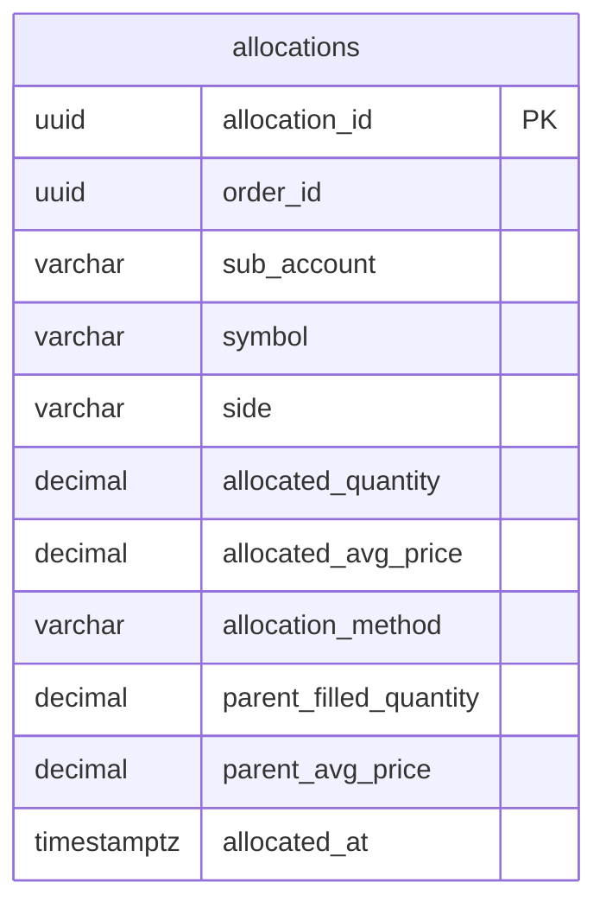

# Trade Allocation

> **Roadmap:** [3.4.2 — Trade allocation](https://github.com/drag0sd0g/MariaAlpha/issues/98).
> **TDD reference:** §5.2.6 (Post-Trade & Reconciliation Engine).

## 1. What this is

A post-trade module that splits a filled parent order across one or more sub-accounts.

Trading desks rarely run a single book. The same VWAP execution that fills 1,000 shares of AAPL might be carrying flow from the house book, a hedge-fund client A, and a hedge-fund client B simultaneously. After the parent fills, those 1,000 shares need to be split back to the originating accounts — typically pro-rata by some weight, sometimes FIFO by allocation order, occasionally via a discretionary override. That's allocation.

The MVP supports two industry-standard algorithms and persists the result to `allocations` so the desk's book-of-record reflects per-account positions, not just the parent.

## 2. Algorithms

| Method | Logic | When to use |
| --- | --- | --- |
| `PRO_RATA` | Each sub-account gets `weight / Σ weights × parent_quantity`, floored to whole shares. The rounding remainder is awarded to the heaviest-weighted sub-account so the sum exactly equals the parent. | The default — used for bunched orders where every sub-account participates proportionally to its capital commitment. |
| `FIFO` | Sub-accounts are filled in declaration order. Each gets `min(weight, remaining)` where `weight` is interpreted as a per-account share cap. Overflow (parent qty exceeds Σ caps) is absorbed by the last filled sub-account so the parent fully allocates. | Waterfall structures — first sub-account has priority, leftovers spill. Less common; useful for prime-broker arrangements. |

Both algorithms guarantee `Σ allocations == parent_quantity`. Both use the parent's executed average price as the per-account fill price — the MVP doesn't model per-account pricing (which would require batch/bunched-order workflows that are out of scope).

## 3. REST surface

| Endpoint | Body | Returns |
| --- | --- | --- |
| `GET /api/allocations/sub-accounts` | — | `{ defaultMethod, subAccounts: [ { name, weight } ] }` |
| `POST /api/allocations/run` | `AllocationRequestDto` | `201 Created` + `AllocationResponse[]` (one per sub-account that received a non-zero allocation) |
| `GET /api/allocations/order/{orderId}` | — | `AllocationResponse[]` for the parent — empty if the parent hasn't been allocated. |
| `GET /api/allocations/sub-account/{name}` | — | `AllocationResponse[]` for the sub-account, newest first. |

### 3.1 `POST /api/allocations/run` example

```json
{
  "orderId":              "5a3b…",
  "symbol":               "AAPL",
  "side":                 "BUY",
  "parentFilledQuantity": 1000,
  "parentAvgPrice":       178.42
}
```

→ `201 Created`

```json
[
  {
    "allocationId":        "…",
    "orderId":             "5a3b…",
    "subAccount":          "HOUSE",
    "symbol":              "AAPL",
    "side":                "BUY",
    "allocatedQuantity":   "500",
    "allocatedAvgPrice":   "178.42",
    "allocationMethod":    "PRO_RATA",
    "parentFilledQuantity":"1000",
    "parentAvgPrice":      "178.42",
    "allocatedAt":         "…"
  },
  { /* HEDGE_FUND_A — 300 shares */ },
  { /* HEDGE_FUND_B — 200 shares */ }
]
```

### 3.2 Idempotency

Re-running allocation for the same `orderId` is idempotent: prior rows are deleted before new ones are written. This matters in two scenarios:

1. **Re-fill after a partial.** The parent originally allocated at 600 shares; later it fills the full 1,000. Re-running with the larger quantity replaces the 600-share allocation cleanly.
2. **Method change.** An ops operator decides PRO_RATA was wrong and re-runs with FIFO. The old rows go, the new ones land.

The DB enforces this with a `UNIQUE (order_id, sub_account)` constraint; the service implements it by issuing `deleteByOrderId(orderId)` before `saveAll(...)` inside a single transaction.

### 3.3 Error codes

- `400 Bad Request` — invalid input: missing `orderId`, missing `symbol`, missing `side`, non-positive quantity, negative price.
- `503 Service Unavailable` — sub-account roster is unconfigured (`post-trade.allocation.sub-accounts` is empty). The check is intentionally noisy: an unconfigured roster is an operational issue that needs visibility, not a silent fallback.

## 4. Configuration

```yaml
post-trade:
  allocation:
    default-method: PRO_RATA      # applied when the request omits `method`
    sub-accounts:
      - name: HOUSE
        weight: 50.0
      - name: HEDGE_FUND_A
        weight: 30.0
      - name: HEDGE_FUND_B
        weight: 20.0
```

`SubAccountRegistry` validates the configuration at startup:

- Names must be non-blank
- Weights must be positive
- Names must be unique
- The roster is preserved in declaration order (FIFO depends on it)

A misconfigured roster fails fast at startup rather than silently producing surprising allocations later.

## 5. Data model



Indexes: `idx_allocations_order_id`, `idx_allocations_sub_account`. Unique constraint: `(order_id, sub_account)` — supports the idempotency rule above without duplicate-detection logic at the service layer.

## 6. Metrics

| Metric | Type | Labels | Description |
| --- | --- | --- | --- |
| `mariaalpha_post_trade_allocation_runs_total` | Counter | `symbol`, `method` | Allocation runs (one per parent) |
| `mariaalpha_post_trade_allocation_allocations_total` | Counter | `symbol`, `method` | Per-sub-account rows emitted (Σ rows / Σ runs ≈ average row-fan-out per parent) |
| `mariaalpha_post_trade_allocation_shares_allocated` | Distribution | `symbol`, `method` | Shares per run |

## 7. Limitations and roadmap notes

- **No per-account pricing.** Both algorithms assign the parent's average price to every sub-account. Batch/bunched-order workflows (each sub-account gets a different average due to their share of partials at different prices) need a deeper integration with the order-manager fills feed; out of scope for the MVP.
- **No allocation overrides.** The desk operator can re-run with a different method but can't manually override specific quantities. The roadmap item for a `POST /api/allocations/manual` override endpoint exists in the planning notes for after Phase 5.
- **No multi-symbol baskets.** Each call allocates exactly one parent. Program trading (3.4.1) allocates a whole basket and would invoke this endpoint N times — one per basket leg. The implementation here is the building block for that integration.
- **No commission allocation.** Commissions stay on the parent; per-sub-account commission attribution requires a fee schedule per sub-account, which the MVP doesn't model.

## 8. Test coverage

| Test | What it asserts |
| --- | --- |
| `AllocationCalculatorTest` | PRO_RATA splits cleanly with no remainder; remainder goes to heaviest; single-account and zero-weight cases; FIFO declaration-order fill; FIFO overflow to last; empty list / zero parent quantity; negative price rejected. |
| `SubAccountRegistryTest` | Empty config is valid; declaration order preserved; duplicate names rejected; non-positive weights rejected; blank names rejected. |
| `AllocationServiceTest` | `deleteByOrderId` fires before `saveAll`; method override honoured; falls back to registry default; rejects unconfigured registry; rejects zero quantity / missing orderId; re-allocation is idempotent across runs. |
| `AllocationRepositoryIT` (integration) | Save + fetch round-trip; lookup by sub-account; cascading delete; unique-constraint enforcement under load. |
| `AllocationControllerTest` | REST happy path (201); 400 on invalid quantity; 503 on unconfigured roster; order/sub-account lookup endpoints. |
| `TradeAllocationE2ETest` (e2e) | Full docker-compose stack via gateway: roster lookup; 1000-share pro-rata split sums to parent; idempotency on re-run with FIFO; 400 on invalid quantity. |
| UI `Allocations.test.tsx` | Roster loads on mount; submit renders the 500/300/200 split; API errors surface. |
