# MariaAlpha — Technical Design Document

## Table of Contents

1. [Glossary](#1-glossary)
2. [Background](#2-background)
3. [Functional Requirements](#3-functional-requirements)
4. [Non-Functional Requirements](#4-non-functional-requirements)
5. [Main Proposal](#5-main-proposal)
6. [Scalability](#6-scalability)
7. [Resilience](#7-resilience)
8. [Observability](#8-observability)
9. [Security](#9-security)
10. [Deployment](#10-deployment)
11. [Roadmap](#11-roadmap)

---

## 1. Glossary

| Term | Definition |
| --- | --- |
| **Alpha** | The excess return of a trading strategy relative to a benchmark index; the measure of a strategy's value-add. |
| **VWAP** | Volume-Weighted Average Price — an execution algorithm that slices an order across the trading day proportional to historical volume, aiming to match the day's average price. |
| **TWAP** | Time-Weighted Average Price — an execution algorithm that distributes an order evenly across fixed time intervals, regardless of volume. |
| **Momentum** | A trading strategy that buys instruments with strong recent price trends, betting that trends persist over short to medium timeframes. |
| **EMA** | Exponential Moving Average — a type of moving average that gives more weight to recent prices. Used in trend-following strategies (e.g., 20-period EMA crossing 50-period EMA signals a trend change). |
| **RSI** | Relative Strength Index — a momentum oscillator measuring the speed and magnitude of recent price changes on a scale of 0–100. RSI above 70 suggests overbought; below 30 suggests oversold. |
| **MACD** | Moving Average Convergence Divergence — a trend-following momentum indicator showing the relationship between two EMAs (typically 12-period and 26-period). Signal crossovers indicate potential buy/sell opportunities. |
| **ATR** | Average True Range — a volatility indicator measuring the average range between high and low prices over a period. Higher ATR indicates higher volatility. Used for position sizing and stop-loss placement. |
| **TCA** | Transaction Cost Analysis — a post-trade evaluation measuring execution quality by comparing achieved prices against benchmarks (arrival price, VWAP, close). |
| **Slippage** | The difference between the expected execution price and the actual fill price, caused by market movement or insufficient liquidity. |
| **RFQ** | Request for Quote — a manual pricing workflow where a client requests a price from a dealer for a specific instrument and quantity. |
| **Order Book** | The list of outstanding buy and sell orders for an instrument at various price levels, maintained by an exchange or venue. |
| **Market Data** | Real-time or delayed price, volume, and order book information streamed from exchanges or data providers. |
| **Tick** | A single market data update representing a price change, trade, or quote update for an instrument. |
| **Signal** | A numerical score or classification produced by an ML model indicating a predicted price movement direction or magnitude. |
| **Feature** | An input variable to an ML model derived from raw market data (e.g., moving average, RSI, volume ratio). |
| **Regime** | A characterization of the current market state (e.g., trending, mean-reverting, volatile, quiet) used to select appropriate trading strategies. |
| **Gradient-Boosted Tree** | An ensemble ML technique that builds a sequence of decision trees, where each new tree corrects the errors of the previous ones. LightGBM is a high-performance implementation used for the signal model. |
| **Random Forest** | An ensemble ML technique that builds many independent decision trees on random subsets of data and averages their predictions. Used for the regime classifier. |
| **gRPC** | Google Remote Procedure Call — a high-performance, language-agnostic RPC framework using Protocol Buffers for serialization and HTTP/2 for transport. |
| **CDC** | Change Data Capture — a pattern for detecting and propagating data changes in real time, typically from a database transaction log. |
| **P&L** | Profit and Loss — the net financial result of trading activity, computed as realized gains/losses plus unrealized mark-to-market on open positions. |
| **Position** | The net quantity of an instrument currently held (long if positive, short if negative, flat if zero). |
| **Fill** | An execution report confirming that part or all of an order has been matched at a specific price and quantity on the exchange. |
| **Reconciliation** | The process of comparing internal trade records against external exchange or clearing reports to detect and resolve discrepancies. |
| **Arrival Price** | The mid-price of an instrument at the moment an order decision is made; used as a TCA benchmark. |
| **Implementation Shortfall** | The difference between the arrival price and the realized average fill price, capturing the full cost of executing a decision. |
| **Circuit Breaker** | A resilience pattern that stops calling a failing downstream service after a threshold of failures, allowing it time to recover before retrying. |
| **Bulkhead** | A resilience pattern that isolates thread pools or resources so that a failure in one downstream dependency does not exhaust resources needed by other call paths. |
| **Helm** | A package manager for Kubernetes that uses templated YAML charts to define, version, and deploy application stacks. |
| **HPA** | Horizontal Pod Autoscaler — a Kubernetes resource that automatically scales the number of pod replicas based on observed metrics. |
| **Paper Trading** | Simulated trading using real market data but virtual money, used for testing strategies without financial risk. |
| **SOR** | Smart Order Router — a system that routes orders to the optimal execution venue based on price, liquidity, latency, and fees across multiple venues (lit exchanges, dark pools, internal crossing). |
| **IOC** | Immediate Or Cancel — an order that executes whatever quantity is available immediately and cancels the remainder. No residual order sits on the book. |
| **FOK** | Fill Or Kill — an order that must be executed in its entirety immediately or cancelled entirely. All or nothing. |
| **GTC** | Good Till Cancel — an order that remains active until manually cancelled, potentially sitting on the book for days or weeks. |
| **Iceberg** | An order that displays only a portion of its total size to the market. When the visible portion fills, the next tranche is revealed, hiding the full order intention. |
| **Pegged** | An order whose price adjusts automatically relative to a benchmark (e.g., pegged to the midpoint between bid and ask), tracking market movements. |
| **Implementation Shortfall (Algorithm)** | An execution algorithm that front-loads order execution to minimize the gap between the decision price and the final execution price, accepting higher market impact to reduce timing risk. |
| **POV** | Percentage of Volume — an execution algorithm that participates as a fixed percentage of real-time market volume (e.g., "execute at 10% of volume"), adapting to actual market conditions. |
| **Close** | An execution algorithm that targets the closing auction price by accumulating orders and submitting them at the closing auction. Particularly important in Japan where 10–15% of daily volume executes at the close. |
| **Adverse Selection** | The risk of being on the losing side of trades against better-informed counterparties. If a counterparty consistently trades right before prices move, their flow is adversely selective. |
| **Flow Toxicity** | A measure of how informed or adversely selective a particular counterparty's order flow is. Toxic flow leads to consistent losses for the desk facilitating it. |
| **Internalization** | Matching client buy and sell orders within the firm without accessing external markets, capturing the spread without market impact or exchange fees. |
| **Axe** | A security the desk actively wants to trade (buy or sell) to manage inventory. Axes are distributed to sales traders and clients to drive targeted flow. |
| **Client Interest** | A model predicting which clients are likely to trade specific securities based on historical patterns, enabling proactive matching of axes with likely counterparties. |
| **FIX Protocol** | Financial Information eXchange — the industry-standard messaging protocol for electronic order routing between buy-side and sell-side participants. |
| **Program Trading** | The simultaneous execution of a basket of securities (typically 15+), used for index rebalancing, portfolio transitions, ETF creation/redemption, and statistical arbitrage. |
| **ADV** | Average Daily Volume — the average number of shares traded per day over a period (typically 20 or 30 days), used to assess liquidity and order sizing. |
| **Beta Exposure** | Sensitivity of a portfolio or position to overall market movements. A beta of 1.2 means the portfolio moves 1.2% for every 1% market move. |
| **Sector Exposure** | Concentration of positions by industry sector (e.g., technology, financials). High sector concentration amplifies risk from sector-specific events. |
| **VaR** | Value at Risk — the maximum expected loss at a given confidence level over a given period under normal market conditions. |
| **PnL Attribution** | Decomposition of profit and loss into constituent sources: spread capture, hedging costs, market movement, commissions, and timing. |
| **TSE** | Tokyo Stock Exchange — the primary exchange in Japan, part of Japan Exchange Group (JPX). Operates three market segments: Prime, Standard, and Growth. |
| **Alpaca** | A commission-free stock trading API that provides paper trading accounts, real-time/historical market data, and order management via REST and WebSocket APIs. |
| **IBKR** | Interactive Brokers — a multi-asset brokerage providing programmatic access to global exchanges via the TWS API, including the Tokyo Stock Exchange. |
| **Testcontainers** | A Java/Python library that provides lightweight, disposable Docker containers for integration testing — enabling tests against real Kafka, PostgreSQL, and Redis instances rather than mocks. |

---

## 2. Background

### 2.1 Problem Statement

Building a complete algorithmic trading system requires integrating many complex, independently moving parts: market data ingestion, signal generation, order management, execution, risk monitoring, post-trade analytics, and a UI for human oversight. Existing open-source projects typically cover only a subset of these concerns, and most production-grade systems are proprietary and closed-source.

An engineer looking to demonstrate end-to-end competence in trading technology — from real-time data pipelines to AI-driven signal generation to production deployment — has no single reference architecture that ties all these components together with production-quality engineering practices.

### 2.2 Proposed Solution

**MariaAlpha** is a full-stack algorithmic trading engine that covers the complete trading lifecycle:

1. Subscribes to real-time market data from free, open-source-compatible APIs (Alpaca).
2. Runs configurable execution algorithms (VWAP, TWAP, Momentum, Implementation Shortfall) with a pluggable strategy interface.
3. Integrates Python-based AI/ML services for real-time signal generation and strategy selection via gRPC, and async analytics (TCA, risk) via Kafka.
4. Provides a React-based UI for live portfolio risk monitoring, manual RFQ pricing, order management, and analytics dashboards.
5. Includes a complete post-trade pipeline with reconciliation, P&L attribution, and transaction cost analysis.
6. Deploys on local Kubernetes (Docker Desktop / minikube / kind) with Helm, full observability, and production-grade CI/CD.
7. Provides an extensible inbound API layer — supporting both manual UI-driven trading and programmatic electronic trading via REST or FIX protocol.

### 2.3 Goals

| ID | Goal |
| --- | --- |
| G-1 | Demonstrate a complete, end-to-end algorithmic trading system from market data subscription to post-trade reconciliation. |
| G-2 | Integrate AI/ML for real-time trading signal generation and intelligent strategy selection. |
| G-3 | Support multiple configurable trading algorithms (VWAP, TWAP, Momentum, Implementation Shortfall) with a pluggable architecture. |
| G-4 | Provide a production-quality React UI for live risk monitoring, manual pricing, and order management. |
| G-5 | Use only free, open-source tools and APIs — zero cost to run or demonstrate. |
| G-6 | Follow production engineering best practices: CI/CD, Helm/K8s deployment, observability, security, resilience. |
| G-7 | Build incrementally — deliver a working MVP (happy path) first, then iterate toward full feature coverage. |
| G-8 | Document all architectural decisions with explicit rationale and trade-offs. |
| G-9 | Design the architecture to support both manual (UI) and programmatic (REST API, FIX protocol) access to pricing and execution — ensuring the execution pipeline is channel-agnostic from the start. |

### 2.4 Non-Goals

| ID | Non-Goal |
| --- | --- |
| NG-1 | Building a production trading system with real money — this is a portfolio/demonstration project using paper trading only. |
| NG-2 | Supporting multi-tenancy or multi-user access in the MVP — single-user is sufficient. |
| NG-3 | Backtesting engine in the MVP — historical replay is a later iteration. |
| NG-4 | Derivatives support (options, futures, warrants) in the MVP — equities cash only, with derivatives added via IBKR in a later iteration. |
| NG-5 | Cloud deployment — the MVP targets local Kubernetes only. |
| NG-6 | Training custom ML models from scratch — we use established open-source models and standard feature engineering. |
| NG-7 | Sub-microsecond HFT latency — we target low-latency (sub-100ms tick-to-order) but not ultra-low-latency. |

### 2.5 System Context Diagram

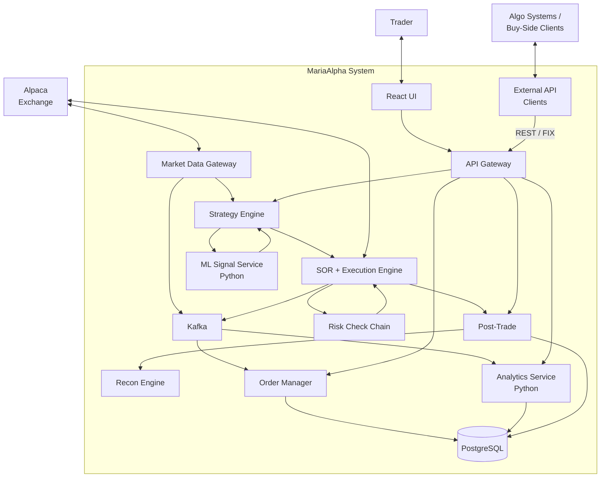
```mermaid
graph TB
    subgraph MariaAlpha System
        MDG[Market Data Gateway] --> SE[Strategy Engine]
        SE --> SOR[SOR + Execution Engine]
        SOR --> PT[Post-Trade]
        PT --> RE[Recon Engine]
        SE --> MLS[ML Signal Service<br/>Python]
        MLS --> SE
        SOR --> RC[Risk Check Chain]
        RC --> SOR
        MDG --> K[Kafka]
        SOR --> K
        K --> OM[Order Manager]
        K --> AN[Analytics Service<br/>Python]
        OM --> PG[(PostgreSQL)]
        AN --> PG
        PT --> PG
        UI[React UI] --> GW[API Gateway]
        EXT_API[External API<br/>Clients] -->|REST / FIX| GW
        GW --> SE
        GW --> OM
        GW --> AN
        GW --> PT
    end
    ALP[Alpaca<br/>Exchange] <--> MDG
    ALP <--> SOR
    TR[Trader] <--> UI
    ALGO[Algo Systems /<br/>Buy-Side Clients] <--> EXT_API
```

### 2.6 Key Sequence Diagrams

#### 2.6.1 Tick-to-Trade (Happy Path)

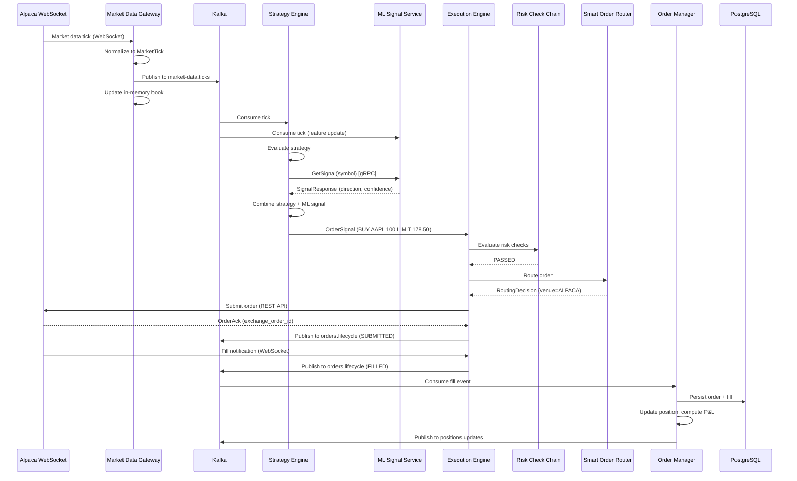
```mermaid
sequenceDiagram
    participant ALP as Alpaca WebSocket
    participant MDG as Market Data Gateway
    participant K as Kafka
    participant SE as Strategy Engine
    participant MLS as ML Signal Service
    participant EE as Execution Engine
    participant RC as Risk Check Chain
    participant SOR as Smart Order Router
    participant OM as Order Manager
    participant PG as PostgreSQL

    ALP->>MDG: Market data tick (WebSocket)
    MDG->>MDG: Normalize to MarketTick
    MDG->>K: Publish to market-data.ticks
    MDG->>MDG: Update in-memory book
    K->>SE: Consume tick
    K->>MLS: Consume tick (feature update)
    SE->>SE: Evaluate strategy
    SE->>MLS: GetSignal(symbol) [gRPC]
    MLS-->>SE: SignalResponse (direction, confidence)
    SE->>SE: Combine strategy + ML signal
    SE->>EE: OrderSignal (BUY AAPL 100 LIMIT 178.50)
    EE->>RC: Evaluate risk checks
    RC-->>EE: PASSED
    EE->>SOR: Route order
    SOR-->>EE: RoutingDecision (venue=ALPACA)
    EE->>ALP: Submit order (REST API)
    ALP-->>EE: OrderAck (exchange_order_id)
    EE->>K: Publish to orders.lifecycle (SUBMITTED)
    ALP->>EE: Fill notification (WebSocket)
    EE->>K: Publish to orders.lifecycle (FILLED)
    K->>OM: Consume fill event
    OM->>PG: Persist order + fill
    OM->>OM: Update position, compute P&L
    OM->>K: Publish to positions.updates
```

#### 2.6.2 RFQ Pricing Flow

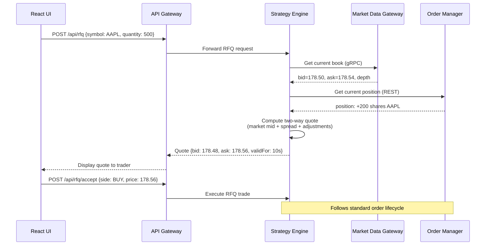
```mermaid
sequenceDiagram
    participant UI as React UI
    participant GW as API Gateway
    participant SE as Strategy Engine
    participant MDG as Market Data Gateway
    participant OM as Order Manager

    UI->>GW: POST /api/rfq {symbol: AAPL, quantity: 500}
    GW->>SE: Forward RFQ request
    SE->>MDG: Get current book (gRPC)
    MDG-->>SE: bid=178.50, ask=178.54, depth
    SE->>OM: Get current position (REST)
    OM-->>SE: position: +200 shares AAPL
    SE->>SE: Compute two-way quote<br/>(market mid + spread + adjustments)
    SE-->>GW: Quote {bid: 178.48, ask: 178.56, validFor: 10s}
    GW-->>UI: Display quote to trader
    UI->>GW: POST /api/rfq/accept {side: BUY, price: 178.56}
    GW->>SE: Execute RFQ trade
    Note over SE,OM: Follows standard order lifecycle
```

#### 2.6.3 End-of-Day Reconciliation

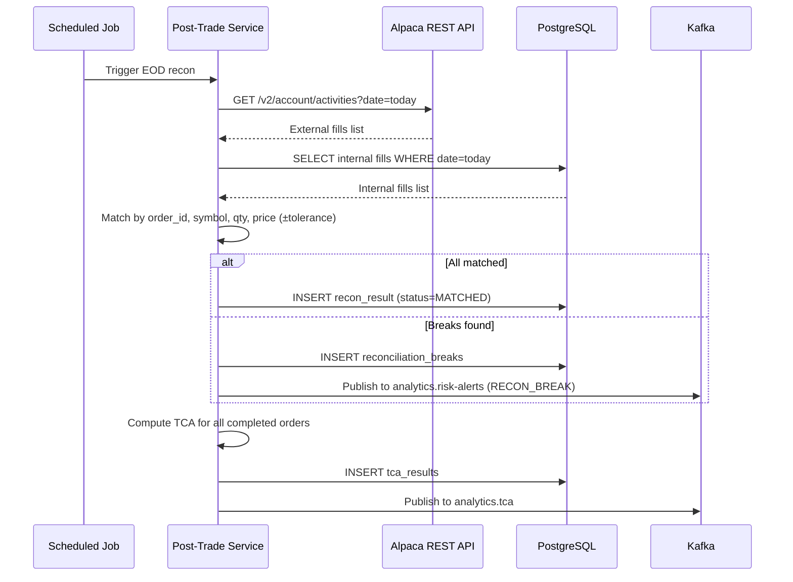
```mermaid
sequenceDiagram
    participant CRON as Scheduled Job
    participant PT as Post-Trade Service
    participant ALP as Alpaca REST API
    participant PG as PostgreSQL
    participant K as Kafka

    CRON->>PT: Trigger EOD recon
    PT->>ALP: GET /v2/account/activities?date=today
    ALP-->>PT: External fills list
    PT->>PG: SELECT internal fills WHERE date=today
    PG-->>PT: Internal fills list
    PT->>PT: Match by order_id, symbol, qty, price (±tolerance)
    alt All matched
        PT->>PG: INSERT recon_result (status=MATCHED)
    else Breaks found
        PT->>PG: INSERT reconciliation_breaks
        PT->>K: Publish to analytics.risk-alerts (RECON_BREAK)
    end
    PT->>PT: Compute TCA for all completed orders
    PT->>PG: INSERT tca_results
    PT->>K: Publish to analytics.tca
```

#### 2.6.4 Programmatic Algo Execution (External API Client)

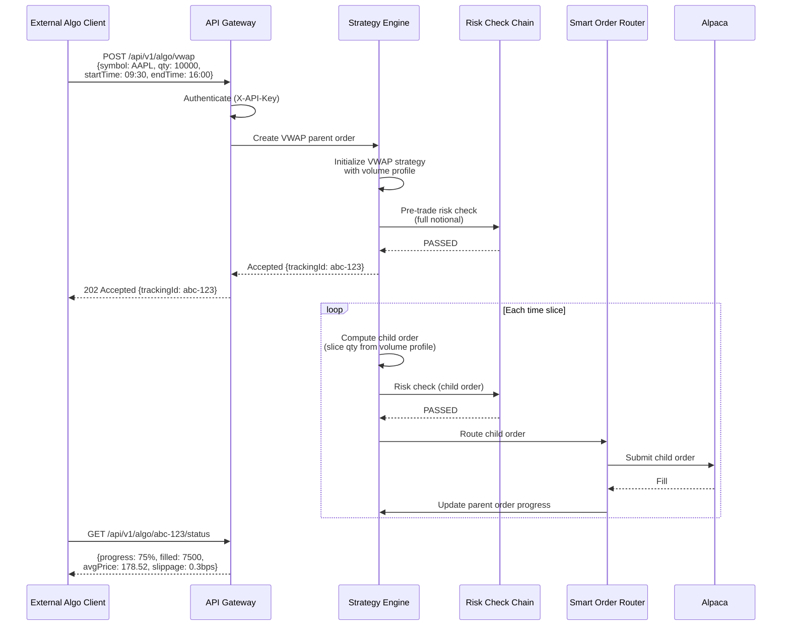
```mermaid
sequenceDiagram
    participant CLIENT as External Algo Client
    participant GW as API Gateway
    participant SE as Strategy Engine
    participant RC as Risk Check Chain
    participant SOR as Smart Order Router
    participant ALP as Alpaca

    CLIENT->>GW: POST /api/v1/algo/vwap<br/>{symbol: AAPL, qty: 10000,<br/>startTime: 09:30, endTime: 16:00}
    GW->>GW: Authenticate (X-API-Key)
    GW->>SE: Create VWAP parent order
    SE->>SE: Initialize VWAP strategy<br/>with volume profile
    SE->>RC: Pre-trade risk check<br/>(full notional)
    RC-->>SE: PASSED
    SE-->>GW: Accepted {trackingId: abc-123}
    GW-->>CLIENT: 202 Accepted {trackingId: abc-123}
    
    loop Each time slice
        SE->>SE: Compute child order<br/>(slice qty from volume profile)
        SE->>RC: Risk check (child order)
        RC-->>SE: PASSED
        SE->>SOR: Route child order
        SOR->>ALP: Submit child order
        ALP-->>SOR: Fill
        SOR->>SE: Update parent order progress
    end

    CLIENT->>GW: GET /api/v1/algo/abc-123/status
    GW-->>CLIENT: {progress: 75%, filled: 7500,<br/>avgPrice: 178.52, slippage: 0.3bps}
```

---

## 3. Functional Requirements

### 3.1 Market Data Gateway

| ID | Requirement |
| --- | --- |
| FR-1 | The system SHALL connect to Alpaca's real-time WebSocket API (`wss://stream.data.alpaca.markets`) and subscribe to trade and quote updates for a configurable list of symbols. |
| FR-2 | The system SHALL accept a list of symbols via a configuration file (`config/symbols.yml`) that defines which instruments to subscribe to. |
| FR-3 | The system SHALL normalize incoming Alpaca market data (trades, quotes, bars) into a unified internal `MarketTick` event schema and publish each tick to the `market-data.ticks` Kafka topic. |
| FR-4 | The system SHALL maintain a real-time in-memory order book (best bid/ask, last trade price, cumulative volume) per subscribed symbol, accessible by other services via a gRPC streaming API. |
| FR-5 | The system SHALL fetch historical daily bars from Alpaca's REST API (`/v2/stocks/{symbol}/bars`) for strategy warm-up and feature computation, storing results in PostgreSQL. |
| FR-6 | The system SHALL support a simulated market data adapter that replays historical data from CSV files at configurable speed, enabling deterministic testing without external API dependencies. |

### 3.2 Strategy Engine

| ID | Requirement |
| --- | --- |
| FR-7 | The system SHALL provide a pluggable `TradingStrategy` interface that accepts market data events and produces order signals (buy/sell/hold with target quantity and urgency). New strategy implementations SHALL be registrable at runtime via a `StrategyRegistry` without modifying existing code — adding a new algorithm requires only implementing the interface and registering it. |
| FR-8 | The system SHALL implement a VWAP execution algorithm that slices a parent order across the trading day proportional to a historical volume profile, targeting the day's volume-weighted average price. |
| FR-9 | The system SHALL implement a TWAP execution algorithm that distributes a parent order evenly across configurable fixed time intervals. |
| FR-10 | The system SHALL implement a Momentum/Trend-following strategy that generates entry/exit signals based on configurable moving average crossovers (e.g., 20-period / 50-period EMA cross), RSI thresholds, and volume confirmation. |
| FR-10a | The system SHALL implement a Percentage-of-Volume (POV) execution algorithm that participates as a configurable fraction of the real-time traded volume on the tape (TRADE ticks only; quotes excluded), with per-clip minimum/maximum size guards and an end-of-window MARKET sweep for any unexecuted remainder. |
| FR-10b | The system SHALL implement a Close execution algorithm that benchmarks against the closing-auction print: a configurable fraction of the parent is worked as equal-duration LIMIT slices through a pre-close window `[windowStart, mocCutoff)`, and the remainder fires as a single MARKET (Market-on-Close equivalent) child at `mocCutoff = closeTime − mocOffsetMinutes`. The algorithm SHALL handle the degenerate cases (zero pre-close fraction ⇒ pure MOC; full fraction ⇒ no MOC clip) and SHALL include a defensive post-close sweep for late-binding scenarios. |
| FR-11 | The system SHALL allow runtime selection of the active strategy per symbol via the REST API and UI, without requiring a restart. |
| FR-12 | The system SHALL consume real-time ML signals from the Signal Service via gRPC and incorporate them as an additional input to strategy decisions (e.g., adjusting urgency, confirming/vetoing signals). |

### 3.3 ML Signal Service (Python)

| ID | Requirement |
| --- | --- |
| FR-13 | The ML Signal Service SHALL consume market data ticks from Kafka (`market-data.ticks`), compute features (EMA, RSI, MACD, volume ratios, ATR, volatility measures), and maintain a rolling feature window per symbol. |
| FR-14 | The Signal Service SHALL expose a gRPC endpoint (`GetSignal(symbol)`) that returns the current signal prediction: direction (LONG/SHORT/NEUTRAL), confidence score (0.0–1.0), and recommended position size as a fraction of available capital. The Signal Service SHALL also expose `StreamSignals` for push-based signal delivery to the Strategy Engine. |
| FR-15 | The Signal Service SHALL implement a gradient-boosted tree model (LightGBM) trained on historical features to predict short-term price direction (next 5-minute return sign). |
| FR-16 | The Signal Service SHALL implement a market regime classifier (Random Forest) that categorizes the current market state (TRENDING_UP, TRENDING_DOWN, MEAN_REVERTING, HIGH_VOLATILITY, LOW_VOLATILITY) based on rolling statistical features, and expose it via a gRPC endpoint (`GetRegime(symbol)`). |
| FR-17 | The Strategy Engine SHALL use the regime classification to select the most appropriate execution algorithm: Momentum for TRENDING regimes, VWAP/TWAP for MEAN_REVERTING or LOW_VOLATILITY regimes. |
| FR-18 | The Signal Service SHALL support model reloading without downtime via a `POST /v1/models/reload` REST endpoint, allowing hot-swapping of model artifacts. |

### 3.4 Execution Engine

| ID | Requirement |
| --- | --- |
| FR-19 | The Execution Engine SHALL accept order signals from the Strategy Engine and submit them to the configured exchange adapter (Alpaca or simulated). |
| FR-20 | The system SHALL implement an Alpaca exchange adapter using Alpaca's REST API (`POST /v2/orders`) for order submission and the WebSocket trade updates stream for fill notifications. |
| FR-21 | The system SHALL implement a simulated exchange adapter with a basic price-time priority matching engine that fills orders against the current market data, simulating realistic latency and partial fills. |
| FR-22 | The Execution Engine SHALL support order types MARKET, LIMIT, STOP, IOC, FOK, GTC, and Iceberg. Order type handling SHALL be implemented via an `OrderTypeHandler` interface with a registry, so that additional types (e.g. Pegged) can be added by implementing the interface and registering the handler — without modifying existing order processing logic. Iceberg is implemented via a dedicated `IcebergCoordinator` (sibling of the handler registry) that slices a parent into LIMIT children, rather than as a stateless handler. |
| FR-23 | The Execution Engine SHALL maintain the full order lifecycle state machine: NEW → SUBMITTED → PARTIALLY_FILLED → FILLED / CANCELLED / REJECTED, with all state transitions published to the `orders.lifecycle` Kafka topic. |
| FR-24 | The Execution Engine SHALL enforce pre-trade risk checks before submitting any order via a composable `RiskCheck` chain. MVP checks include: maximum order notional value, maximum position size per symbol, and maximum total portfolio exposure. The chain is configured via `config/risk-limits.yml` and designed so that additional checks (sector exposure limits, beta limits, intraday VaR, ADV-relative sizing) can be added by implementing the `RiskCheck` interface and appending to the chain — without modifying existing checks. |

### 3.5 Order Manager and Position Tracking

| ID | Requirement |
| --- | --- |
| FR-25 | The Order Manager SHALL persist all orders and fills to PostgreSQL with full audit trail (timestamps, state transitions, fill prices and quantities). |
| FR-26 | The system SHALL maintain a real-time position book that updates on every fill event, tracking per-symbol: net quantity, average entry price, realized P&L, and unrealized P&L (mark-to-market against latest tick). |
| FR-27 | The system SHALL compute portfolio-level aggregates in real time: total P&L, total exposure (gross and net), number of open positions, and cash balance. |
| FR-28 | The system SHALL publish position and P&L updates to the `positions.updates` Kafka topic for consumption by the UI and analytics services. |

### 3.6 Post-Trade and Reconciliation

| ID | Requirement |
| --- | --- |
| FR-29 | The Post-Trade Service SHALL run an end-of-day reconciliation process that compares internal order/fill records against Alpaca's account activity API (`GET /v2/account/activities`). |
| FR-30 | The reconciliation process SHALL flag discrepancies (missing fills, price mismatches, quantity mismatches) and persist them to a `reconciliation_breaks` table in PostgreSQL. |
| FR-31 | The system SHALL compute transaction cost analysis (TCA) for every completed order, measuring: slippage (fill price vs. arrival price), implementation shortfall, VWAP benchmark comparison, and spread cost. |
| FR-32 | TCA results SHALL be published to the `analytics.tca` Kafka topic and persisted to PostgreSQL for historical analysis. |

### 3.7 Analytics Service (Python)

| ID | Requirement |
| --- | --- |
| FR-33 | The Analytics Service SHALL consume events from `orders.lifecycle`, `positions.updates`, and `analytics.tca` Kafka topics and compute aggregate analytics. |
| FR-34 | The Analytics Service SHALL compute and expose via REST API: daily P&L time series, cumulative return curve, Sharpe ratio (rolling and cumulative), maximum drawdown, win rate (percentage of profitable trades), and average trade duration. |
| FR-35 | The Analytics Service SHALL compute per-strategy performance breakdowns, allowing comparison of algorithm effectiveness. |
| FR-36 | The Analytics Service SHALL detect portfolio risk anomalies: concentration risk (single position exceeding configurable threshold of total portfolio value), unusually large drawdowns (exceeding 2× rolling standard deviation), and abnormal trading volume patterns. Risk alerts SHALL be published to the `analytics.risk-alerts` Kafka topic. |

### 3.8 React UI

| ID | Requirement |
| --- | --- |
| FR-37 | The UI SHALL display a live portfolio dashboard showing: all open positions with real-time P&L, total portfolio value, daily P&L, gross/net exposure, and cash balance. Updates SHALL reflect within 1 second of a position change. |
| FR-38 | The UI SHALL display a live market data panel showing real-time bid/ask/last price and volume for subscribed symbols, powered by WebSocket streaming from the API Gateway. |
| FR-39 | The UI SHALL provide an order entry form allowing the user to manually submit orders (symbol, side, quantity, order type, limit price) and view the order's lifecycle status in real time. |
| FR-40 | The UI SHALL provide an RFQ panel where the user can request a two-way quote (bid and ask) for a given symbol and quantity. The pricing engine SHALL compute quotes using current market data (bid/ask, depth) and configurable spread parameters in the MVP. The pricing model is designed to be extended with inventory-aware adjustments, volatility-adjusted spreads, order-size-relative-to-ADV scaling, and client tiering in later iterations. |
| FR-41 | The UI SHALL display a strategy control panel allowing the user to: view active strategies per symbol, switch strategies at runtime, and see the current ML signal and regime classification for each symbol. |
| FR-42 | The UI SHALL display a TCA and analytics dashboard showing: execution quality metrics per order, aggregate strategy performance charts, daily P&L chart, and risk alert notifications. |
| FR-43 | The UI SHALL display a reconciliation panel showing the latest reconciliation run results: matched trades, breaks, and break resolution status. |

### 3.9 API Gateway

| ID | Requirement |
| --- | --- |
| FR-44 | The API Gateway SHALL expose a unified REST API for the UI and external consumers, proxying requests to the appropriate backend services (Strategy Engine, Order Manager, Analytics). |
| FR-45 | The API Gateway SHALL expose WebSocket endpoints for real-time streaming of: market data ticks, position updates, order lifecycle events, and risk alerts. |
| FR-46 | Each backend service SHALL expose `GET /health` and `GET /ready` endpoints returning `{"status": "healthy"}` with HTTP 200 when the service and its dependencies are operational. |

---

## 4. Non-Functional Requirements

### 4.1 Performance

| ID | Requirement |
| --- | --- |
| NFR-1 | Tick-to-signal latency (market data received → ML signal available via gRPC) SHALL be below 50ms at p99. |
| NFR-2 | Tick-to-order latency (market data received → order submitted to exchange adapter) SHALL be below 100ms at p99 for algorithmic orders. |
| NFR-3 | Market data normalization and Kafka publishing SHALL sustain at least 10,000 ticks per second on a single Market Data Gateway instance. |
| NFR-4 | Position and P&L recalculation SHALL complete within 10ms per fill event. |
| NFR-5 | UI dashboard updates SHALL reflect position changes within 1 second (end-to-end from fill to screen). |

> **Note:** NFR-1 through NFR-5 are design targets for the intended deployment profile (developer workstation, ≥16 GB RAM, SSD). Benchmark measurements are not in this table yet; the work to produce them across local, OrbStack-Kubernetes, and OCI Ampere A1 cloud surfaces is tracked by [#5.1.3](https://github.com/drag0sd0g/MariaAlpha/issues/178). Once that issue lands, this footnote will be replaced with the actual p50 / p95 / p99 numbers and any required revisions to the targets above.

### 4.2 Capacity

| ID | Requirement |
| --- | --- |
| NFR-6 | The system SHALL support simultaneous subscription to at least 100 symbols with real-time market data. |
| NFR-7 | The system SHALL support up to 10,000 active orders and 100,000 historical orders in PostgreSQL without performance degradation. |
| NFR-8 | The system SHALL retain at least 90 days of tick history, order history, and analytics data. |

### 4.3 Code Quality and Testing

| ID | Requirement |
| --- | --- |
| NFR-9 | All Java code SHALL pass Checkstyle, SpotBugs, and Spotless (Google Java Format) analysis with zero errors. |
| NFR-10 | All Python code SHALL pass `ruff` linting and `mypy` type checking with zero errors. |
| NFR-11 | Each Java service SHALL have unit tests with at least 80% line coverage, measured by JaCoCo. |
| NFR-12 | Each Python service SHALL have unit tests with at least 80% line coverage, measured by `pytest-cov`. |
| NFR-13 | Integration tests SHALL use Testcontainers to spin up real Kafka, PostgreSQL, and Redis instances — no mocked infrastructure dependencies for integration-level tests. |
| NFR-14 | The project SHALL include end-to-end tests using the simulated exchange adapter to validate the full trading pipeline without external dependencies. |
| NFR-15 | The CI pipeline SHALL include mutation testing (PITest for Java, mutmut for Python) to validate test suite effectiveness. |

### 4.4 API Documentation

| ID | Requirement |
| --- | --- |
| NFR-16 | ALL REST APIs SHALL be documented with OpenAPI 3.0 specifications, auto-generated from code annotations (springdoc-openapi for Java, FastAPI's built-in OpenAPI for Python). |
| NFR-17 | Each service's OpenAPI spec SHALL be accessible at `/v3/api-docs` (Java) or `/openapi.json` (Python) and rendered via Swagger UI at `/swagger-ui`. |

### 4.5 Developer Experience

| ID | Requirement |
| --- | --- |
| NFR-18 | The entire stack SHALL be runnable locally with a single `just run` command (using Docker Compose). |
| NFR-19 | The project SHALL include a comprehensive `README.md` with quickstart instructions, architecture overview, and configuration guide. |

---

## 5. Main Proposal

### 5.1 High-Level Architecture

The system is **microservice-based with a shared PostgreSQL database** — a pragmatic choice for a single-team product that avoids the operational overhead of per-service databases (distributed transactions, eventual consistency, cross-service JOIN complexity) while maintaining service independence through Kafka-based event communication. Redis serves as a **cache layer** for the hot path (sub-millisecond position lookups, shared order book state), not as a replacement for PostgreSQL. PostgreSQL remains the single system of record for all durable state. The hot path (in-memory order book, current positions, latest ML features) is held in-process within each service for low latency, with Redis providing cross-service cache coherence where it's needed (notably for pre-trade risk checks).

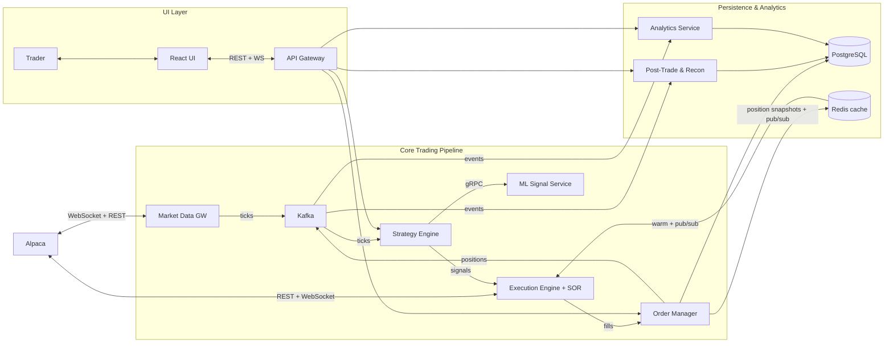
```mermaid
graph LR
    ALP[Alpaca] <-->|WebSocket + REST| MDG
    ALP <-->|REST + WebSocket| EE

    subgraph Core Trading Pipeline
        MDG[Market Data GW] -->|ticks| K[Kafka]
        K -->|ticks| SE[Strategy Engine]
        SE -->|gRPC| MLS[ML Signal Service]
        SE -->|signals| EE[Execution Engine + SOR]
        EE -->|fills| OM[Order Manager]
        OM -->|positions| K
    end

    subgraph Persistence & Analytics
        K -->|events| PT[Post-Trade & Recon]
        K -->|events| AN[Analytics Service]
        OM --> PG[(PostgreSQL)]
        OM -->|position snapshots + pub/sub| RD[(Redis cache)]
        RD -->|warm + pub/sub| EE
        PT --> PG
        AN --> PG
    end

    subgraph UI Layer
        TR[Trader] <--> UI[React UI]
        UI <-->|REST + WS| GW[API Gateway]
        GW --> SE & OM & AN & PT
    end
```

### 5.2 Service Descriptions

#### 5.2.1 Market Data Gateway

| Property | Value |
| --- | --- |
| **Language** | Java 21 |
| **Framework** | Spring Boot 3 with Spring WebFlux (reactive) |
| **Role** | Connects to Alpaca WebSocket/REST APIs, normalizes market data, publishes ticks to Kafka, and serves real-time data via gRPC |

**Unified MarketTick Schema (Kafka `market-data.ticks`):**

```json
{
  "symbol": "AAPL",
  "timestamp": "2026-03-24T14:30:00.123Z",
  "eventType": "TRADE",
  "price": 178.52,
  "size": 100,
  "bidPrice": 178.50,
  "askPrice": 178.54,
  "bidSize": 200,
  "askSize": 150,
  "cumulativeVolume": 12345678,
  "source": "ALPACA"
}
```

**Adapter Interface:**

```java
public interface MarketDataAdapter {
    void connect(List<String> symbols);
    void disconnect();
    Flux<MarketTick> streamTicks();
    List<HistoricalBar> getHistoricalBars(String symbol, LocalDate from,
                                          LocalDate to, BarTimeframe timeframe);
}
```

Two implementations: `AlpacaMarketDataAdapter` (production) and `SimulatedMarketDataAdapter` (testing — replays CSVs).

#### 5.2.2 Strategy Engine

| Property | Value |
| --- | --- |
| **Language** | Java 21 |
| **Framework** | Spring Boot 3 |
| **Role** | Consumes market data, applies trading strategies, and produces order signals |

**Strategy Interface:**

```java
public interface TradingStrategy {
    String name();
    void onTick(MarketTick tick);
    Optional<OrderSignal> evaluate(String symbol);
    Map<String, Object> getParameters();
    void updateParameters(Map<String, Object> params);
}
```

**Strategy Implementations:**

| Strategy | Key Parameters | Entry Condition | Exit Condition |
| --- | --- | --- | --- |
| VWAP | `targetQuantity`, `startTime`, `endTime`, `volumeProfile` | Slices parent order across time bins proportional to historical volume curve | Target quantity fully executed or end time reached |
| TWAP | `targetQuantity`, `startTime`, `endTime`, `numSlices` | Distributes equal child orders across evenly spaced intervals | Target quantity fully executed or end time reached |
| Momentum | `fastPeriod` (20), `slowPeriod` (50), `rsiPeriod` (14), `rsiOverbought` (70), `rsiOversold` (30), `volumeMultiplier` (1.5), `tradeQuantity`, `side`, `stopLossPct` (2.0) | Fast EMA crosses above slow EMA AND RSI not overbought AND volume > 1.5× average | Fast EMA crosses below slow EMA OR RSI reaches overbought OR stop-loss hit |
| Implementation Shortfall (IS) | `targetQuantity`, `startTime`, `endTime`, `numSlices`, `urgency` (κ, default 0.5) | Front-loads child orders across equal time slices along the Almgren–Chriss optimal trajectory; `urgency=0` degrades to TWAP | Target quantity fully executed or end time reached |
| POV | `targetQuantity`, `startTime`, `endTime`, `participationRate` (default 10%), `minClipSize`, `maxClipSize` | Reactive: tracks cumulative traded volume from TRADE ticks and emits LIMIT child orders sized so total emitted ≈ `participationRate × volume`. Quotes do not contribute volume. | Target quantity fully executed or end time reached — any remainder is swept with a MARKET order at the deadline |
| Close | `targetQuantity`, `windowStart`, `closeTime`, `mocOffsetMinutes` (default 5), `preCloseFraction` (default 0.30), `numPreCloseSlices` (default 6) | Working-into-the-close: distributes a `preCloseFraction` share of the parent as equal-duration LIMIT slices across `[windowStart, mocCutoff)`, then fires the remainder as a single MARKET (MOC-equivalent) child at `mocCutoff = closeTime − mocOffsetMinutes`. `preCloseFraction = 0` ≡ pure MOC; `preCloseFraction = 1` ≡ TWAP-into-close with no MOC clip. | MOC fires at the cutoff (sweeping skipped slices); a defensive sweep handles late binding after `closeTime` |

**Signal integration:** if the ML signal confidence > 0.7 and agrees with the strategy direction, proceed. If > 0.7 and contradicts, suppress. If ≤ 0.7, proceed with strategy signal alone. Configurable via `config/strategy.yml`.

**Options pricing module (roadmap 3.2.1 / 3.2.2 — delivered):** Black-Scholes-Merton fair value plus the five first-order Greeks (Δ, Γ, vega, θ, ρ) for a European option on a single underlying with a continuous dividend yield. Exposed under `/api/options/{price,greeks,implied-volatility}`; the implied-volatility endpoint inverts a market premium back to σ via Newton-Raphson with a bisection fallback. The module is stateless, lives alongside the equity strategies in `strategy-engine`, and does **not** implement `TradingStrategy` (it answers "what is this contract worth right now?", not "how do I work a parent over time?"). Full design is in [`strategies/options-pricing.md`](strategies/options-pricing.md).

#### 5.2.3 ML Signal Service

| Property | Value |
| --- | --- |
| **Language** | Python 3.12 |
| **Framework** | gRPC server (grpcio) + FastAPI sidecar (health/metrics/model reload) |
| **Role** | Computes features from market data, generates directional signals and regime classifications |

**gRPC Service Definition (`signal.proto`):**

```protobuf
syntax = "proto3";
package mariaalpha.signal;

service SignalService {
  rpc GetSignal(SignalRequest) returns (SignalResponse);
  rpc GetRegime(RegimeRequest) returns (RegimeResponse);
  rpc StreamSignals(SignalStreamRequest) returns (stream SignalResponse);
}

enum Direction { NEUTRAL = 0; LONG = 1; SHORT = 2; }
enum MarketRegime {
  UNKNOWN = 0; TRENDING_UP = 1; TRENDING_DOWN = 2;
  MEAN_REVERTING = 3; HIGH_VOLATILITY = 4; LOW_VOLATILITY = 5;
}
```

**ML Models:**

| Model | Library | Input | Output | Training Data |
| --- | --- | --- | --- | --- |
| Signal | LightGBM (gradient-boosted trees) | 15 rolling features (EMA, RSI, MACD, volume ratios, ATR, realized vol) | Direction + confidence | Historical 1-min bars, label = sign of next-5-min return |
| Regime | scikit-learn (Random Forest) | 8 statistical features (trend strength, volatility ratio, mean-reversion score) | MarketRegime + confidence | Historical daily bars, hand-labeled regimes |

Pre-trained model artifacts stored as `.joblib` files in `ml-models/`, loaded at startup. Hot-reloading via `POST /v1/models/reload`.

#### 5.2.4 Execution Engine

| Property | Value |
| --- | --- |
| **Language** | Java 21 |
| **Framework** | Spring Boot 3 |
| **Role** | Receives order signals, applies pre-trade risk checks, routes via SOR, submits orders to exchange, and processes fill events |

**Order Lifecycle State Machine:**

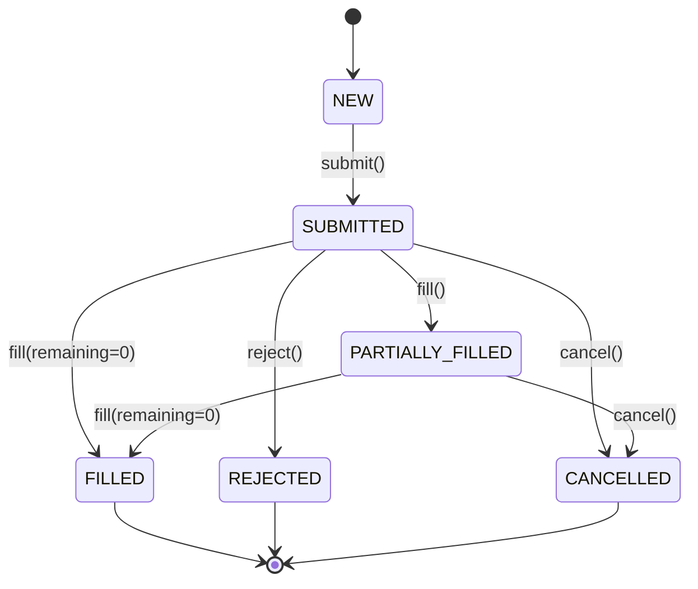
```mermaid
stateDiagram-v2
    [*] --> NEW
    NEW --> SUBMITTED : submit()
    SUBMITTED --> PARTIALLY_FILLED : fill()
    SUBMITTED --> FILLED : fill(remaining=0)
    SUBMITTED --> REJECTED : reject()
    SUBMITTED --> CANCELLED : cancel()
    PARTIALLY_FILLED --> FILLED : fill(remaining=0)
    PARTIALLY_FILLED --> CANCELLED : cancel()
    FILLED --> [*]
    REJECTED --> [*]
    CANCELLED --> [*]
```

**Exchange Adapter Interface:**

```java
public interface ExchangeAdapter {
    OrderAck submitOrder(Order order);
    OrderAck cancelOrder(String orderId);
    OrderStatus getOrderStatus(String orderId);
    Flux<ExecutionReport> streamExecutionReports();
    List<AccountActivity> getAccountActivities(LocalDate date);
}
```

#### 5.2.5 Order Manager

| Property | Value |
| --- | --- |
| **Language** | Java 21 |
| **Framework** | Spring Boot 3 with Spring Data JPA |
| **Role** | Persists orders and fills, maintains position book, computes real-time P&L |

**Position Calculation:** On every fill: (1) adjust quantity and weighted avg entry price, (2) compute realized P&L on position-reducing fills, (3) mark-to-market open positions against latest tick, (4) publish updated snapshot to `positions.updates` (Kafka, authoritative async path) and to the **Redis position cache** (key `mariaalpha:position:<symbol>` with a 24 h TTL, plus a pub/sub event on `mariaalpha.positions.updates` so subscribers can refresh without polling). Redis is a pure cache — PostgreSQL remains the system of record and Kafka is the durable event log; cache failures degrade gracefully (warn + continue) so a Redis outage never blocks fill processing.

#### 5.2.6 Post-Trade and Reconciliation Engine

| Property | Value |
| --- | --- |
| **Language** | Java 21 |
| **Framework** | Spring Boot 3 with Spring Batch |
| **Role** | End-of-day reconciliation, TCA computation, post-trade reports |

**TCA Metrics Per Order:** slippage (bps), implementation shortfall (bps), VWAP benchmark (bps), spread cost (bps). See sequence diagram in §2.6.3 for reconciliation flow.

**EOD reconciliation engine:** A Spring `@Scheduled` cron (default `0 0 22 * * MON-FRI` in `America/New_York`) fires `EodReconciliationService.runForDate(...)` for the configured target date. The engine pulls internal fills from `order-manager` via `GET /api/orders/fills/by-date?date=...` and external activities from the venue via `GET /v2/account/activities?activity_types=FILL&date=...`. A pure `ReconciliationComparator` aggregates fills per order (keyed by exchange order id with a `client_order_id` fallback) and emits breaks of four types: `MISSING_FILL` (external-only), `EXTRA_FILL` (internal-only), `QUANTITY_MISMATCH` (|qty diff| > tolerance), and `PRICE_MISMATCH` (|relative diff| > priceToleranceBps). Severity scales with absolute notional (`HIGH` ≥ $10k, `CRITICAL` ≥ $100k) or, for price breaks, with the bps-diff magnitude relative to the configured tolerance. Each break is persisted to `reconciliation_breaks`, counted on `mariaalpha_recon_breaks_total{break_type,severity}`, and published as a `RECON_BREAK` event on `analytics.risk-alerts` — the same topic the api-gateway forwards over `/ws/alerts`. The run itself upserts one row in `reconciliation_runs` keyed by `recon_date` (§7.3 idempotency: re-running for the same date wipes prior breaks first). Manual triggers go through `POST /api/recon/run?date=YYYY-MM-DD`. Two modes are supported via `post-trade.recon.mode`: `EXTERNAL` (Alpaca HTTP) and `MIRROR` (echoes internal fills back as external for the simulated docker-compose stack — keeps the engine end-to-end exercisable without venue credentials).

#### 5.2.7 Analytics Service

| Property | Value |
| --- | --- |
| **Language** | Python 3.12 |
| **Framework** | FastAPI |
| **Role** | Consumes trade/position events from Kafka, computes aggregate analytics, exposes REST API |

Key endpoints: `/v1/analytics/pnl/daily`, `/v1/analytics/pnl/cumulative`, `/v1/analytics/performance`, `/v1/analytics/performance/{strategy}`, `/v1/analytics/tca/{orderId}`, `/v1/analytics/tca/summary`, `/v1/analytics/risk/alerts`, `/v1/analytics/pnl/attribution`, `/v1/analytics/flow/toxicity`, `/v1/analytics/axes`.

**Phase-2 sub-modules (delivered):**
- **Flow toxicity detector (2.2.4)** — listens to `analytics.tca` fills, looks up post-fill market-data at configurable horizons (default 60s/300s/1800s) via the `MarketDataCache`, computes signed markout in bps (positive = adverse selection), and publishes `FLOW_TOXICITY` events to `analytics.risk-alerts` when the rolling mean breaches `ANALYTICS_TOXICITY_THRESHOLD_BPS`. Snapshot endpoint: `GET /api/analytics/flow/toxicity?strategy=`.
- **PnL attribution (2.2.5)** — decomposes realised PnL per parent order into spread / market / commission / timing (placeholder) / residual using the Kissell-Glantz framework. State is kept in memory; `analytics.tca` replay rebuilds it after restart. Endpoints: `GET /api/analytics/pnl/attribution[?strategy=]`, `/{orderId}`, `/by-strategy/{strategy}`.
- **Axe matcher (2.2.6)** — in-memory axe book with TTL + refresh-based confidence; matches incoming `orders.lifecycle` SUBMITTED orders against opposite-side axes, ranking by confidence × remaining-size. Endpoints: `POST/GET /api/analytics/axes`, `DELETE /api/analytics/axes/{axeId}`, `GET /api/analytics/axes/matches/{orderId}`.

Exposed Prometheus metrics: `mariaalpha_analytics_toxicity_markout_bps`, `mariaalpha_analytics_toxicity_alerts_total`, `mariaalpha_analytics_pnl_attribution_usd`, `mariaalpha_analytics_axes_active`, `mariaalpha_analytics_axes_matches_total`. Scraped by Alloy at `analytics-service:8095/metrics`.

#### 5.2.8 API Gateway

| Property | Value |
| --- | --- |
| **Language** | Java 21 |
| **Framework** | Spring Cloud Gateway (reactive) |
| **Role** | Unified REST + WebSocket entry point for the React UI, programmatic consumers, and (roadmap) external electronic trading clients via REST API + FIX gateway |

Routes: `/api/market-data/**`, `/api/strategies/**`, `/api/orders/**`, `/api/analytics/**`, `/api/recon/**`, `/api/routing/**`. WebSocket endpoints: `/ws/market-data`, `/ws/positions`, `/ws/orders`, `/ws/alerts`.

#### 5.2.9 React UI

| Property | Value |
| --- | --- |
| **Language** | TypeScript |
| **Framework** | React 18 with Vite, TailwindCSS, Recharts |
| **Role** | SPA for live risk monitoring, order management, RFQ pricing, and analytics |

Pages: Dashboard, Market Data, Order Entry, RFQ, Strategy Control, Analytics, Reconciliation.

### 5.3 Extensibility Architecture

#### 5.3.1 Strategy Registry

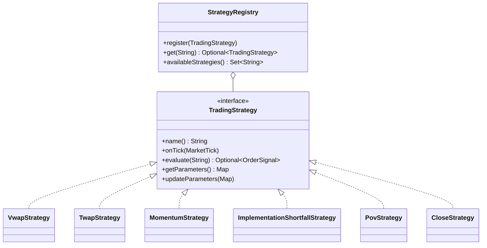
```mermaid
classDiagram
    class TradingStrategy {
        <<interface>>
        +name() String
        +onTick(MarketTick)
        +evaluate(String) Optional~OrderSignal~
        +getParameters() Map
        +updateParameters(Map)
    }
    class StrategyRegistry {
        +register(TradingStrategy)
        +get(String) Optional~TradingStrategy~
        +availableStrategies() Set~String~
    }
    TradingStrategy <|.. VwapStrategy
    TradingStrategy <|.. TwapStrategy
    TradingStrategy <|.. MomentumStrategy
    TradingStrategy <|.. ImplementationShortfallStrategy
    TradingStrategy <|.. PovStrategy
    TradingStrategy <|.. CloseStrategy
    StrategyRegistry o-- TradingStrategy
```

Implemented strategies: VWAP, TWAP, Momentum, Implementation Shortfall (front-loaded execution along an Almgren–Chriss trajectory; see [`strategies/implementation-shortfall.md`](strategies/implementation-shortfall.md)), POV (reactive participation as a fraction of traded volume; see [`strategies/pov.md`](strategies/pov.md)), and Close (working-into-the-close plus Market-on-Close child; see [`strategies/close.md`](strategies/close.md)). Candidate future algorithms: Mean Reversion, Statistical Arbitrage.

#### 5.3.2 Order Type Handler Registry

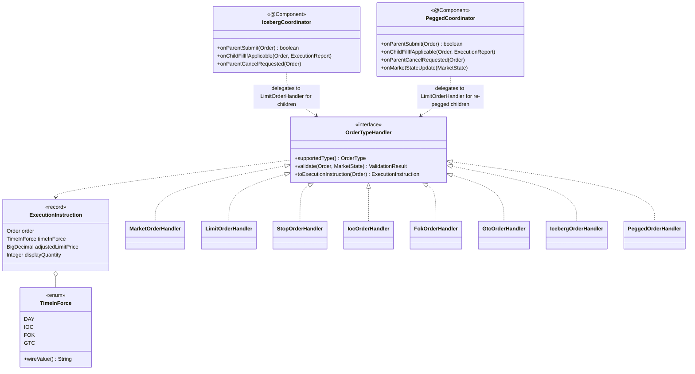
```mermaid
classDiagram
    class OrderTypeHandler {
        <<interface>>
        +supportedType() OrderType
        +validate(Order, MarketState) ValidationResult
        +toExecutionInstruction(Order) ExecutionInstruction
    }
    class ExecutionInstruction {
        <<record>>
        Order order
        TimeInForce timeInForce
        BigDecimal adjustedLimitPrice
        Integer displayQuantity
    }
    class TimeInForce {
        <<enum>>
        DAY
        IOC
        FOK
        GTC
        +wireValue() String
    }
    class IcebergCoordinator {
        <<@Component>>
        +onParentSubmit(Order) boolean
        +onChildFillIfApplicable(Order, ExecutionReport)
        +onParentCancelRequested(Order)
    }
    class PeggedCoordinator {
        <<@Component>>
        +onParentSubmit(Order) boolean
        +onChildFillIfApplicable(Order, ExecutionReport)
        +onParentCancelRequested(Order)
        +onMarketStateUpdate(MarketState)
    }
    OrderTypeHandler <|.. MarketOrderHandler
    OrderTypeHandler <|.. LimitOrderHandler
    OrderTypeHandler <|.. StopOrderHandler
    OrderTypeHandler <|.. IocOrderHandler
    OrderTypeHandler <|.. FokOrderHandler
    OrderTypeHandler <|.. GtcOrderHandler
    OrderTypeHandler <|.. IcebergOrderHandler
    OrderTypeHandler <|.. PeggedOrderHandler
    OrderTypeHandler ..> ExecutionInstruction
    ExecutionInstruction o-- TimeInForce
    IcebergCoordinator ..> OrderTypeHandler : delegates to LimitOrderHandler for children
    PeggedCoordinator ..> OrderTypeHandler : delegates to LimitOrderHandler for re-pegged children
```

All eight handlers are implemented: MARKET, LIMIT, STOP, IOC, FOK, GTC, Iceberg, and Pegged.

The `AlpacaOrderTypeMapper` collapses IOC/FOK/GTC into Alpaca's `type=limit` with the appropriate `time_in_force` wire value; ICEBERG and PEGGED never reach the Alpaca adapter directly because the `IcebergCoordinator` slices an iceberg into LIMIT children and the `PeggedCoordinator` fronts a peg with a single re-pegging LIMIT child — in both cases the children flow through the regular path.

The `IcebergCoordinator` is intentionally *not* an `OrderTypeHandler`. The handler interface returns a single `ExecutionInstruction` per call; iceberg parents need to issue many child orders over time, react to fills, and own their own state. The coordinator's `onParentSubmit` is invoked from `OrderExecutionService.processOrder` after validation + risk checks (before the normal venue dispatch); `onChildFillIfApplicable` is invoked from `onExecutionReport` after the regular fill processing. The coordinator's collaborators are `ParentChildOrderRegistry` (in-memory linkage + per-parent `IcebergProgress`), `IcebergSliceFactory` (constructs child LIMIT `Order` instances with `parentOrderId` set and `strategyName="ICEBERG-CHILD"`), and `IcebergMetrics`. A REST endpoint `GET /api/execution/orders/{parentId}/iceberg-progress` exposes live slice progress for the UI.

The `PeggedCoordinator` follows the same pattern but for a different runtime shape: a pegged parent always has at most one active LIMIT child, and the coordinator cancels-and-resubmits that child when the NBBO moves past `execution-engine.pegged.repeg-threshold-bps` (default 5 bps). It subscribes to `MarketStateTracker` at startup so each NBBO tick triggers a single recomputation per tracked parent. Three peg types ship — `MIDPOINT` (centre of the NBBO), `PRIMARY` (join-side: BUY→bid, SELL→ask), and `MARKET` (take-side: BUY→ask, SELL→bid) — combined with a signed `pegOffsetBps` (positive = toward fill) and an optional `priceCap` reusing the existing `limitPrice` field. The coordinator's collaborators are `PeggedRegistry` (parent ↔ active-child linkage + `PeggedProgress`), `PeggedPriceCalculator` (pure math), `PeggedChildFactory` (creates the LIMIT child), and `PeggedMetrics`. A REST endpoint `GET /api/execution/orders/{parentId}/pegged-progress` exposes total/filled/repegs/lastReference/lastSubmitted for the UI. Full design in [`strategies/pegged-orders.md`](strategies/pegged-orders.md).

#### 5.3.3 Composable Risk Check Chain

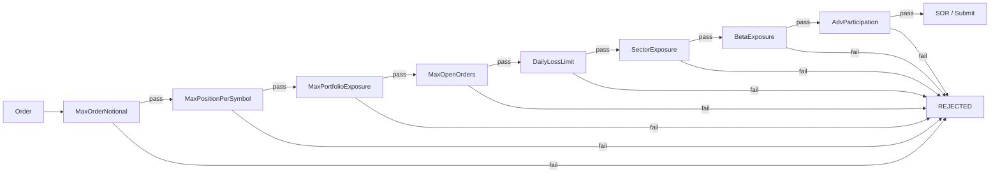
```mermaid
graph LR
    ORD[Order] --> R1[MaxOrderNotional]
    R1 -->|pass| R2[MaxPositionPerSymbol]
    R2 -->|pass| R3[MaxPortfolioExposure]
    R3 -->|pass| R4[MaxOpenOrders]
    R4 -->|pass| R5[DailyLossLimit]
    R5 -->|pass| R6[SectorExposure]
    R6 -->|pass| R7[BetaExposure]
    R7 -->|pass| R8[AdvParticipation]
    R8 -->|pass| SOR[SOR / Submit]
    R1 & R2 & R3 & R4 & R5 & R6 & R7 & R8 -->|fail| REJ[REJECTED]
```

Phase-2 additions (all landed):

- **`SectorExposureCheck`** — aggregates the absolute notional of every open position by sector, projects the incoming order onto its sector, rejects when the projection exceeds the configured ceiling. Per-sector ceilings live under `execution-engine.risk.sector-exposure-limits.<SECTOR>` with a global fallback (`default-sector-exposure-limit`). Sector classification is provided by `SymbolReferenceData`; symbols missing reference data land in a synthetic `UNKNOWN` sector that uses the fallback.
- **`BetaExposureCheck`** — caps |Σ position_notional × beta| in dollars. Catches the case where MaxPortfolioExposure passes (gross $ is fine) but the underlying mix has drifted into a high-beta concentration that would amplify a market drawdown. Self-disables when `max-absolute-beta-weighted-exposure ≤ 0`.
- **`AdvParticipationCheck`** — rejects parents whose share count exceeds `max-adv-participation × ADV(symbol)`. Runs against the **parent** quantity, not the first slice, so oversized parents are caught regardless of how they'd be chopped. Refuses any order on a symbol with missing reference data (the conservative default ADV of 0).

`SymbolReferenceData` owns sector / beta / ADV lookup. Reference rows live under `execution-engine.risk.reference-data.symbols[]` in `application.yml` for the MVP simulator universe; production deployments would back this with a periodic vendor refresh (Bloomberg FLDS, Refinitiv RDP, etc.). Unmapped symbols fall through to `defaults` (sector=UNKNOWN, β=1.0, ADV=0).

Roadmap checks: Intraday VaR (issue 3.5.1), Correlated Positions (issue 3.5.2).

#### 5.3.4 Exchange Adapter SPI

Both `MarketDataAdapter` and `ExchangeAdapter` are pluggable via Spring profiles (`spring.profiles.active: alpaca | simulated | ibkr`). Each adapter implementation is annotated with `@Profile("simulated")` / `@Profile("alpaca")` etc., and profile-specific configuration is externalized via `@ConfigurationProperties` records and corresponding `application-{profile}.yml` files (e.g., `application-simulated.yml` defines `market-data.simulated.csv-path` and `market-data.simulated.speed-multiplier`). Adding a new exchange requires implementing two interfaces — no changes to upstream services.

#### 5.3.5 Smart Order Router

`SmartOrderRouter` is a single-method interface (`route(Order) → RoutingDecision`) called between
the risk-check chain and the exchange adapter. Two implementations ship today, selected by
`execution-engine.sor.mode`:

- **`DirectRouter`** (`mode=direct`) — pass-through to the configured exchange adapter. Phase-1
  fallback retained for one-flag rollback.
- **`ScoredSmartOrderRouter`** (`mode=scored`, default) — weighted multi-criteria scoring across
  configured venues. Five `VenueScoreCriterion` beans (PriceImprovement, Liquidity, Latency, Fees,
  InformationLeakage) each return a score in [0,1]; the weighted sum picks one venue per order.
  Each decision is persisted to Kafka topic `routing.decisions` with the full per-venue breakdown
  and the market snapshot used. The router exposes `/api/routing/{venues,score,decisions/{orderId}}`
  endpoints documented via springdoc.

Three venue types are modelled (`LIT`, `DARK`, `INTERNAL`). A `VenueAdapterRegistry` submits each
routed child order to the right adapter — the simulated profile ships a LIT venue (`SIMULATED` or
`ALPACA`), a simulated dark venue, and an internal venue backed by the real midpoint crossing
engine described below. ML-based adaptive scoring is on the roadmap (issue 4.8.1).

#### 5.3.7 Internal Crossing Engine

`InternalCrossingEngine` is the in-process matching engine behind the `INTERNAL_CROSS` venue. It
maintains a per-symbol, side-keyed FIFO book of resting orders and crosses offsetting BUY/SELL
interest **at the NBBO midpoint**, capturing the bid-ask spread without market impact.

Key properties:

- **Midpoint pricing** — all crosses execute at `(bid + ask) / 2` of the current NBBO snapshot
  taken from `MarketStateTracker`. LIT/DARK adapters pay the bid or lift the ask; INTERNAL_CROSS
  pockets the difference and attributes it to spread capture.
- **Limit-price gating** — LIMIT/IOC/FOK/GTC orders only cross when their limit straddles the
  midpoint (BUY: `midpoint ≤ limit`; SELL: `midpoint ≥ limit`). MARKET orders accept any midpoint.
- **Price-time priority** — degenerates to time priority because all crosses share the NBBO
  midpoint; resting orders are matched in arrival order.
- **Partial fills** — a 100-share aggressing BUY against a 30-share resting SELL emits one 30-share
  cross and leaves the BUY's 70-share remainder resting.
- **Sweep on NBBO update** — `sweep()` is invoked from the adapter's scheduler (`tickIntervalMs`)
  so previously price-blocked orders cross when the midpoint shifts into their acceptable range.
- **Simulated liquidity** — the legacy `cross-probability-on-submit` and
  `match-probability-per-tick` knobs from 2.1.2 are repurposed as a synthetic-counterparty
  injection rate, kept so the simulator still produces crosses when only one strategy is feeding
  the venue. Real matching is always tried first; synthetic counterparties are conjured only when
  the book has no real opposite-side interest.
- **Stats and book introspection** — `/api/execution/internal-crossing/{stats,book,recent}` expose
  `crossesTotal`, `internalCrossesTotal`, `syntheticCrossesTotal`, `sharesCrossedTotal`,
  `spreadCapturedNotional`, per-symbol resting depth, and a 256-event ring of recent crosses.
- **Metrics** — `mariaalpha.execution.internal.crosses.total{symbol,synthetic}`,
  `mariaalpha.execution.internal.shares.crossed.total{symbol}`,
  `mariaalpha.execution.internal.spread.captured.bps{symbol}`, and the
  `mariaalpha.execution.internal.book.{buy,sell,resting}.depth` gauges feed the Post-Trade &
  Quality dashboard's *internalization rate* panel.

The adapter dispatches `ExecutionReport` callbacks **asynchronously** through its own scheduler
(matching the LIT/DARK adapter contract), so a same-tick BUY+SELL pair leaves
`OrderExecutionService.processOrder` time to transition both orders to `SUBMITTED` before the
`FILLED` events arrive.

#### 5.3.6 Electronic Trading API (Roadmap)

The architecture decouples **inbound order channels** from the **execution pipeline**. In the MVP, orders originate exclusively from the React UI via the API Gateway. The same Strategy Engine → Risk Check Chain → SOR → Exchange Adapter pipeline processes all orders regardless of origin. This means adding new inbound channels requires **no changes to the execution pipeline** — only a new entry point that produces `OrderSignal` objects:

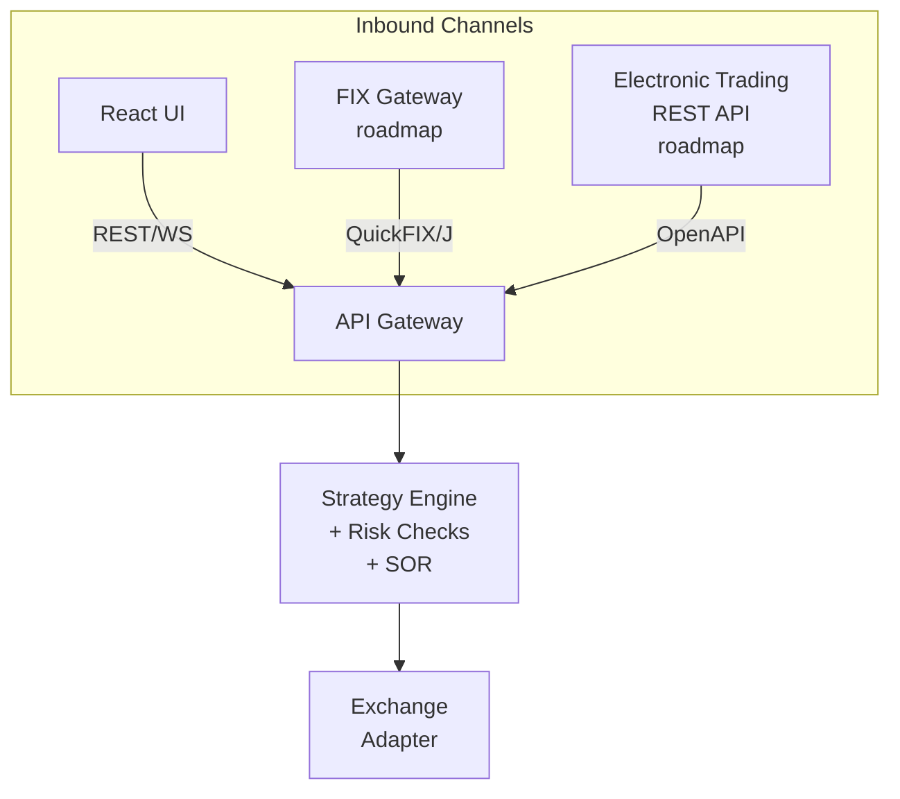
```mermaid
graph TB
    subgraph "Inbound Channels"
        UI[React UI] -->|REST/WS| GW[API Gateway]
        FIX[FIX Gateway<br/>roadmap] -->|QuickFIX/J| GW
        REST[Electronic Trading<br/>REST API<br/>roadmap] -->|OpenAPI| GW
    end

    GW --> SE[Strategy Engine<br/>+ Risk Checks<br/>+ SOR]
    SE --> EE[Exchange<br/>Adapter]
```

The Electronic Trading REST API (roadmap items 3.4.4 / 3.4.5) would expose endpoints for programmatic algo execution: `POST /api/v1/algo/vwap`, `POST /api/v1/algo/twap`, `POST /api/v1/algo/is`, etc. — each accepting order parameters and returning a tracking ID for monitoring execution progress via WebSocket. The FIX gateway (roadmap item 3.4.3) would accept standard FIX 4.4 NewOrderSingle messages and route them through the same pipeline.

#### 5.3.8 Distributed Position Cache

Redis serves as a **cache layer** for hot-path cross-service reads of the order-manager's authoritative position book. PostgreSQL remains the system of record and Kafka's `positions.updates` topic remains the durable event log; Redis adds sub-millisecond visibility for the pre-trade risk checks running inside the execution-engine.

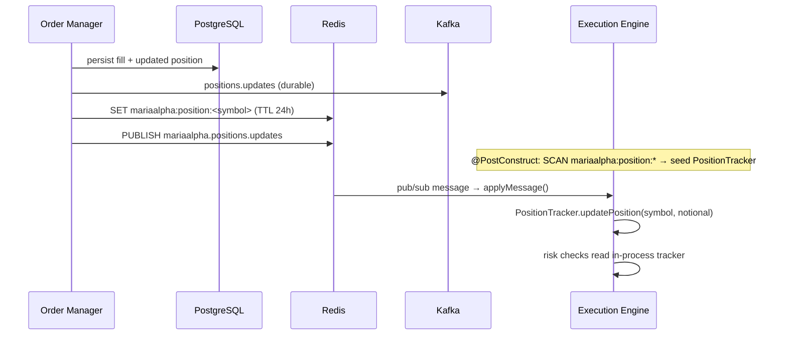
```mermaid
sequenceDiagram
    participant OM as Order Manager
    participant PG as PostgreSQL
    participant RD as Redis
    participant K as Kafka
    participant EE as Execution Engine

    OM->>PG: persist fill + updated position
    OM->>K: positions.updates (durable)
    OM->>RD: SET mariaalpha:position:<symbol> (TTL 24h)
    OM->>RD: PUBLISH mariaalpha.positions.updates
    Note over EE: @PostConstruct: SCAN mariaalpha:position:* → seed PositionTracker
    RD->>EE: pub/sub message → applyMessage()
    EE->>EE: PositionTracker.updatePosition(symbol, notional)
    EE->>EE: risk checks read in-process tracker
```

**Order-manager (writer):** `RedisPositionCachePublisher` writes the snapshot on every fill (after the existing Kafka publish) and emits a pub/sub event so any subscriber can refresh in-process state without polling. Failures are swallowed at WARN level so a Redis hiccup never blocks fill processing.

**Execution-engine (reader):** `RedisPositionCacheClient` warms the in-process `PositionTracker` on startup by scanning every `mariaalpha:position:*` key, then subscribes to the pub/sub channel for incremental updates. A direct `fetch(symbol)` path exists as a fallback when the in-memory state is empty (e.g. between warm-up failure and the first pub/sub message).

**Metrics:** `mariaalpha_position_cache_writes_total`, `mariaalpha_position_cache_write_failures_total`, `mariaalpha_position_cache_write_latency`, `mariaalpha_position_cache_hits_total`, `mariaalpha_position_cache_misses_total`, `mariaalpha_position_cache_pubsub_updates_total`, `mariaalpha_position_cache_read_failures_total`, `mariaalpha_position_cache_read_latency`. Both sides set `management.health.redis.enabled=true` so the Redis component shows up in `/actuator/health`, but Redis is **not** in the readiness group — the cache is non-critical and a transient outage must not flap pod readiness.

**Configuration:** `order-manager.redis.enabled` and `execution-engine.redis.enabled` default to `true`. Set either to `false` (and exclude `RedisAutoConfiguration`) to run a minimal local stack without Redis; the in-memory `PositionTracker` remains usable. Docker Compose adds a `redis:7.4-alpine` service with `--maxmemory-policy allkeys-lru` and a persistent volume; the Helm chart adds Bitnami `redis@20` as a standalone (single-node) subchart, addressable in-cluster at `redis-master.mariaalpha-data.svc.cluster.local:6379`.

### 5.4 Data Model

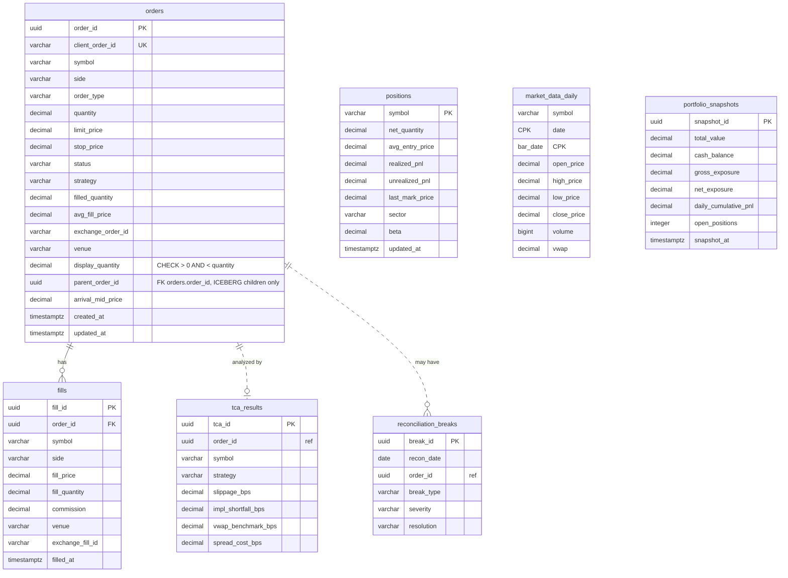
```mermaid
erDiagram
    orders ||--o{ fills : "has"
    orders ||..o| tca_results : "analyzed by"
    orders ||..o{ reconciliation_breaks : "may have"

    orders {
        uuid order_id PK
        varchar client_order_id UK
        varchar symbol
        varchar side
        varchar order_type
        decimal quantity
        decimal limit_price
        decimal stop_price
        varchar status
        varchar strategy
        decimal filled_quantity
        decimal avg_fill_price
        varchar exchange_order_id
        varchar venue
        decimal display_quantity "CHECK > 0 AND < quantity"
        uuid parent_order_id "FK orders.order_id, ICEBERG children only"
        decimal arrival_mid_price
        timestamptz created_at
        timestamptz updated_at
    }

    fills {
        uuid fill_id PK
        uuid order_id FK
        varchar symbol
        varchar side
        decimal fill_price
        decimal fill_quantity
        decimal commission
        varchar venue
        varchar exchange_fill_id
        timestamptz filled_at
    }

    positions {
        varchar symbol PK
        decimal net_quantity
        decimal avg_entry_price
        decimal realized_pnl
        decimal unrealized_pnl
        decimal last_mark_price
        varchar sector
        decimal beta
        timestamptz updated_at
    }

    market_data_daily {
        varchar symbol CPK
        date bar_date CPK
        decimal open_price
        decimal high_price
        decimal low_price
        decimal close_price
        bigint volume
        decimal vwap
    }

    reconciliation_breaks {
        uuid break_id PK
        date recon_date
        uuid order_id "ref"
        varchar break_type
        varchar severity
        varchar resolution
    }

    tca_results {
        uuid tca_id PK
        uuid order_id "ref"
        varchar symbol
        varchar strategy
        decimal slippage_bps
        decimal impl_shortfall_bps
        decimal vwap_benchmark_bps
        decimal spread_cost_bps
    }

    portfolio_snapshots {
        uuid snapshot_id PK
        decimal total_value
        decimal cash_balance
        decimal gross_exposure
        decimal net_exposure
        decimal daily_cumulative_pnl
        integer open_positions
        timestamptz snapshot_at
    }
```

> **Table ownership:** Each service owns its tables exclusively — no cross-service foreign keys. `order-manager` owns `orders`, `fills`, `positions`, `portfolio_snapshots`. `post-trade` owns `reconciliation_breaks`, `tca_results`. `market-data-gateway` owns `market_data_daily`. Cross-service references (e.g. `order_id` in post-trade tables) are stored as UUIDs without FK constraints; consistency is maintained via Kafka events.

> **Note:** `venue` on orders and fills is populated by the SOR. `sector` and `beta` on positions exist as nullable columns reserved for future portfolio-level analytics; the live sector/beta values consumed by the risk checks today are sourced from `SymbolReferenceData` rather than this column. `display_quantity` and `parent_order_id` on orders are populated by the Iceberg coordinator — `display_quantity` is required for ICEBERG parents (gated by migration `005-orders-display-quantity-check.yaml`, CHECK constraint `display_quantity IS NULL OR (display_quantity > 0 AND display_quantity < quantity)`); `parent_order_id` (migration `006-orders-parent-order-id.yaml`) is populated on every ICEBERG child row and indexed for `findByParentOrderId` queries.

#### Kafka Topics

All topics start with **1 partition** and **minimal retention** in the MVP. Partition counts and retention SHALL be increased based on observed throughput and audit requirements.

| Topic | Key | Value Schema | Initial Partitions | Initial Retention |
| --- | --- | --- | --- | --- |
| `market-data.ticks` | symbol | MarketTick JSON | 1 | 4 hours |
| `orders.lifecycle` | orderId | OrderEvent JSON | 1 | 3 days |
| `positions.updates` | symbol | PositionSnapshot JSON | 1 | 3 days |
| `analytics.tca` | orderId | TCA result JSON | 1 | 3 days |
| `analytics.risk-alerts` | symbol | RiskAlert JSON | 1 | 3 days |
| `routing.decisions` | orderId | SOR routing decision JSON | 1 | 3 days |
| `orders.dlq` | orderId | Error + original order JSON | 1 | 30 days |

> **Rationale for non-zero retention:** Even in the MVP, consumers that crash and restart need to replay unprocessed messages from their last committed offset. Zero retention would cause data loss on restart. Market data ticks are high-volume with short-lived value (4 hours). Order/position topics are lower-volume with audit value (3 days). DLQ retains longer for manual inspection.

### 5.5 Technology Choices and Rationale

| Decision | Choice | Rationale |
| --- | --- | --- |
| Core language | Java 21 | Industry standard for trading systems. Virtual threads (Project Loom) for efficient concurrent I/O. Pattern matching and records for clean domain modeling. |
| Core framework | Spring Boot 3 | Production-proven ecosystem (WebFlux, Data JPA, Cloud Gateway, Batch, Actuator). Actuator provides health/metrics out of the box. |
| ML/AI language | Python 3.12 | Required for ML ecosystem (LightGBM, scikit-learn, pandas). FastAPI for REST. grpcio for signal serving. |
| Java ↔ Python | gRPC (real-time) + Kafka (async) | gRPC provides sub-5ms latency for the signal path. Kafka handles async analytics with durability and replay. |
| Event backbone | Apache Kafka (KRaft) | Event-driven decoupling. Durability, replayability, consumer groups. KRaft eliminates Zookeeper. |
| Database | PostgreSQL 16 | Battle-tested RDBMS for transactional (orders, fills) and analytical (TCA, snapshots) workloads. |
| Distributed cache | Redis | Sub-millisecond position lookups for pre-trade risk. Shared order book state. Pub/sub for dashboard updates. |
| Exchange API (MVP) | Alpaca | Free paper trading. Real-time WebSocket. REST order management. Zero cost. |
| UI framework | React 18 + TypeScript + Vite | Vite provides near-instant HMR. Recharts for visualization. TailwindCSS for styling. |
| API gateway | Spring Cloud Gateway | Reactive routing with WebSocket support. Native Spring integration. |
| Resilience | Resilience4j | Circuit breakers, retries, bulkheads, rate limiters, timeouts. Standard Java resilience library. |
| Container orchestration | Kubernetes (Docker Desktop / minikube / kind) | Docker Desktop includes a built-in K8s cluster (simplest option). minikube/kind as alternatives. Helm for deployment. |
| Observability | Grafana + Prometheus + Loki + Tempo + Alloy | Full LGTM stack. Metrics, logs, traces with cross-linking. Alloy as unified collector. |
| CI/CD | GitHub Actions | Free for public repos. Matrix builds. CodeQL + Snyk for security. PITest + mutmut for mutation testing. |
| Task management | GitHub Issues + GitHub Projects | Integrated with repo. Labels for categorization. Milestones for phases. Projects board for Kanban. |
| Integration testing | Testcontainers | Real Kafka/PostgreSQL/Redis in tests. No mocked infrastructure. |
| Database migrations | Liquibase | Supports XML/YAML/JSON/SQL changelogs. Rollback support. Widely used in enterprise Java. Runs automatically on Spring Boot startup. |
| Code formatting | Spotless (Google Java Format) | Gradle plugin that auto-formats Java source code to Google Java Style on build. Enforced via `spotlessCheck` in CI, auto-fixed via `spotlessApply` locally (`just format`). Complements Checkstyle (which checks but does not fix). |
| Command runner | just | Modern alternative to Make. No tab-sensitivity issues, cleaner syntax, built-in argument passing, cross-platform. `justfile` replaces `Makefile`. |
| API testing | Bruno | Open-source API client. Collection shipped in [`api-collection/`](../api-collection/) — covers every gateway-routed REST endpoint plus direct-to-service health/admin calls. Collections stored as files in the repo. Replaces Postman. |
| Stream processing (roadmap) | Apache Flink (under consideration) | Complex event processing for multi-symbol pattern detection, windowed portfolio-level VaR computation, and real-time aggregation across high-volume streams. Adds significant infrastructure complexity — justified only at scale. |

---

## 6. Scalability

### 6.1 Scaling Strategy

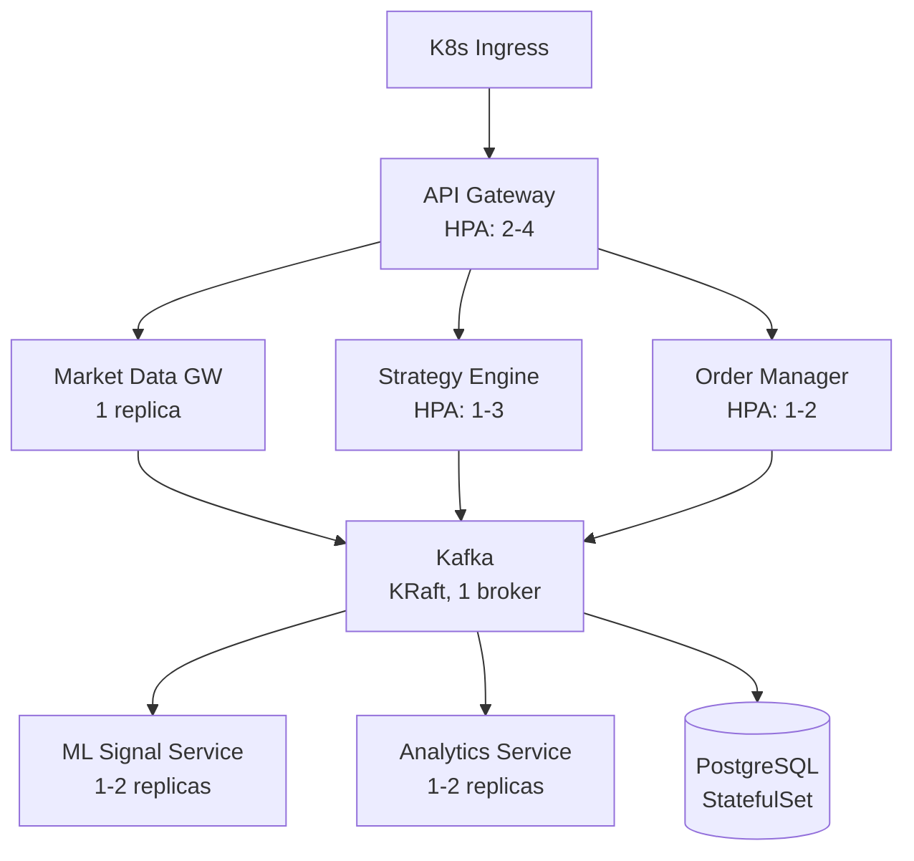
```mermaid
graph TB
    ING[K8s Ingress] --> GW[API Gateway<br/>HPA: 2-4]
    GW --> MDG[Market Data GW<br/>1 replica]
    GW --> SE[Strategy Engine<br/>HPA: 1-3]
    GW --> OM[Order Manager<br/>HPA: 1-2]
    MDG --> K[Kafka<br/>KRaft, 1 broker]
    SE & OM --> K
    K --> MLS[ML Signal Service<br/>1-2 replicas]
    K --> AN[Analytics Service<br/>1-2 replicas]
    K --> PG[(PostgreSQL<br/>StatefulSet)]
```

### 6.2 Bottleneck Analysis

| Component | Bottleneck | Mitigation |
| --- | --- | --- |
| Market Data Gateway | Alpaca allows 1 WebSocket connection per account | Single instance for MVP |
| Strategy Engine | CPU-bound evaluation per tick | Kafka partitioning by symbol distributes across replicas |
| ML Signal Service | Inference latency under high tick volume | Incremental feature computation. HPA scaling. |
| Execution Engine | Alpaca: 200 req/min rate limit | Order queuing with rate limiter |
| PostgreSQL | Write throughput under high fill volume | Batch inserts. Single instance sufficient for MVP |

---

## 7. Resilience

### 7.1 Resilience Patterns

The system uses **Resilience4j** (Java services) for structured resilience patterns. Each pattern is applied at specific integration points:

| Pattern | Where Applied | Configuration |
| --- | --- | --- |
| **Circuit Breaker** | Strategy Engine → ML Signal Service (gRPC) | Failure threshold: 5 calls. Open duration: 30s. Half-open permits: 2. On open: strategy proceeds without ML signal. |
| **Circuit Breaker** | Execution Engine → Alpaca Order API | Failure threshold: 3 calls. Open duration: 60s. On open: orders queued, CRITICAL alert published. |
| **Retry (exponential backoff)** | Market Data Gateway → Alpaca WebSocket reconnect | Max attempts: 5. Initial interval: 1s. Multiplier: 2×. Max interval: 30s. |
| **Retry (exponential backoff)** | Execution Engine → Alpaca order submission | Max attempts: 3. Initial interval: 500ms. Multiplier: 2×. |
| **Retry (exponential backoff)** | All services → PostgreSQL connection | Max attempts: 3. Handled by HikariCP pool configuration. |
| **Timeout** | Strategy Engine → ML Signal Service (gRPC) | Deadline: 100ms. On timeout: proceed without ML signal. |
| **Timeout** | Execution Engine → Alpaca REST API | 5 seconds. On timeout: mark order submission failed, retry. |
| **Timeout** | All services → PostgreSQL queries | 2 seconds. On timeout: log, return error to caller. |
| **Bulkhead** | Execution Engine thread pools | Separate thread pools for: order submission (10 threads), fill processing (5 threads), risk checks (5 threads). Prevents a slow Alpaca API from starving risk check processing. |
| **Rate Limiter** | Execution Engine → Alpaca REST API | 200 requests/minute (Alpaca's limit). Guava `RateLimiter`. |
| **Rate Limiter** | API Gateway → inbound requests | 60 requests/minute per API key. Spring Cloud Gateway filter. |

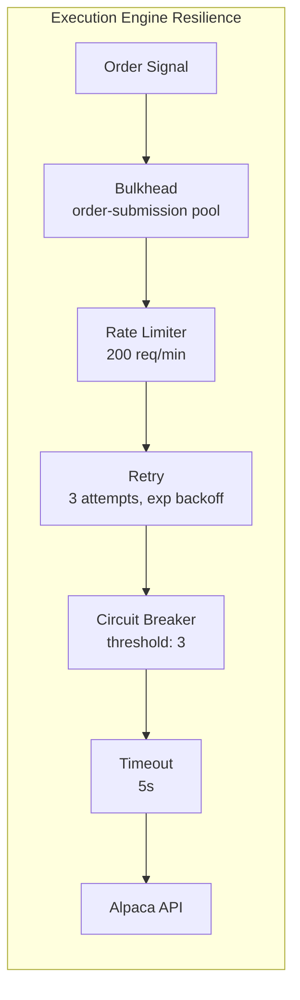
```mermaid
graph LR
    subgraph "Execution Engine Resilience"
        OS[Order Signal] --> BH[Bulkhead<br/>order-submission pool]
        BH --> RL[Rate Limiter<br/>200 req/min]
        RL --> RT[Retry<br/>3 attempts, exp backoff]
        RT --> CB[Circuit Breaker<br/>threshold: 3]
        CB --> TO[Timeout<br/>5s]
        TO --> ALP[Alpaca API]
    end
```

### 7.2 Failure Modes and Mitigations

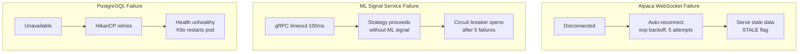
```mermaid
graph TB
    subgraph "Alpaca WebSocket Failure"
        AW1[Disconnected] --> AW2[Auto-reconnect<br/>exp backoff, 5 attempts]
        AW2 --> AW3[Serve stale data<br/>STALE flag]
    end
    subgraph "ML Signal Service Failure"
        ML1[gRPC timeout 100ms] --> ML2[Strategy proceeds<br/>without ML signal]
        ML2 --> ML3[Circuit breaker opens<br/>after 5 failures]
    end
    subgraph "PostgreSQL Failure"
        PG1[Unavailable] --> PG2[HikariCP retries]
        PG2 --> PG3[Health unhealthy<br/>K8s restarts pod]
    end
```

### 7.3 Idempotency

| Component | Mechanism |
| --- | --- |
| Order Manager | `client_order_id` UNIQUE constraint rejects duplicate submissions |
| Fill Processing | `exchange_fill_id` checked before persisting — duplicates ignored |
| Reconciliation | Keyed by `recon_date` — re-running overwrites previous results |
| Market Data | `(symbol, bar_date)` composite PK — re-fetch is an upsert |

### 7.4 Dead Letter Queue

Failed orders (after 3 retries) published to `orders.dlq` with error details, 30-day retention for manual inspection.

### 7.5 Graceful Degradation

| Failure | Behavior |
| --- | --- |
| ML Signal Service unavailable | Strategy operates on signals alone. Logged as degraded. |
| Alpaca WebSocket disconnected | Last-known prices with STALE flag. Strategy pauses signal generation. |
| Analytics Service unavailable | UI shows cached analytics. No trading impact. |
| PostgreSQL unavailable | Order submission paused. Market data continues in-memory. K8s restarts pods. |

### 7.6 Daily Loss Limit Enforcement

On breach of `max-loss-per-day`: (1) Strategy Engine halts signal generation, (2) open orders cancelled, (3) CRITICAL alert published, (4) UI shows halt banner, (5) resumes next trading day or via manual override.

---

## 8. Observability

### 8.1 Observability Stack (Grafana LGTM)

| Component | Role |
| --- | --- |
| **Prometheus** | Metrics collection and storage |
| **Loki** | Log aggregation (structured JSON logs) |
| **Tempo** | Distributed tracing (OpenTelemetry traces) |
| **Grafana** | Unified dashboards with metrics↔logs↔traces cross-linking |
| **Alloy** | Unified telemetry collector (DaemonSet) — replaces separate agents |

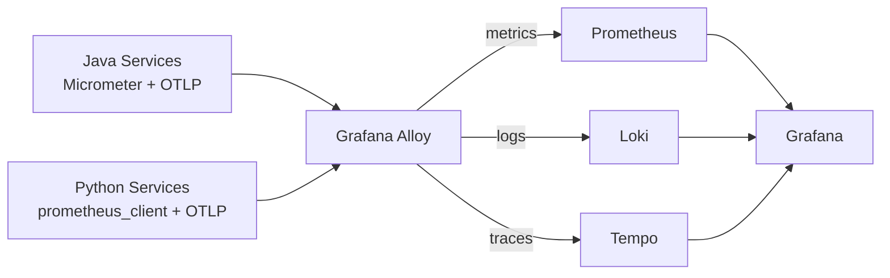
```mermaid
graph LR
    J[Java Services<br/>Micrometer + OTLP] --> AL[Grafana Alloy]
    P[Python Services<br/>prometheus_client + OTLP] --> AL
    AL -->|metrics| PROM[Prometheus]
    AL -->|logs| LOKI[Loki]
    AL -->|traces| TEMPO[Tempo]
    PROM & LOKI & TEMPO --> GF[Grafana]
```

### 8.2 Metrics

#### Built-in Metrics (provided automatically by Spring Boot Actuator + Micrometer)

These require **no custom code** — they are available out of the box for all Java services:

| Category | Examples |
| --- | --- |
| JVM | `jvm_memory_used_bytes`, `jvm_gc_pause_seconds`, `jvm_threads_live` |
| HTTP | `http_server_requests_seconds` (count, sum, max — per endpoint, status, method) |
| Kafka Consumer | `kafka_consumer_records_consumed_total`, `kafka_consumer_records_lag` (consumer lag) |
| HikariCP (DB pool) | `hikaricp_connections_active`, `hikaricp_connections_pending` |
| System | `system_cpu_usage`, `process_cpu_usage`, `disk_free_bytes` |

> **Note:** Kafka consumer lag (`kafka_consumer_records_lag`) is critical for detecting if a service is falling behind on event processing. This metric is available automatically via Spring Kafka's Micrometer integration.

#### Custom Application Metrics

These are instrumented explicitly in application code:

| Metric Name | Type | Labels | Description |
| --- | --- | --- | --- |
| `mariaalpha_md_ticks_received_total` | Counter | `symbol`, `event_type` | Ticks received from exchange |
| `mariaalpha_md_tick_latency_ms` | Histogram | `symbol` | Exchange timestamp to Kafka publish |
| `mariaalpha_md_websocket_reconnects_total` | Counter | — | WebSocket reconnection attempts |
| `mariaalpha_strategy_signals_total` | Counter | `strategy`, `direction` | Signals emitted |
| `mariaalpha_strategy_ml_latency_ms` | Histogram | — | gRPC round-trip to ML Signal Service |
| `mariaalpha_strategy_ml_circuit_breaker_state` | Gauge | — | 0=closed, 1=half-open, 2=open |
| `mariaalpha_exec_orders_submitted_total` | Counter | `symbol`, `side`, `type` | Orders submitted |
| `mariaalpha_exec_order_latency_ms` | Histogram | — | Signal to exchange ack |
| `mariaalpha_exec_risk_rejections_total` | Counter | `reason` | Risk check rejections |
| `mariaalpha_exec_sor_routing_total` | Counter | `venue`, `venue_type` | SOR routing by venue |
| `mariaalpha_positions_count` | Gauge | — | Open positions |
| `mariaalpha_portfolio_total_pnl` | Gauge | — | Total P&L |
| `mariaalpha_portfolio_gross_exposure` | Gauge | — | Gross exposure |
| `mariaalpha_ml_inference_duration_ms` | Histogram | `model` | Model inference latency |
| `mariaalpha_recon_breaks_total` | Counter | `break_type`, `severity` | Reconciliation breaks |
| `mariaalpha_recon_runs_total` | Counter | `status`, `source` | EOD reconciliation runs by status (SUCCESS/FAILED) and source (SCHEDULED/MANUAL) |
| `mariaalpha_recon_duration_seconds` | Timer | — | Wall-clock duration of EOD reconciliation runs |
| `mariaalpha_tca_slippage_bps` | Histogram | `strategy` | Slippage distribution |
| `mariaalpha_position_cache_writes_total` | Counter | — | Redis position-cache writes (order-manager) |
| `mariaalpha_position_cache_write_failures_total` | Counter | — | Failed Redis position-cache writes |
| `mariaalpha_position_cache_write_latency` | Histogram | — | Latency of Redis position-cache writes |
| `mariaalpha_position_cache_hits_total` | Counter | — | Direct Redis fetch returned a snapshot (execution-engine) |
| `mariaalpha_position_cache_misses_total` | Counter | — | Direct Redis fetch returned no snapshot |
| `mariaalpha_position_cache_pubsub_updates_total` | Counter | — | Pub/sub messages applied to in-memory PositionTracker |
| `mariaalpha_position_cache_read_failures_total` | Counter | — | Redis read errors swallowed by the cache client |
| `mariaalpha_position_cache_read_latency` | Histogram | — | Latency of Redis position-cache reads |
| `mariaalpha_options_pricings_total` | Counter | `type` | Black-Scholes pricings executed |
| `mariaalpha_options_pricing_duration` | Timer | `type` | Black-Scholes pricing latency |
| `mariaalpha_options_implied_vol_solves_total` | Counter | `type`, `method` | Implied-vol solves by method (NEWTON / BISECTION) |
| `mariaalpha_options_implied_vol_iterations` | Distribution | `type`, `method` | Iterations to converge in the implied-vol solver |
| `mariaalpha_execution_pegged_parents_submitted_total` | Counter | `symbol`, `pegType` | PEGGED parents accepted |
| `mariaalpha_execution_pegged_parents_filled_total` | Counter | `symbol`, `pegType` | PEGGED parents fully filled |
| `mariaalpha_execution_pegged_children_submitted_total` | Counter | `symbol`, `pegType` | LIMIT children submitted on behalf of a PEGGED parent (includes re-pegs) |
| `mariaalpha_execution_pegged_repegs_total` | Counter | `symbol`, `pegType` | Cancel-and-resubmit cycles triggered by NBBO movement |

### 8.3 Grafana Dashboards

Three Grafana dashboards are provisioned from `config/grafana/provisioning/dashboards/*.json` (compose) and `charts/mariaalpha/files/grafana-dashboards/*.json` (Helm). Both copies are kept in sync byte-for-byte by `GrafanaDashboardTest` in the post-trade module, which also asserts every PromQL expression in every dashboard references a metric this codebase actually registers — a renamed metric fails the build instead of silently producing a "No data" panel.

**Dashboard 1: Trading Pipeline** (uid `mariaalpha-trading-pipeline`) — four rows. **Data Ingestion** holds tick ingestion rate (`mariaalpha_md_ticks_received_total` by symbol), market-data WebSocket reconnect counter (`mariaalpha_md_websocket_reconnects_total`), and strategy-signal rate (`mariaalpha_strategy_signals_total` by strategy). **ML Signal Service** shows gRPC p99 latency, the Resilience4j circuit-breaker state mapped to CLOSED/HALF_OPEN/OPEN (`mariaalpha_strategy_ml_circuit_breaker_state`), and ML-gate decisions stacked by outcome (`mariaalpha_strategy_ml_decisions_total`). **Execution** covers orders persisted by side (`mariaalpha_orders_persisted_total`), fill rate by venue (`mariaalpha_fills_persisted_total`), risk rejections by reason (`mariaalpha_execution_risk_rejections_total`), p99 order latency (`mariaalpha_execution_order_latency_ms_seconds_bucket`), and SOR routing distribution by venue (`mariaalpha_execution_sor_routing_total`). The bottom **Service Health** row is a strip of `up{}` stat tiles.

**Dashboard 2: Portfolio & Risk** (uid `mariaalpha-portfolio-risk`) — four rows. **Portfolio** has total P&L / gross / net exposure stat tiles plus a single time-series panel overlaying all three. **Pre-Trade Risk** plots rejections-by-reason as a stacked bar over the last 5 m and a cumulative-by-reason horizontal stat strip. **Risk Alerts** combines the analytics-service flow-toxicity markout (bps) per strategy with the rate of `RECON_BREAK` and `FLOW_TOXICITY` events published to `analytics.risk-alerts`. **PnL Attribution & Axes** stacks PnL attribution by component (Kissell-Glantz spread/market/commission/timing/residual) and overlays active axe count + matches/min.

**Dashboard 3: Post-Trade & Quality** (uid `mariaalpha-post-trade-quality`) — three rows. **Reconciliation** shows EOD run rate by status (`SUCCESS`/`FAILED` × `SCHEDULED`/`MANUAL`), breaks by type+severity, a p95 duration stat, and cumulative-by-status stat tiles. **Transaction Cost Analysis** plots TCA slippage p50/p95 by strategy from `mariaalpha_tca_slippage_bps_bucket`, TCA computations/min, and the average IS / VWAP / spread components computed from `_sum`/`_count` ratios. **Internalisation** gauges internalisation rate as `mariaalpha_execution_internal_crosses_total` / `mariaalpha_execution_venue_fills_total`, plus crosses/min, shares/min, average spread captured (bps), and the live buy/sell/resting depth of the internal book.

Each dashboard cross-links to the others via dashboard tags (`mariaalpha` + one of `trading|portfolio|post-trade`). Refresh rates: 5 s (Trading Pipeline), 10 s (Portfolio & Risk), 30 s (Post-Trade & Quality) — chosen so the busiest dashboards see real-time changes without hammering Prometheus for the long-horizon ones.

### 8.4 Structured Logging and Distributed Tracing

All services emit structured JSON logs (Logback for Java, structlog for Python) with `traceId` for cross-service correlation. Logs collected by Alloy → Loki. OpenTelemetry traces exported via Alloy → Tempo. Grafana provides trace-to-log and trace-to-metric cross-linking.

---

## 9. Security

### 9.1 Authentication and Authorization

| Mechanism | Implementation |
| --- | --- |
| API Gateway Auth | `X-API-Key` header. Keys stored as K8s Secret. HTTP 401 without valid key. |
| Internal Services | Kafka + gRPC within cluster network. No external exposure. |
| Alpaca API Key | K8s Secret. Only Market Data GW and Execution Engine have access. |
| React UI | No separate auth today (single-user). JWT/OAuth2 are on the roadmap (4.2.1 / 4.2.2). |

### 9.2 Rate Limiting

| Target | Limit | Implementation |
| --- | --- | --- |
| API Gateway (inbound) | 60 req/min per key | Spring Cloud Gateway `RequestRateLimiter` |
| Alpaca REST API | 200 req/min | Guava `RateLimiter` in `AlpacaExchangeAdapter` |
| Alpaca WebSocket | 1 connection per account | Single Market Data GW instance |

### 9.3 Dependency Management

Java: Gradle with dependency locking + OWASP Dependency-Check + Snyk in CI. Python: pinned `requirements.txt` via `pip-compile` + `pip-audit` + Snyk in CI. Docker base images: `eclipse-temurin:21-jre-alpine` (Java), `python:3.12-slim` (Python). Infrastructure images pinned to specific versions.

---

## 10. Deployment

### 10.1 CI/CD Pipeline (GitHub Actions)

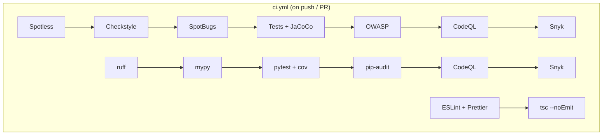
```mermaid
graph LR
    subgraph "ci.yml (on push / PR)"
        direction LR
        JF[Spotless] --> JL[Checkstyle] --> JSB[SpotBugs] --> JT[Tests + JaCoCo] --> JO[OWASP] --> JCQ[CodeQL] --> JS[Snyk]
        PL[ruff] --> PM[mypy] --> PT[pytest + cov] --> PA[pip-audit] --> PCQ[CodeQL] --> PS[Snyk]
        UL[ESLint + Prettier] --> UT[tsc --noEmit]
    end
```

A `helm` job inside `ci.yml` runs `helm dependency update`, `helm lint`, and `kubeconform -strict` against the rendered umbrella chart on every PR.

Mutation testing is intentionally **not** on the per-PR critical path — it is O(mutants × tests) and far too slow. It runs in a dedicated `mutation.yml` workflow on a weekly schedule (plus manual `workflow_dispatch`). PITest covers the six Java services and mutmut covers the Python ML Signal Service; both are advisory (no score gate) and publish their HTML/XML reports as build artifacts.

The multi-arch image publish workflow lives in `docker-publish.yml`:

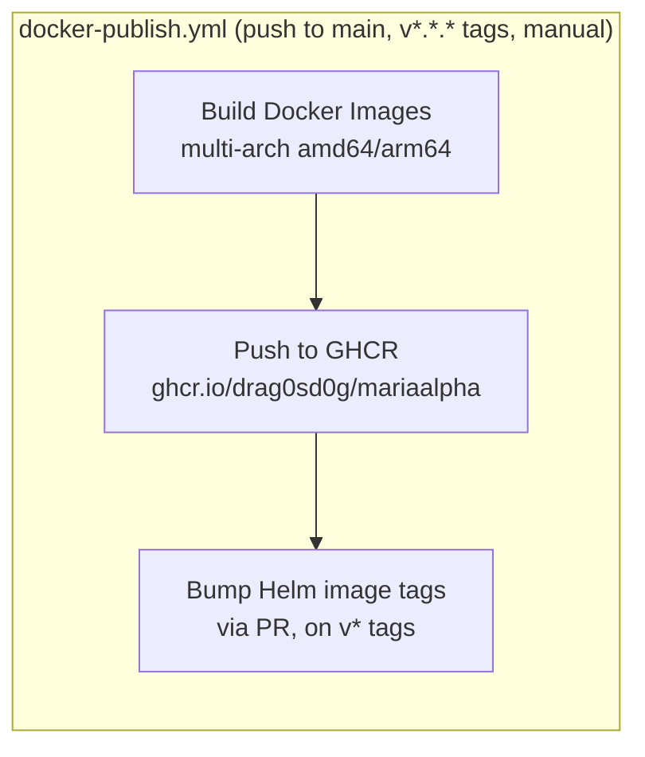
```mermaid
graph LR
    subgraph "docker-publish.yml (push to main, v*.*.* tags, manual)"
        A[Build Docker Images<br/>multi-arch amd64/arm64] --> B[Push to GHCR<br/>ghcr.io/drag0sd0g/mariaalpha] --> C[Bump Helm image tags<br/>via PR, on v* tags]
    end
```

Tag selection is event-driven (`docker/metadata-action`): pull requests build the images without pushing; pushes to `main` publish `:main` and `:sha-<commit>`; a `vX.Y.Z` tag publishes `:X.Y.Z`, `:X.Y`, and `:latest` and then opens a PR repointing `charts/mariaalpha/values.yaml` `global.images` at the released GHCR images.

### 10.2 Kubernetes Deployment (Helm)

> The umbrella Helm chart lives at `charts/mariaalpha/` — see [`charts/mariaalpha/README.md`](../charts/mariaalpha/README.md) and the runbook [`docs/runbooks/helm-install.md`](runbooks/helm-install.md). The Analytics Service row below is not yet covered by the chart.

The table below is the **Phase-2 sizing target**, not what the local chart currently ships. The local chart defaults to `replicaCount: 1` with `autoscaling.enabled: false` for every Java service to keep the OrbStack laptop install lean — HPA templates exist behind the flag so a cloud overlay can enable them without touching templates.

| Component | Replicas (target) | CPU Req | CPU Limit | Mem Req | Mem Limit |
| --- | --- | --- | --- | --- | --- |
| API Gateway | 2 (HPA: 2-4) | 250m | 500m | 256Mi | 512Mi |
| Market Data GW | 1 | 500m | 1000m | 512Mi | 1Gi |
| Strategy Engine | 1 (HPA: 1-3) | 500m | 1000m | 512Mi | 1Gi |
| Execution Engine | 1 | 250m | 500m | 256Mi | 512Mi |
| Order Manager | 1 (HPA: 1-2) | 250m | 500m | 256Mi | 512Mi |
| Post-Trade | 1 | 250m | 500m | 256Mi | 512Mi |
| ML Signal Service | 1 | 500m | 1000m | 1Gi | 2Gi |
| Analytics Service (not yet implemented) | 1 | 250m | 500m | 512Mi | 1Gi |
| React UI | 1 | 100m | 250m | 128Mi | 256Mi |
| PostgreSQL | 1 (StatefulSet) | 500m | 2000m | 1Gi | 4Gi |
| Kafka (KRaft) | 1 | 500m | 1000m | 1Gi | 2Gi |
| Prometheus | 1 | 250m | 500m | 512Mi | 1Gi |
| Loki | 1 | 250m | 500m | 256Mi | 512Mi |
| Tempo | 1 | 250m | 500m | 256Mi | 512Mi |
| Alloy | DaemonSet | 100m | 250m | 128Mi | 256Mi |
| Grafana | 1 | 100m | 250m | 256Mi | 512Mi |

**Kubernetes orchestration:** the chart is developed against **OrbStack**'s built-in single-node Kubernetes cluster (`orb start k8s`), which auto-resolves `*.orb.local` hostnames to in-cluster services — this is what the chart's `values.yaml` defaults to. Docker Desktop's built-in Kubernetes, minikube, and kind also work (override `ingress.hostBase` and add `/etc/hosts` entries; see `charts/mariaalpha/README.md` § Troubleshooting).

---

## 11. Roadmap

The capabilities described in §3 (functional requirements) through §10 (deployment) are all
**implemented** and form the core of MariaAlpha today. This section records the work that has not
yet been picked up. Each row is scoped to a single GitHub issue so the backlog stays trackable;
none of them is required to *run* the system, but the Phase 5 block below is required to *trust*
it — that is, to gain enough evidence (cloud-deployed multi-week paper-trading run, measured NFRs,
operational hardening) to make any subsequent real-money decision honestly.

**Priority ordering as of 2026-06-05:**

1. **Phase 5 — Validation & Productionisation.** Promoted ahead of everything else. This is the
   evidence-gathering and hardening phase: backtester, cloud deploy, engineering benchmarks,
   multi-week paper-trading run, alerting, SLOs, chaos drills. None of it adds features; all of it
   is what separates "engineering-complete prototype" from "system you would trust with capital."
2. **Phase 3 — Multi-Market & Derivatives Capabilities.** Feature expansion. Picked up after
   Phase 5 evidence is in hand and after a deliberate decision on whether to invest in extending
   the asset-class surface.
3. **Phase 4 — Advanced Platform Features.** Mostly operational/analytical depth (RBAC, model
   retraining, portfolio optimization, ML-driven SOR, multi-region HA). Mostly post-validation.
4. **Other Considerations (unscheduled).** Architectural alternatives kept for the record.

The numeric prefixes (3.x.y, 4.x.y, 5.x.y) are **stable issue identifiers**, not a temporal
ordering. The order in which the phases are presented below reflects the work order.

### Phase 5: Validation & Productionisation (in flight — do this first)

The single largest gap between *"the system runs"* and *"the system is trustworthy"* is **evidence**:
that the strategies make money on historical data, that the NFRs hold under load on the realistic
deployment target, that the operational story (alerting, kill-switch, recon, secrets) survives
contact with reality, and that the system can run unattended for weeks. This phase is structured to
close that gap before any further feature work.

The execution sequence within Phase 5 has three parallel-friendly workstreams: **strategy
validation** (backtester first, ML signal A/B audit second, then long-run paper-trading evidence),
**cloud deployment** (Cloud-1..Cloud-8 from `docs/cloud-deployment-plan.md`, which is what enables
24×5 paper trading without a local laptop), and **operational hardening** (the things you find out
you needed only after running unattended).

#### 5.1 Strategy validation

| # | Issue Title | Component |
| --- | --- | --- |
| [5.1.1](https://github.com/drag0sd0g/MariaAlpha/issues/104) | Implement backtesting engine (historical replay) | Strategy Engine |
| [5.1.2](https://github.com/drag0sd0g/MariaAlpha/issues/109) | Implement A/B (shadow-mode) audit for the ML signal gate | ML Signal Service |
| [5.1.3](https://github.com/drag0sd0g/MariaAlpha/issues/178) | Engineering benchmark suite + Grafana 'Benchmark' dashboard | Observability |
| [5.1.4](https://github.com/drag0sd0g/MariaAlpha/issues/174) | Extended paper-trading evidence-gathering run (8+ weeks) | Strategy Engine |

5.1.1 was previously identifier 4.1.1 and 5.1.2 was 4.4.2; both have been re-milestoned ahead of
the multi-market work. The order within 5.1 is sequential: the backtester (5.1.1) produces baseline
per-strategy expectations on historical data; the A/B audit (5.1.2) layers on top to decide whether
the ML signal gate adds or destroys alpha; the engineering benchmark (5.1.3) replaces the
*"unmeasured design targets"* footnote in §4.1 with real numbers across local, OrbStack, and cloud
deployment surfaces; the evidence run (5.1.4) is the calendar-time experiment that brings
everything together and produces a published equity curve.

#### 5.2 Cloud deployment

| # | Issue Title | Component |
| --- | --- | --- |
| [5.2.1](https://github.com/drag0sd0g/MariaAlpha/issues/179) | Cloud-1: Provision OCI/OKE cluster and VCN | Infrastructure |
| [5.2.2](https://github.com/drag0sd0g/MariaAlpha/issues/173) | Cloud-2: Ingress + DNS + TLS (NGINX + cert-manager + nip.io) | Infrastructure |
| [5.2.3](https://github.com/drag0sd0g/MariaAlpha/issues/177) | Cloud-3: Sealed-secrets controller + initial secret set | Infrastructure |
| [5.2.4](https://github.com/drag0sd0g/MariaAlpha/issues/180) | Cloud-4: Persistent storage and Postgres backups | Infrastructure |
| [5.2.5](https://github.com/drag0sd0g/MariaAlpha/issues/181) | Cloud-5: deploy.yml GitHub Actions workflow (OKE rollout) | CI/CD |
| [5.2.6](https://github.com/drag0sd0g/MariaAlpha/issues/182) | Cloud-6: Cloud security hardening | Infrastructure |
| [5.2.7](https://github.com/drag0sd0g/MariaAlpha/issues/183) | Cloud-7: Cloud smoke runbook + observability check | Documentation |
| [5.2.8](https://github.com/drag0sd0g/MariaAlpha/issues/184) | Cloud-8: Helm chart cloud overrides (values-cloud.yaml) | Infrastructure |

These eight issues operationalise `docs/cloud-deployment-plan.md`. The target is Oracle Cloud
Always-Free (Ampere A1, 4 OCPU / 24 GB, OKE Basic, eu-frankfurt-1) — see the cloud plan §3 for why
this is the only no-time-limit-free option in 2026.

#### 5.3 Operational hardening

| # | Issue Title | Component |
| --- | --- | --- |
| [5.3.1](https://github.com/drag0sd0g/MariaAlpha/issues/185) | Alertmanager + Slack webhook + initial alert rules | Observability |
| [5.3.2](https://github.com/drag0sd0g/MariaAlpha/issues/186) | Define SLOs + error budgets for the trading pipeline | Observability |
| [5.3.3](https://github.com/drag0sd0g/MariaAlpha/issues/187) | Daily-loss-limit kill-switch chaos drill | Execution Engine |
| [5.3.4](https://github.com/drag0sd0g/MariaAlpha/issues/188) | DLQ inspection + remediation runbook | Execution Engine |
| [5.3.5](https://github.com/drag0sd0g/MariaAlpha/issues/189) | Continuous EXTERNAL-mode EOD reconciliation | Post-Trade |

These five close the gaps between the resilience design in §7 and the operational reality that, as
of writing, has not been stress-tested. The daily-loss kill-switch (§7.6) is implemented but has
never fired in anger; the DLQ (§7.4) retains messages but has no documented remediation path;
EOD reconciliation against Alpaca's `/v2/account/activities` (§5.2.6) is exercised only by the
manual smoke runbook today.

### Phase 3: Multi-Market & Derivatives Capabilities (post-validation)

Broker integration with Interactive Brokers, options pricing, Japanese-market microstructure rules,
and program/basket trading. These extend MariaAlpha beyond a single broker (Alpaca, US equities)
into multi-asset, multi-region territory. **Deliberately deferred behind Phase 5** — there is no
benefit to extending the asset-class surface before the existing one is validated.

| # | Issue Title | Component |
| --- | --- | --- |
| [3.1.1](https://github.com/drag0sd0g/MariaAlpha/issues/87) | Implement IBKR `MarketDataAdapter` (TWS API) | Market Data GW |
| [3.1.2](https://github.com/drag0sd0g/MariaAlpha/issues/88) | Implement IBKR `ExchangeAdapter` (TWS API) | Execution Engine |
| [3.1.3](https://github.com/drag0sd0g/MariaAlpha/issues/89) | Implement multi-market trading hours support | Strategy Engine |
| [3.2.1](https://github.com/drag0sd0g/MariaAlpha/issues/90) | Implement options pricing model (Black-Scholes) — **delivered**, see [`strategies/options-pricing.md`](strategies/options-pricing.md) | Strategy Engine |
| [3.2.2](https://github.com/drag0sd0g/MariaAlpha/issues/91) | Implement Greeks computation (delta, gamma, vega, theta) — **delivered**, see [`strategies/options-pricing.md`](strategies/options-pricing.md) | Strategy Engine |
| [3.2.3](https://github.com/drag0sd0g/MariaAlpha/issues/92) | Implement Pegged order type handler — **delivered**, see [`strategies/pegged-orders.md`](strategies/pegged-orders.md) | Execution Engine |
| [3.3.1](https://github.com/drag0sd0g/MariaAlpha/issues/93) | Implement TSE tick size table and validation | Execution Engine |
| [3.3.2](https://github.com/drag0sd0g/MariaAlpha/issues/94) | Implement auction session handling (Itayose, closing) | Market Data GW |
| [3.3.3](https://github.com/drag0sd0g/MariaAlpha/issues/95) | Implement daily price limit enforcement | Execution Engine |
| [3.3.4](https://github.com/drag0sd0g/MariaAlpha/issues/96) | Implement short-selling uptick rule | Execution Engine |
| [3.4.1](https://github.com/drag0sd0g/MariaAlpha/issues/97) | Implement program / basket trading engine | Execution Engine |
| [3.4.2](https://github.com/drag0sd0g/MariaAlpha/issues/98) | Implement trade allocation | Post-Trade |
| [3.4.3](https://github.com/drag0sd0g/MariaAlpha/issues/99) | Implement FIX protocol gateway (QuickFIX/J) for inbound algo orders | API Gateway |
| [3.4.4](https://github.com/drag0sd0g/MariaAlpha/issues/100) | Implement Electronic Trading REST API for programmatic algo execution | API Gateway |
| [3.4.5](https://github.com/drag0sd0g/MariaAlpha/issues/119) | Implement algo execution tracking and progress reporting via WebSocket | API Gateway |
| [3.5.1](https://github.com/drag0sd0g/MariaAlpha/issues/101) | Implement intraday VaR risk check | Execution Engine |
| [3.5.2](https://github.com/drag0sd0g/MariaAlpha/issues/102) | Implement correlated position limits | Execution Engine |
| [3.5.3](https://github.com/drag0sd0g/MariaAlpha/issues/103) | Implement currency exposure tracking | Order Manager |

### Phase 4: Advanced Platform Features (post-validation)

OAuth/RBAC, ML model lifecycle, multi-region HA, portfolio optimization, ML-driven SOR, and other
items that improve the operational and analytical surface of the product without changing what
markets it trades.

> 4.1.1 (Backtester) and 4.4.2 (ML A/B audit) were originally scheduled here; they have been
> promoted into **Phase 5** as #5.1.1 and #5.1.2 respectively, since both are validation
> prerequisites for any real-money path rather than feature expansions.
>
> 4.5.1 (Cloud IaC) was originally scoped as multi-cloud Terraform; it has been **re-scoped** to
> multi-region / HA expansion of the OKE deployment because the initial single-region OKE bring-up
> is now handled by Phase 5 issues #5.2.1–#5.2.8.

| # | Issue Title | Component |
| --- | --- | --- |
| [4.2.1](https://github.com/drag0sd0g/MariaAlpha/issues/105) | Implement JWT/OAuth2 authentication | API Gateway |
| [4.2.2](https://github.com/drag0sd0g/MariaAlpha/issues/106) | Implement role-based access control | API Gateway |
| [4.3.1](https://github.com/drag0sd0g/MariaAlpha/issues/107) | Implement warrant trading via IBKR | Execution Engine |
| [4.4.1](https://github.com/drag0sd0g/MariaAlpha/issues/108) | Implement model retraining pipeline | ML Signal Service |
| [4.5.1](https://github.com/drag0sd0g/MariaAlpha/issues/110) | Multi-region HA expansion of the OKE deployment | Deployment |
| [4.6.1](https://github.com/drag0sd0g/MariaAlpha/issues/111) | Implement portfolio optimization (mean-variance) | Analytics Service |
| [4.7.1](https://github.com/drag0sd0g/MariaAlpha/issues/112) | Implement client tiering for RFQ pricing | Strategy Engine |
| [4.8.1](https://github.com/drag0sd0g/MariaAlpha/issues/113) | Implement ML-based adaptive SOR | Execution Engine |
| [4.9.1](https://github.com/drag0sd0g/MariaAlpha/issues/114) | Evaluate Apache Flink for complex event processing | Infrastructure |

### Other Considerations (unscheduled)

Items below are deliberately **unscheduled** — they're recorded here so the rationale and trade-offs aren't lost, but the decision to take them on is deferred until either a concrete need or a clear cost/benefit signal emerges.

#### LMAX Disruptor refactor for in-process hot paths

The current architecture relies on Spring `@KafkaListener` (one thread per partition), `ConcurrentHashMap`, `ThreadPoolBulkhead`, and Project Reactor for in-process event handling. End-to-end p99 latency today is gated by inter-service Kafka hops (~1–10 ms each), the ML gRPC call (up to 100 ms timeout), the Alpaca REST call, and Postgres writes — *not* by in-process queueing. So adopting the LMAX Disruptor pattern would not move NFR-2 today.

A Disruptor-based refactor becomes worthwhile once features appear that are bound by **in-process throughput** rather than network I/O:

- **Backtesting engine** (roadmap issue 5.1.1) — millions of historical ticks replayed through the full pipeline in a single process; no Kafka, no DB hot path. The initial Phase 5 backtester is scoped as a *correctness* deliverable, not a throughput one; a Disruptor pass on the backtester comes later if replay speed becomes the bottleneck.
- **Internal crossing engine** — an in-process matching engine is the canonical single-writer Disruptor use case; the existing engine is the natural pilot site.
- **Program / basket trading engine** (3.4.1) and **FIX gateway** (3.4.3) — high in-process fan-out per parent order.
- **Tokyo full-depth market data** (3.3.x) — if it materially exceeds NFR-3's 10k ticks/s budget per gateway instance.

The natural insertion point is **after the multi-market / derivatives work lands** (the Phase 3 items) and **once the Phase 5 backtester has produced its first results** — that's when in-process throughput becomes the binding constraint and the backtester gains the most from a Disruptor re-platform. Doing it before Phase 5 finishes would be premature: the backtester's first job is to produce evidence on strategies that may or may not survive that evidence, and re-platforming a component that gets deleted is wasted effort.

Three ambition levels worth keeping in mind:

| Level | Scope | Effort | Outcome |
|---|---|---|---|
| **A** | One new module (e.g. internal crossing engine) implemented Disruptor-internal, Kafka at the boundaries. | ~1 week | A contained, demonstrable component. Touches nothing else. |
| **B** | `execution-engine` in-process pipeline (signal-in → audit → validate → risk → SOR → submit; fills → lifecycle → publish) refactored to a Disruptor ring with pooled events. Kafka stays at the edges. Persistence in `order-manager` stays as-is. | ~3–4 weeks | LMAX-style architectural fingerprint without the inter-service rip. Resilience4j bulkheads removed on the in-process path; mutable pooled event slots replace per-event allocation. Benchmarks become a deliverable. |
| **C** | Consolidate `execution-engine` + `order-manager` into one event-sourced "business-logic core" running on a single Disruptor pipeline (LMAX original). Postgres becomes a journal sink; state is in-memory and rebuilt by replay. Aeron/Chronicle Queue replaces Kafka for core transport. | ~8–12 weeks | Maximally HFT-realistic but reverses the §5.1 microservice choice for the trading core. |

**Default recommendation when this is picked up: Level B, scheduled as a dedicated milestone between the multi-market/derivatives work and the advanced-platform work.** Level A remains the right scope-limited pilot if it's bundled into a follow-up iteration of the internal crossing engine. Level C is documented for completeness but should not be considered without an explicit product-level decision to abandon the microservice boundary between execution and order management.

Friction points that any of the above will have to address:

- `@KafkaListener` and `@Transactional` flows are blocking by design — bridge code is needed at the ring boundaries.
- JDBC inside a Disruptor handler stalls the ring; persistence must stay outside the hot path (Level B) or be replaced by event sourcing (Level C).
- Project Reactor in `market-data-gateway` (`OrderBookManager` / `Sinks.Many`) does not compose with Disruptor — pick one model per service.
- Resilience4j `ThreadPoolBulkhead` is the pattern Disruptor replaces; it would be retired from the in-process path and retained only for outbound HTTP boundaries.
- Without pinned cores / low-jitter hosts (i.e. on a noisy K8s pod), Disruptor's measurable gain shrinks substantially — the deployment target affects ROI.

