# MariaAlpha — Technical Design Document

## Table of Contents

1. [Glossary](#1-glossary)
2. [Background](#2-background)
3. [Functional Requirements](#3-functional-requirements)
4. [Non-Functional Requirements](#4-non-functional-requirements)
5. [Main Proposal](#5-main-proposal)
6. [Scalability](#6-scalability)
7. [Resilience](#7-resilience)
8. [Observability](#8-observability)
9. [Security](#9-security)
10. [Deployment](#10-deployment)
11. [Iteration Roadmap](#11-iteration-roadmap)

---

## 1. Glossary

| Term | Definition |
| --- | --- |
| **Alpha** | The excess return of a trading strategy relative to a benchmark index; the measure of a strategy's value-add. |
| **VWAP** | Volume-Weighted Average Price — an execution algorithm that slices an order across the trading day proportional to historical volume, aiming to match the day's average price. |
| **TWAP** | Time-Weighted Average Price — an execution algorithm that distributes an order evenly across fixed time intervals, regardless of volume. |
| **Momentum** | A trading strategy that buys instruments with strong recent price trends, betting that trends persist over short to medium timeframes. |
| **EMA** | Exponential Moving Average — a type of moving average that gives more weight to recent prices. Used in trend-following strategies (e.g., 20-period EMA crossing 50-period EMA signals a trend change). |
| **RSI** | Relative Strength Index — a momentum oscillator measuring the speed and magnitude of recent price changes on a scale of 0–100. RSI above 70 suggests overbought; below 30 suggests oversold. |
| **MACD** | Moving Average Convergence Divergence — a trend-following momentum indicator showing the relationship between two EMAs (typically 12-period and 26-period). Signal crossovers indicate potential buy/sell opportunities. |
| **ATR** | Average True Range — a volatility indicator measuring the average range between high and low prices over a period. Higher ATR indicates higher volatility. Used for position sizing and stop-loss placement. |
| **TCA** | Transaction Cost Analysis — a post-trade evaluation measuring execution quality by comparing achieved prices against benchmarks (arrival price, VWAP, close). |
| **Slippage** | The difference between the expected execution price and the actual fill price, caused by market movement or insufficient liquidity. |
| **RFQ** | Request for Quote — a manual pricing workflow where a client requests a price from a dealer for a specific instrument and quantity. |
| **Order Book** | The list of outstanding buy and sell orders for an instrument at various price levels, maintained by an exchange or venue. |
| **Market Data** | Real-time or delayed price, volume, and order book information streamed from exchanges or data providers. |
| **Tick** | A single market data update representing a price change, trade, or quote update for an instrument. |
| **Signal** | A numerical score or classification produced by an ML model indicating a predicted price movement direction or magnitude. |
| **Feature** | An input variable to an ML model derived from raw market data (e.g., moving average, RSI, volume ratio). |
| **Regime** | A characterization of the current market state (e.g., trending, mean-reverting, volatile, quiet) used to select appropriate trading strategies. |
| **Gradient-Boosted Tree** | An ensemble ML technique that builds a sequence of decision trees, where each new tree corrects the errors of the previous ones. LightGBM is a high-performance implementation used for the signal model. |
| **Random Forest** | An ensemble ML technique that builds many independent decision trees on random subsets of data and averages their predictions. Used for the regime classifier. |
| **gRPC** | Google Remote Procedure Call — a high-performance, language-agnostic RPC framework using Protocol Buffers for serialization and HTTP/2 for transport. |
| **CDC** | Change Data Capture — a pattern for detecting and propagating data changes in real time, typically from a database transaction log. |
| **P&L** | Profit and Loss — the net financial result of trading activity, computed as realized gains/losses plus unrealized mark-to-market on open positions. |
| **Position** | The net quantity of an instrument currently held (long if positive, short if negative, flat if zero). |
| **Fill** | An execution report confirming that part or all of an order has been matched at a specific price and quantity on the exchange. |
| **Reconciliation** | The process of comparing internal trade records against external exchange or clearing reports to detect and resolve discrepancies. |
| **Arrival Price** | The mid-price of an instrument at the moment an order decision is made; used as a TCA benchmark. |
| **Implementation Shortfall** | The difference between the arrival price and the realized average fill price, capturing the full cost of executing a decision. |
| **Circuit Breaker** | A resilience pattern that stops calling a failing downstream service after a threshold of failures, allowing it time to recover before retrying. |
| **Bulkhead** | A resilience pattern that isolates thread pools or resources so that a failure in one downstream dependency does not exhaust resources needed by other call paths. |
| **Helm** | A package manager for Kubernetes that uses templated YAML charts to define, version, and deploy application stacks. |
| **HPA** | Horizontal Pod Autoscaler — a Kubernetes resource that automatically scales the number of pod replicas based on observed metrics. |
| **Paper Trading** | Simulated trading using real market data but virtual money, used for testing strategies without financial risk. |
| **SOR** | Smart Order Router — a system that routes orders to the optimal execution venue based on price, liquidity, latency, and fees across multiple venues (lit exchanges, dark pools, internal crossing). |
| **IOC** | Immediate Or Cancel — an order that executes whatever quantity is available immediately and cancels the remainder. No residual order sits on the book. |
| **FOK** | Fill Or Kill — an order that must be executed in its entirety immediately or cancelled entirely. All or nothing. |
| **GTC** | Good Till Cancel — an order that remains active until manually cancelled, potentially sitting on the book for days or weeks. |
| **Iceberg** | An order that displays only a portion of its total size to the market. When the visible portion fills, the next tranche is revealed, hiding the full order intention. |
| **Pegged** | An order whose price adjusts automatically relative to a benchmark (e.g., pegged to the midpoint between bid and ask), tracking market movements. |
| **Implementation Shortfall (Algorithm)** | An execution algorithm that front-loads order execution to minimize the gap between the decision price and the final execution price, accepting higher market impact to reduce timing risk. |
| **POV** | Percentage of Volume — an execution algorithm that participates as a fixed percentage of real-time market volume (e.g., "execute at 10% of volume"), adapting to actual market conditions. |
| **Close** | An execution algorithm that targets the closing auction price by accumulating orders and submitting them at the closing auction. Particularly important in Japan where 10–15% of daily volume executes at the close. |
| **Adverse Selection** | The risk of being on the losing side of trades against better-informed counterparties. If a counterparty consistently trades right before prices move, their flow is adversely selective. |
| **Flow Toxicity** | A measure of how informed or adversely selective a particular counterparty's order flow is. Toxic flow leads to consistent losses for the desk facilitating it. |
| **Internalization** | Matching client buy and sell orders within the firm without accessing external markets, capturing the spread without market impact or exchange fees. |
| **Axe** | A security the desk actively wants to trade (buy or sell) to manage inventory. Axes are distributed to sales traders and clients to drive targeted flow. |
| **Client Interest** | A model predicting which clients are likely to trade specific securities based on historical patterns, enabling proactive matching of axes with likely counterparties. |
| **FIX Protocol** | Financial Information eXchange — the industry-standard messaging protocol for electronic order routing between buy-side and sell-side participants. |
| **Program Trading** | The simultaneous execution of a basket of securities (typically 15+), used for index rebalancing, portfolio transitions, ETF creation/redemption, and statistical arbitrage. |
| **ADV** | Average Daily Volume — the average number of shares traded per day over a period (typically 20 or 30 days), used to assess liquidity and order sizing. |
| **Beta Exposure** | Sensitivity of a portfolio or position to overall market movements. A beta of 1.2 means the portfolio moves 1.2% for every 1% market move. |
| **Sector Exposure** | Concentration of positions by industry sector (e.g., technology, financials). High sector concentration amplifies risk from sector-specific events. |
| **VaR** | Value at Risk — the maximum expected loss at a given confidence level over a given period under normal market conditions. |
| **PnL Attribution** | Decomposition of profit and loss into constituent sources: spread capture, hedging costs, market movement, commissions, and timing. |
| **TSE** | Tokyo Stock Exchange — the primary exchange in Japan, part of Japan Exchange Group (JPX). Operates three market segments: Prime, Standard, and Growth. |
| **Alpaca** | A commission-free stock trading API that provides paper trading accounts, real-time/historical market data, and order management via REST and WebSocket APIs. |
| **IBKR** | Interactive Brokers — a multi-asset brokerage providing programmatic access to global exchanges via the TWS API, including the Tokyo Stock Exchange. |
| **Testcontainers** | A Java/Python library that provides lightweight, disposable Docker containers for integration testing — enabling tests against real Kafka, PostgreSQL, and Redis instances rather than mocks. |

---

## 2. Background

### 2.1 Problem Statement

Building a complete algorithmic trading system requires integrating many complex, independently moving parts: market data ingestion, signal generation, order management, execution, risk monitoring, post-trade analytics, and a UI for human oversight. Existing open-source projects typically cover only a subset of these concerns, and most production-grade systems are proprietary and closed-source.

An engineer looking to demonstrate end-to-end competence in trading technology — from real-time data pipelines to AI-driven signal generation to production deployment — has no single reference architecture that ties all these components together with production-quality engineering practices.

### 2.2 Proposed Solution

**MariaAlpha** is a full-stack algorithmic trading engine that covers the complete trading lifecycle:

1. Subscribes to real-time market data from free, open-source-compatible APIs (Alpaca).
2. Runs configurable execution algorithms (VWAP, TWAP, Momentum) with a pluggable strategy interface.
3. Integrates Python-based AI/ML services for real-time signal generation and strategy selection via gRPC, and async analytics (TCA, risk) via Kafka.
4. Provides a React-based UI for live portfolio risk monitoring, manual RFQ pricing, order management, and analytics dashboards.
5. Includes a complete post-trade pipeline with reconciliation, P&L attribution, and transaction cost analysis.
6. Deploys on local Kubernetes (Docker Desktop / minikube / kind) with Helm, full observability, and production-grade CI/CD.
7. Provides an extensible inbound API layer — supporting both manual UI-driven trading and programmatic electronic trading via REST or FIX protocol.

### 2.3 Goals

| ID | Goal |
| --- | --- |
| G-1 | Demonstrate a complete, end-to-end algorithmic trading system from market data subscription to post-trade reconciliation. |
| G-2 | Integrate AI/ML for real-time trading signal generation and intelligent strategy selection. |
| G-3 | Support multiple configurable trading algorithms (VWAP, TWAP, Momentum) with a pluggable architecture. |
| G-4 | Provide a production-quality React UI for live risk monitoring, manual pricing, and order management. |
| G-5 | Use only free, open-source tools and APIs — zero cost to run or demonstrate. |
| G-6 | Follow production engineering best practices: CI/CD, Helm/K8s deployment, observability, security, resilience. |
| G-7 | Build incrementally — deliver a working MVP (happy path) first, then iterate toward full feature coverage. |
| G-8 | Document all architectural decisions with explicit rationale and trade-offs. |
| G-9 | Design the architecture to support both manual (UI) and programmatic (REST API, FIX protocol) access to pricing and execution — ensuring the execution pipeline is channel-agnostic from the start. |

### 2.4 Non-Goals

| ID | Non-Goal |
| --- | --- |
| NG-1 | Building a production trading system with real money — this is a portfolio/demonstration project using paper trading only. |
| NG-2 | Supporting multi-tenancy or multi-user access in the MVP — single-user is sufficient. |
| NG-3 | Backtesting engine in the MVP — historical replay is a later iteration. |
| NG-4 | Derivatives support (options, futures, warrants) in the MVP — equities cash only, with derivatives added via IBKR in a later iteration. |
| NG-5 | Cloud deployment — the MVP targets local Kubernetes only. |
| NG-6 | Training custom ML models from scratch — we use established open-source models and standard feature engineering. |
| NG-7 | Sub-microsecond HFT latency — we target low-latency (sub-100ms tick-to-order) but not ultra-low-latency. |

### 2.5 System Context Diagram

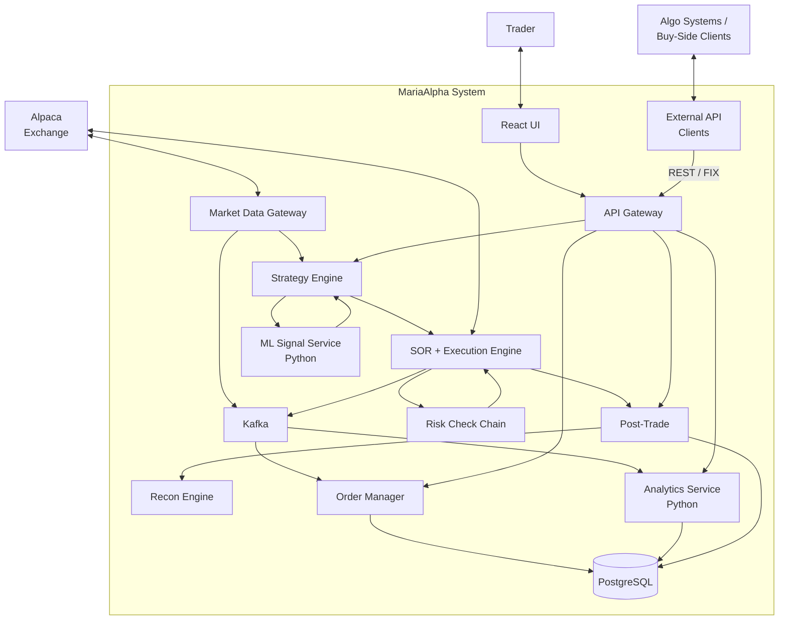

### 2.6 Key Sequence Diagrams

#### 2.6.1 Tick-to-Trade (Happy Path)

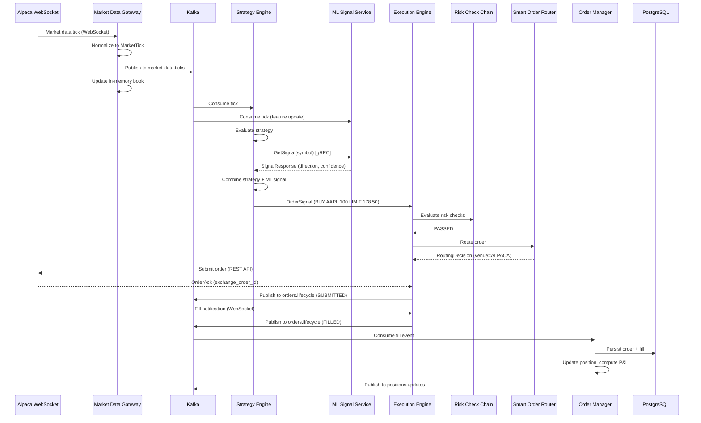

#### 2.6.2 RFQ Pricing Flow

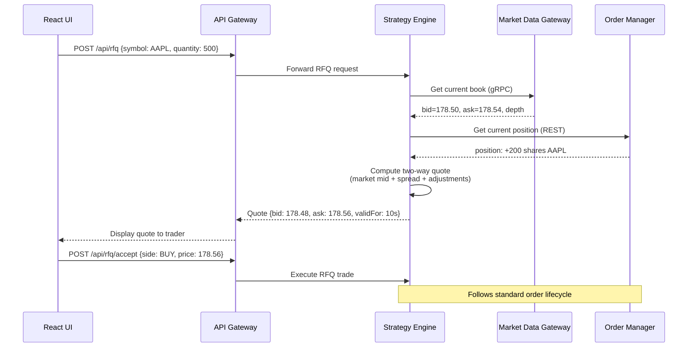

#### 2.6.3 End-of-Day Reconciliation

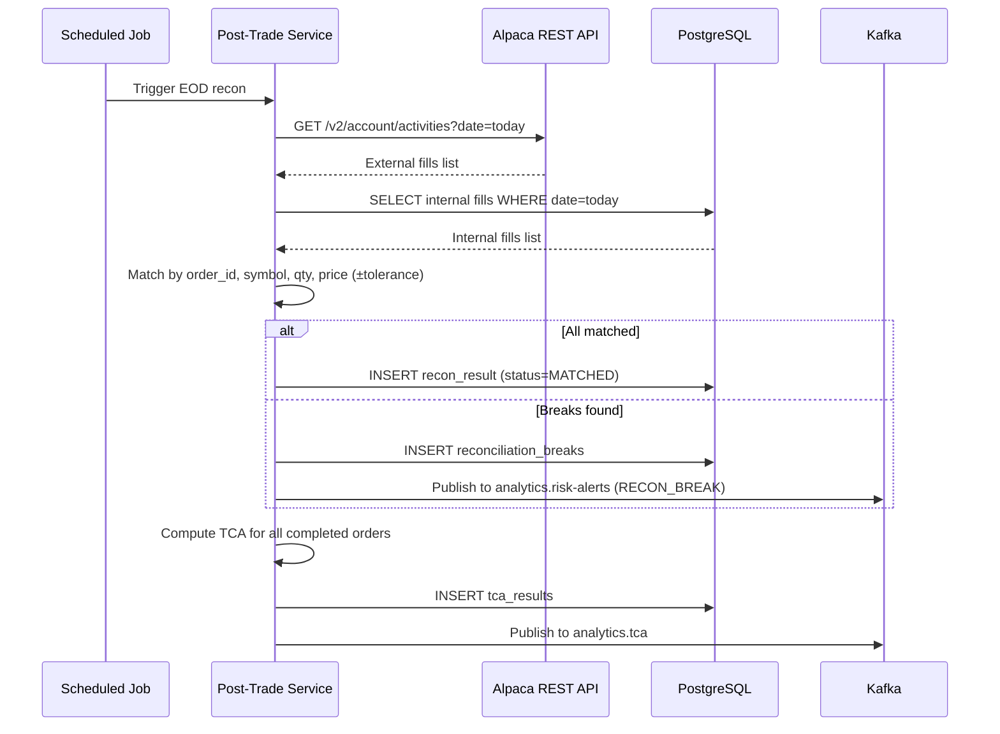

#### 2.6.4 Programmatic Algo Execution (External API Client)

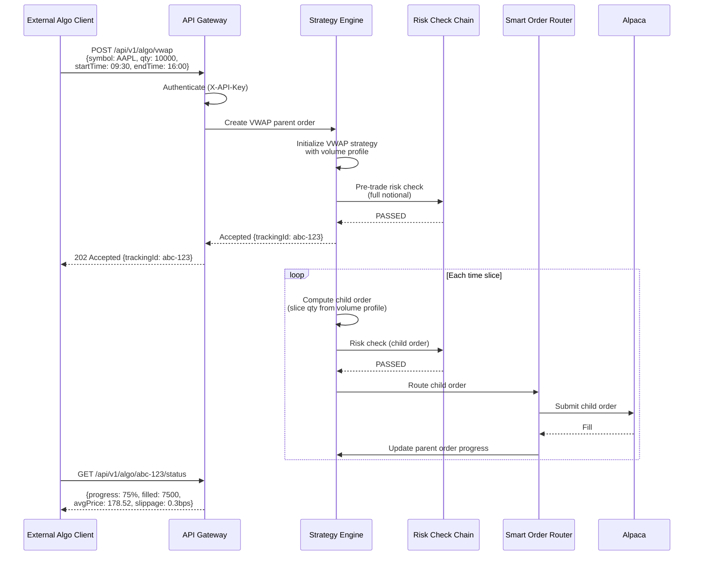

---

## 3. Functional Requirements

### 3.1 Market Data Gateway

| ID | Requirement |
| --- | --- |
| FR-1 | The system SHALL connect to Alpaca's real-time WebSocket API (`wss://stream.data.alpaca.markets`) and subscribe to trade and quote updates for a configurable list of symbols. |
| FR-2 | The system SHALL accept a list of symbols via a configuration file (`config/symbols.yml`) that defines which instruments to subscribe to. |
| FR-3 | The system SHALL normalize incoming Alpaca market data (trades, quotes, bars) into a unified internal `MarketTick` event schema and publish each tick to the `market-data.ticks` Kafka topic. |
| FR-4 | The system SHALL maintain a real-time in-memory order book (best bid/ask, last trade price, cumulative volume) per subscribed symbol, accessible by other services via a gRPC streaming API. |
| FR-5 | The system SHALL fetch historical daily bars from Alpaca's REST API (`/v2/stocks/{symbol}/bars`) for strategy warm-up and feature computation, storing results in PostgreSQL. |
| FR-6 | The system SHALL support a simulated market data adapter that replays historical data from CSV files at configurable speed, enabling deterministic testing without external API dependencies. |

### 3.2 Strategy Engine

| ID | Requirement |
| --- | --- |
| FR-7 | The system SHALL provide a pluggable `TradingStrategy` interface that accepts market data events and produces order signals (buy/sell/hold with target quantity and urgency). New strategy implementations SHALL be registrable at runtime via a `StrategyRegistry` without modifying existing code — adding a new algorithm requires only implementing the interface and registering it. |
| FR-8 | The system SHALL implement a VWAP execution algorithm that slices a parent order across the trading day proportional to a historical volume profile, targeting the day's volume-weighted average price. |
| FR-9 | The system SHALL implement a TWAP execution algorithm that distributes a parent order evenly across configurable fixed time intervals. |
| FR-10 | The system SHALL implement a Momentum/Trend-following strategy that generates entry/exit signals based on configurable moving average crossovers (e.g., 20-period / 50-period EMA cross), RSI thresholds, and volume confirmation. |
| FR-11 | The system SHALL allow runtime selection of the active strategy per symbol via the REST API and UI, without requiring a restart. |
| FR-12 | The system SHALL consume real-time ML signals from the Signal Service via gRPC and incorporate them as an additional input to strategy decisions (e.g., adjusting urgency, confirming/vetoing signals). |

### 3.3 ML Signal Service (Python)

| ID | Requirement |
| --- | --- |
| FR-13 | The ML Signal Service SHALL consume market data ticks from Kafka (`market-data.ticks`), compute features (EMA, RSI, MACD, volume ratios, ATR, volatility measures), and maintain a rolling feature window per symbol. |
| FR-14 | The Signal Service SHALL expose a gRPC endpoint (`GetSignal(symbol)`) that returns the current signal prediction: direction (LONG/SHORT/NEUTRAL), confidence score (0.0–1.0), and recommended position size as a fraction of available capital. The Signal Service SHALL also expose `StreamSignals` for push-based signal delivery to the Strategy Engine. |
| FR-15 | The Signal Service SHALL implement a gradient-boosted tree model (LightGBM) trained on historical features to predict short-term price direction (next 5-minute return sign). |
| FR-16 | The Signal Service SHALL implement a market regime classifier (Random Forest) that categorizes the current market state (TRENDING_UP, TRENDING_DOWN, MEAN_REVERTING, HIGH_VOLATILITY, LOW_VOLATILITY) based on rolling statistical features, and expose it via a gRPC endpoint (`GetRegime(symbol)`). |
| FR-17 | The Strategy Engine SHALL use the regime classification to select the most appropriate execution algorithm: Momentum for TRENDING regimes, VWAP/TWAP for MEAN_REVERTING or LOW_VOLATILITY regimes. |
| FR-18 | The Signal Service SHALL support model reloading without downtime via a `POST /v1/models/reload` REST endpoint, allowing hot-swapping of model artifacts. |

### 3.4 Execution Engine

| ID | Requirement |
| --- | --- |
| FR-19 | The Execution Engine SHALL accept order signals from the Strategy Engine and submit them to the configured exchange adapter (Alpaca or simulated). |
| FR-20 | The system SHALL implement an Alpaca exchange adapter using Alpaca's REST API (`POST /v2/orders`) for order submission and the WebSocket trade updates stream for fill notifications. |
| FR-21 | The system SHALL implement a simulated exchange adapter with a basic price-time priority matching engine that fills orders against the current market data, simulating realistic latency and partial fills. |
| FR-22 | The Execution Engine SHALL support order types: MARKET, LIMIT, and STOP in the MVP. Order type handling SHALL be implemented via an `OrderTypeHandler` interface with a registry, so that additional types (IOC, FOK, GTC, Iceberg, Pegged) can be added by implementing the interface and registering the handler — without modifying existing order processing logic. |
| FR-23 | The Execution Engine SHALL maintain the full order lifecycle state machine: NEW → SUBMITTED → PARTIALLY_FILLED → FILLED / CANCELLED / REJECTED, with all state transitions published to the `orders.lifecycle` Kafka topic. |
| FR-24 | The Execution Engine SHALL enforce pre-trade risk checks before submitting any order via a composable `RiskCheck` chain. MVP checks include: maximum order notional value, maximum position size per symbol, and maximum total portfolio exposure. The chain is configured via `config/risk-limits.yml` and designed so that additional checks (sector exposure limits, beta limits, intraday VaR, ADV-relative sizing) can be added by implementing the `RiskCheck` interface and appending to the chain — without modifying existing checks. |

### 3.5 Order Manager and Position Tracking

| ID | Requirement |
| --- | --- |
| FR-25 | The Order Manager SHALL persist all orders and fills to PostgreSQL with full audit trail (timestamps, state transitions, fill prices and quantities). |
| FR-26 | The system SHALL maintain a real-time position book that updates on every fill event, tracking per-symbol: net quantity, average entry price, realized P&L, and unrealized P&L (mark-to-market against latest tick). |
| FR-27 | The system SHALL compute portfolio-level aggregates in real time: total P&L, total exposure (gross and net), number of open positions, and cash balance. |
| FR-28 | The system SHALL publish position and P&L updates to the `positions.updates` Kafka topic for consumption by the UI and analytics services. |

### 3.6 Post-Trade and Reconciliation

| ID | Requirement |
| --- | --- |
| FR-29 | The Post-Trade Service SHALL run an end-of-day reconciliation process that compares internal order/fill records against Alpaca's account activity API (`GET /v2/account/activities`). |
| FR-30 | The reconciliation process SHALL flag discrepancies (missing fills, price mismatches, quantity mismatches) and persist them to a `reconciliation_breaks` table in PostgreSQL. |
| FR-31 | The system SHALL compute transaction cost analysis (TCA) for every completed order, measuring: slippage (fill price vs. arrival price), implementation shortfall, VWAP benchmark comparison, and spread cost. |
| FR-32 | TCA results SHALL be published to the `analytics.tca` Kafka topic and persisted to PostgreSQL for historical analysis. |

### 3.7 Analytics Service (Python)

| ID | Requirement |
| --- | --- |
| FR-33 | The Analytics Service SHALL consume events from `orders.lifecycle`, `positions.updates`, and `analytics.tca` Kafka topics and compute aggregate analytics. |
| FR-34 | The Analytics Service SHALL compute and expose via REST API: daily P&L time series, cumulative return curve, Sharpe ratio (rolling and cumulative), maximum drawdown, win rate (percentage of profitable trades), and average trade duration. |
| FR-35 | The Analytics Service SHALL compute per-strategy performance breakdowns, allowing comparison of algorithm effectiveness. |
| FR-36 | The Analytics Service SHALL detect portfolio risk anomalies: concentration risk (single position exceeding configurable threshold of total portfolio value), unusually large drawdowns (exceeding 2× rolling standard deviation), and abnormal trading volume patterns. Risk alerts SHALL be published to the `analytics.risk-alerts` Kafka topic. |

### 3.8 React UI

| ID | Requirement |
| --- | --- |
| FR-37 | The UI SHALL display a live portfolio dashboard showing: all open positions with real-time P&L, total portfolio value, daily P&L, gross/net exposure, and cash balance. Updates SHALL reflect within 1 second of a position change. |
| FR-38 | The UI SHALL display a live market data panel showing real-time bid/ask/last price and volume for subscribed symbols, powered by WebSocket streaming from the API Gateway. |
| FR-39 | The UI SHALL provide an order entry form allowing the user to manually submit orders (symbol, side, quantity, order type, limit price) and view the order's lifecycle status in real time. |
| FR-40 | The UI SHALL provide an RFQ panel where the user can request a two-way quote (bid and ask) for a given symbol and quantity. The pricing engine SHALL compute quotes using current market data (bid/ask, depth) and configurable spread parameters in the MVP. The pricing model is designed to be extended with inventory-aware adjustments, volatility-adjusted spreads, order-size-relative-to-ADV scaling, and client tiering in later iterations. |
| FR-41 | The UI SHALL display a strategy control panel allowing the user to: view active strategies per symbol, switch strategies at runtime, and see the current ML signal and regime classification for each symbol. |
| FR-42 | The UI SHALL display a TCA and analytics dashboard showing: execution quality metrics per order, aggregate strategy performance charts, daily P&L chart, and risk alert notifications. |
| FR-43 | The UI SHALL display a reconciliation panel showing the latest reconciliation run results: matched trades, breaks, and break resolution status. |

### 3.9 API Gateway

| ID | Requirement |
| --- | --- |
| FR-44 | The API Gateway SHALL expose a unified REST API for the UI and external consumers, proxying requests to the appropriate backend services (Strategy Engine, Order Manager, Analytics). |
| FR-45 | The API Gateway SHALL expose WebSocket endpoints for real-time streaming of: market data ticks, position updates, order lifecycle events, and risk alerts. |
| FR-46 | Each backend service SHALL expose `GET /health` and `GET /ready` endpoints returning `{"status": "healthy"}` with HTTP 200 when the service and its dependencies are operational. |

---

## 4. Non-Functional Requirements

### 4.1 Performance

| ID | Requirement |
| --- | --- |
| NFR-1 | Tick-to-signal latency (market data received → ML signal available via gRPC) SHALL be below 50ms at p99. |
| NFR-2 | Tick-to-order latency (market data received → order submitted to exchange adapter) SHALL be below 100ms at p99 for algorithmic orders. |
| NFR-3 | Market data normalization and Kafka publishing SHALL sustain at least 10,000 ticks per second on a single Market Data Gateway instance. |
| NFR-4 | Position and P&L recalculation SHALL complete within 10ms per fill event. |
| NFR-5 | UI dashboard updates SHALL reflect position changes within 1 second (end-to-end from fill to screen). |

> **Note:** NFR-1 through NFR-5 are design targets for the intended deployment profile (developer workstation, ≥16 GB RAM, SSD). No benchmark measurements have been taken yet. Numbers may be revised once real data is collected.

### 4.2 Capacity

| ID | Requirement |
| --- | --- |
| NFR-6 | The system SHALL support simultaneous subscription to at least 100 symbols with real-time market data. |
| NFR-7 | The system SHALL support up to 10,000 active orders and 100,000 historical orders in PostgreSQL without performance degradation. |
| NFR-8 | The system SHALL retain at least 90 days of tick history, order history, and analytics data. |

### 4.3 Code Quality and Testing

| ID | Requirement |
| --- | --- |
| NFR-9 | All Java code SHALL pass Checkstyle and SpotBugs analysis with zero errors. |
| NFR-10 | All Python code SHALL pass `ruff` linting and `mypy` type checking with zero errors. |
| NFR-11 | Each Java service SHALL have unit tests with at least 80% line coverage, measured by JaCoCo. |
| NFR-12 | Each Python service SHALL have unit tests with at least 80% line coverage, measured by `pytest-cov`. |
| NFR-13 | Integration tests SHALL use Testcontainers to spin up real Kafka, PostgreSQL, and Redis instances — no mocked infrastructure dependencies for integration-level tests. |
| NFR-14 | The project SHALL include end-to-end tests using the simulated exchange adapter to validate the full trading pipeline without external dependencies. |
| NFR-15 | The CI pipeline SHALL include mutation testing (PITest for Java, mutmut for Python) to validate test suite effectiveness. |

### 4.4 API Documentation

| ID | Requirement |
| --- | --- |
| NFR-16 | ALL REST APIs SHALL be documented with OpenAPI 3.0 specifications, auto-generated from code annotations (springdoc-openapi for Java, FastAPI's built-in OpenAPI for Python). |
| NFR-17 | Each service's OpenAPI spec SHALL be accessible at `/v3/api-docs` (Java) or `/openapi.json` (Python) and rendered via Swagger UI at `/swagger-ui`. |

### 4.5 Developer Experience

| ID | Requirement |
| --- | --- |
| NFR-18 | The entire stack SHALL be runnable locally with a single `just run` command (using Docker Compose). |
| NFR-19 | The project SHALL include a comprehensive `README.md` with quickstart instructions, architecture overview, and configuration guide. |

---

## 5. Main Proposal

### 5.1 High-Level Architecture

The system is **microservice-based with a shared PostgreSQL database** — a pragmatic choice for a portfolio project that avoids the operational overhead of per-service databases (distributed transactions, eventual consistency, cross-service JOIN complexity) while maintaining service independence through Kafka-based event communication. Introducing Redis in Phase 2 does **not** change this — Redis serves as a **cache layer** for the hot path (sub-millisecond position lookups, shared order book state), not as a replacement for PostgreSQL. PostgreSQL remains the single system of record for all durable state. The hot path (in-memory order book, current positions, latest ML features) is held in-process within each service for low latency in the MVP, with Redis providing cross-service cache coherence in Phase 2.

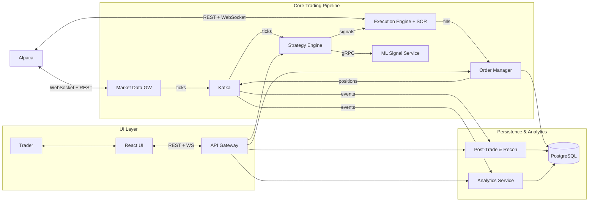

### 5.2 Service Descriptions

#### 5.2.1 Market Data Gateway

| Property | Value |
| --- | --- |
| **Language** | Java 21 |
| **Framework** | Spring Boot 3 with Spring WebFlux (reactive) |
| **Role** | Connects to Alpaca WebSocket/REST APIs, normalizes market data, publishes ticks to Kafka, and serves real-time data via gRPC |

**Unified MarketTick Schema (Kafka `market-data.ticks`):**

```json
{
  "symbol": "AAPL",
  "timestamp": "2026-03-24T14:30:00.123Z",
  "eventType": "TRADE",
  "price": 178.52,
  "size": 100,
  "bidPrice": 178.50,
  "askPrice": 178.54,
  "bidSize": 200,
  "askSize": 150,
  "cumulativeVolume": 12345678,
  "source": "ALPACA"
}
```

**Adapter Interface:**

```java
public interface MarketDataAdapter {
    void connect(List<String> symbols);
    void disconnect();
    Flux<MarketTick> streamTicks();
    List<HistoricalBar> getHistoricalBars(String symbol, LocalDate from,
                                          LocalDate to, BarTimeframe timeframe);
}
```

Two implementations: `AlpacaMarketDataAdapter` (production) and `SimulatedMarketDataAdapter` (testing — replays CSVs).

#### 5.2.2 Strategy Engine

| Property | Value |
| --- | --- |
| **Language** | Java 21 |
| **Framework** | Spring Boot 3 |
| **Role** | Consumes market data, applies trading strategies, and produces order signals |

**Strategy Interface:**

```java
public interface TradingStrategy {
    String name();
    void onTick(MarketTick tick);
    Optional<OrderSignal> evaluate(String symbol);
    Map<String, Object> getParameters();
    void updateParameters(Map<String, Object> params);
}
```

**Strategy Implementations:**

| Strategy | Key Parameters | Entry Condition | Exit Condition |
| --- | --- | --- | --- |
| VWAP | `targetQuantity`, `startTime`, `endTime`, `volumeProfile` | Slices parent order across time bins proportional to historical volume curve | Target quantity fully executed or end time reached |
| TWAP | `targetQuantity`, `startTime`, `endTime`, `numSlices` | Distributes equal child orders across evenly spaced intervals | Target quantity fully executed or end time reached |
| Momentum | `fastEMA` (20), `slowEMA` (50), `rsiPeriod` (14), `rsiOverbought` (70), `rsiOversold` (30) | Fast EMA crosses above slow EMA AND RSI not overbought AND volume > 1.5× average | Fast EMA crosses below slow EMA OR RSI reaches overbought OR stop-loss hit |

**Signal integration:** if the ML signal confidence > 0.7 and agrees with the strategy direction, proceed. If > 0.7 and contradicts, suppress. If ≤ 0.7, proceed with strategy signal alone. Configurable via `config/strategy.yml`.

#### 5.2.3 ML Signal Service

| Property | Value |
| --- | --- |
| **Language** | Python 3.12 |
| **Framework** | gRPC server (grpcio) + FastAPI sidecar (health/metrics/model reload) |
| **Role** | Computes features from market data, generates directional signals and regime classifications |

**gRPC Service Definition (`signal.proto`):**

```protobuf
syntax = "proto3";
package mariaalpha.signal;

service SignalService {
  rpc GetSignal(SignalRequest) returns (SignalResponse);
  rpc GetRegime(RegimeRequest) returns (RegimeResponse);
  rpc StreamSignals(SignalStreamRequest) returns (stream SignalResponse);
}

enum Direction { NEUTRAL = 0; LONG = 1; SHORT = 2; }
enum MarketRegime {
  UNKNOWN = 0; TRENDING_UP = 1; TRENDING_DOWN = 2;
  MEAN_REVERTING = 3; HIGH_VOLATILITY = 4; LOW_VOLATILITY = 5;
}
```

**ML Models:**

| Model | Library | Input | Output | Training Data |
| --- | --- | --- | --- | --- |
| Signal | LightGBM (gradient-boosted trees) | 15 rolling features (EMA, RSI, MACD, volume ratios, ATR, realized vol) | Direction + confidence | Historical 1-min bars, label = sign of next-5-min return |
| Regime | scikit-learn (Random Forest) | 8 statistical features (trend strength, volatility ratio, mean-reversion score) | MarketRegime + confidence | Historical daily bars, hand-labeled regimes |

Pre-trained model artifacts stored as `.joblib` files in `ml-models/`, loaded at startup. Hot-reloading via `POST /v1/models/reload`.

#### 5.2.4 Execution Engine

| Property | Value |
| --- | --- |
| **Language** | Java 21 |
| **Framework** | Spring Boot 3 |
| **Role** | Receives order signals, applies pre-trade risk checks, routes via SOR, submits orders to exchange, and processes fill events |

**Order Lifecycle State Machine:**

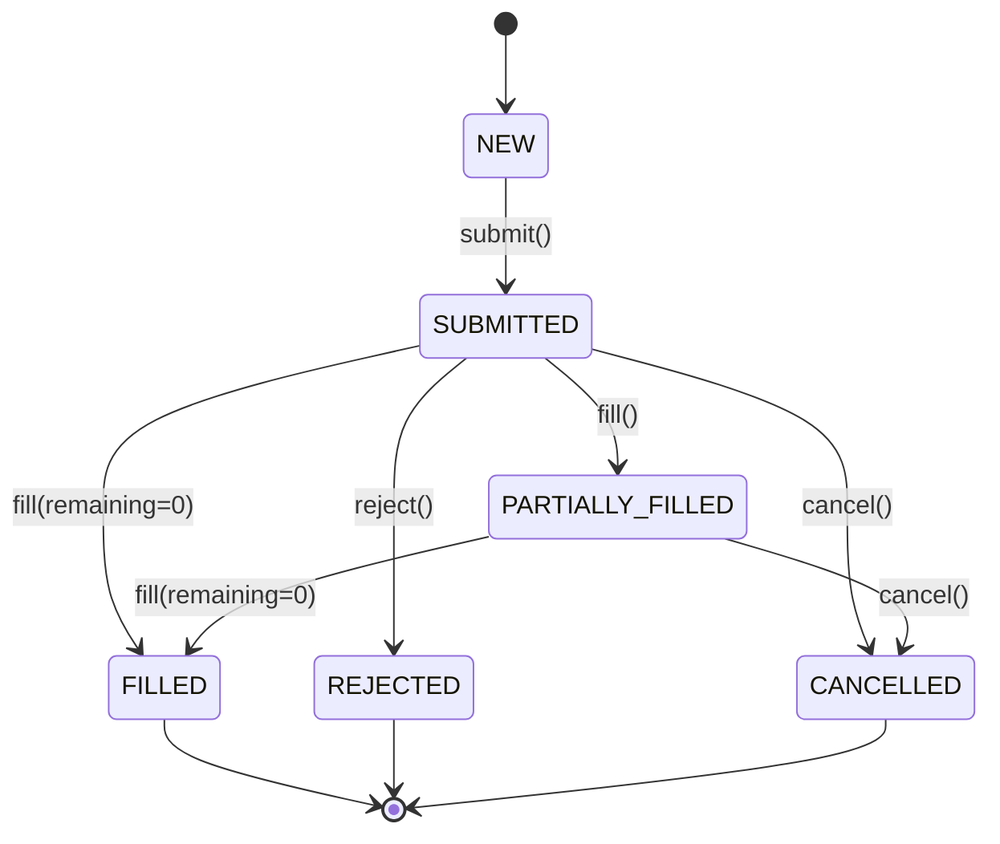

**Exchange Adapter Interface:**

```java
public interface ExchangeAdapter {
    OrderAck submitOrder(Order order);
    OrderAck cancelOrder(String orderId);
    OrderStatus getOrderStatus(String orderId);
    Flux<ExecutionReport> streamExecutionReports();
    List<AccountActivity> getAccountActivities(LocalDate date);
}
```

#### 5.2.5 Order Manager

| Property | Value |
| --- | --- |
| **Language** | Java 21 |
| **Framework** | Spring Boot 3 with Spring Data JPA |
| **Role** | Persists orders and fills, maintains position book, computes real-time P&L |

**Position Calculation:** On every fill: (1) adjust quantity and weighted avg entry price, (2) compute realized P&L on position-reducing fills, (3) mark-to-market open positions against latest tick, (4) publish updated snapshot to `positions.updates`.

#### 5.2.6 Post-Trade and Reconciliation Engine

| Property | Value |
| --- | --- |
| **Language** | Java 21 |
| **Framework** | Spring Boot 3 with Spring Batch |
| **Role** | End-of-day reconciliation, TCA computation, post-trade reports |

**TCA Metrics Per Order:** slippage (bps), implementation shortfall (bps), VWAP benchmark (bps), spread cost (bps). See sequence diagram in §2.6.3 for reconciliation flow.

#### 5.2.7 Analytics Service

| Property | Value |
| --- | --- |
| **Language** | Python 3.12 |
| **Framework** | FastAPI |
| **Role** | Consumes trade/position events from Kafka, computes aggregate analytics, exposes REST API |

Key endpoints: `/v1/analytics/pnl/daily`, `/v1/analytics/pnl/cumulative`, `/v1/analytics/performance`, `/v1/analytics/performance/{strategy}`, `/v1/analytics/tca/{orderId}`, `/v1/analytics/tca/summary`, `/v1/analytics/risk/alerts`. Phase 2 adds: `/v1/analytics/pnl/attribution`, `/v1/analytics/flow/toxicity`, `/v1/analytics/axes`.

#### 5.2.8 API Gateway

| Property | Value |
| --- | --- |
| **Language** | Java 21 |
| **Framework** | Spring Cloud Gateway (reactive) |
| **Role** | Unified REST + WebSocket entry point for the React UI, external electronic trading clients (REST API, FIX gateway in Phase 3), and any programmatic consumers |

Routes: `/api/market-data/**`, `/api/strategies/**`, `/api/orders/**`, `/api/analytics/**`, `/api/recon/**`, `/api/routing/**` (Phase 2). WebSocket endpoints: `/ws/market-data`, `/ws/positions`, `/ws/orders`, `/ws/alerts`.

#### 5.2.9 React UI

| Property | Value |
| --- | --- |
| **Language** | TypeScript |
| **Framework** | React 18 with Vite, TailwindCSS, Recharts |
| **Role** | SPA for live risk monitoring, order management, RFQ pricing, and analytics |

Pages: Dashboard, Market Data, Order Entry, RFQ, Strategy Control, Analytics, Reconciliation.

### 5.3 Extensibility Architecture

#### 5.3.1 Strategy Registry

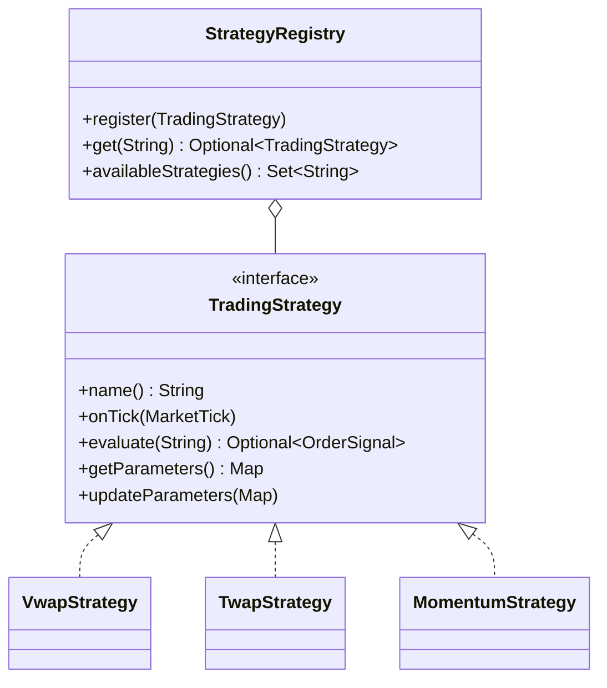

Future algorithms: Implementation Shortfall (Phase 2), POV (Phase 2), Close (Phase 2), Mean Reversion (Phase 3), Statistical Arbitrage (Phase 3).

#### 5.3.2 Order Type Handler Registry

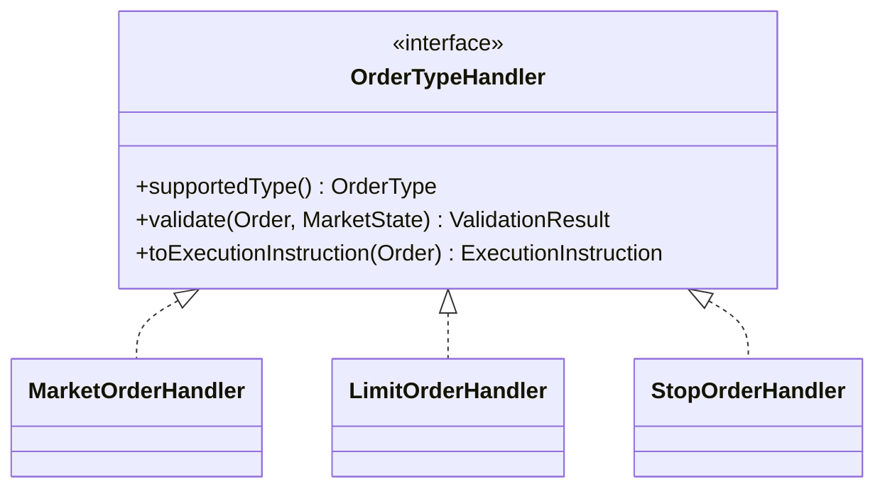

Future order types: IOC (Phase 2), FOK (Phase 2), GTC (Phase 2), Iceberg (Phase 2), Pegged (Phase 3).

#### 5.3.3 Composable Risk Check Chain

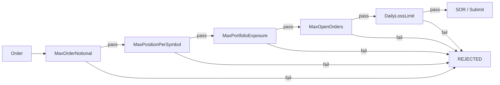

Future checks: Sector Exposure (Phase 2), Beta Exposure (Phase 2), ADV Sizing (Phase 2), Intraday VaR (Phase 3), Correlated Positions (Phase 3).

#### 5.3.4 Exchange Adapter SPI

Both `MarketDataAdapter` and `ExchangeAdapter` are pluggable via Spring profiles (`spring.profiles.active: alpaca | simulated | ibkr`). Adding a new exchange requires implementing two interfaces — no changes to upstream services.

#### 5.3.5 Smart Order Router (Phase 2)

MVP uses `DirectRouter` (pass-through). Phase 2 SOR considers: price improvement, liquidity, latency, fees, information leakage, and internalization opportunities across lit, dark, and internal crossing venues.

#### 5.3.6 Electronic Trading API (Phase 3)

The architecture decouples **inbound order channels** from the **execution pipeline**. In the MVP, orders originate exclusively from the React UI via the API Gateway. The same Strategy Engine → Risk Check Chain → SOR → Exchange Adapter pipeline processes all orders regardless of origin. This means adding new inbound channels requires **no changes to the execution pipeline** — only a new entry point that produces `OrderSignal` objects:

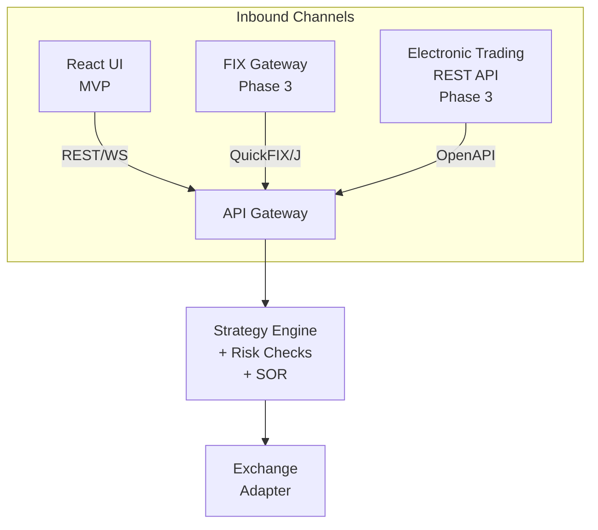

The Electronic Trading REST API (Phase 3) would expose endpoints for programmatic algo execution: `POST /api/v1/algo/vwap`, `POST /api/v1/algo/twap`, `POST /api/v1/algo/is`, etc. — each accepting order parameters and returning a tracking ID for monitoring execution progress via WebSocket. The FIX gateway (also Phase 3) would accept standard FIX 4.4 NewOrderSingle messages and route them through the same pipeline.

### 5.4 Data Model

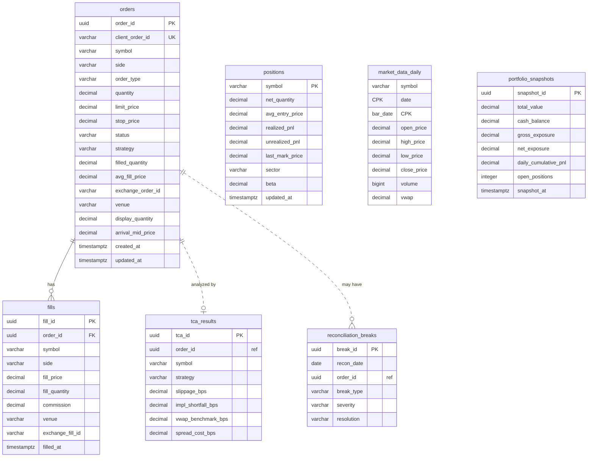

> **Table ownership:** Each service owns its tables exclusively — no cross-service foreign keys. `order-manager` owns `orders`, `fills`, `positions`, `portfolio_snapshots`. `post-trade` owns `reconciliation_breaks`, `tca_results`. `market-data-gateway` owns `market_data_daily`. Cross-service references (e.g. `order_id` in post-trade tables) are stored as UUIDs without FK constraints; consistency is maintained via Kafka events.

> **Note:** `venue` and `display_quantity` on orders, `venue` on fills, `sector` and `beta` on positions are nullable Phase 2 columns unused in the MVP.

#### Kafka Topics

All topics start with **1 partition** and **minimal retention** in the MVP. Partition counts and retention SHALL be increased based on observed throughput and audit requirements.

| Topic | Key | Value Schema | Initial Partitions | Initial Retention |
| --- | --- | --- | --- | --- |
| `market-data.ticks` | symbol | MarketTick JSON | 1 | 4 hours |
| `orders.lifecycle` | orderId | OrderEvent JSON | 1 | 3 days |
| `positions.updates` | symbol | PositionSnapshot JSON | 1 | 3 days |
| `analytics.tca` | orderId | TCA result JSON | 1 | 3 days |
| `analytics.risk-alerts` | symbol | RiskAlert JSON | 1 | 3 days |
| `routing.decisions` | orderId | SOR routing decision JSON | 1 | 3 days |
| `orders.dlq` | orderId | Error + original order JSON | 1 | 30 days |

> **Rationale for non-zero retention:** Even in the MVP, consumers that crash and restart need to replay unprocessed messages from their last committed offset. Zero retention would cause data loss on restart. Market data ticks are high-volume with short-lived value (4 hours). Order/position topics are lower-volume with audit value (3 days). DLQ retains longer for manual inspection.

### 5.5 Technology Choices and Rationale

| Decision | Choice | Rationale |
| --- | --- | --- |
| Core language | Java 21 | Industry standard for trading systems. Virtual threads (Project Loom) for efficient concurrent I/O. Pattern matching and records for clean domain modeling. |
| Core framework | Spring Boot 3 | Production-proven ecosystem (WebFlux, Data JPA, Cloud Gateway, Batch, Actuator). Actuator provides health/metrics out of the box. |
| ML/AI language | Python 3.12 | Required for ML ecosystem (LightGBM, scikit-learn, pandas). FastAPI for REST. grpcio for signal serving. |
| Java ↔ Python | gRPC (real-time) + Kafka (async) | gRPC provides sub-5ms latency for the signal path. Kafka handles async analytics with durability and replay. |
| Event backbone | Apache Kafka (KRaft) | Event-driven decoupling. Durability, replayability, consumer groups. KRaft eliminates Zookeeper. |
| Database | PostgreSQL 16 | Battle-tested RDBMS for transactional (orders, fills) and analytical (TCA, snapshots) workloads. |
| Distributed cache | Redis (Phase 2) | Sub-millisecond position lookups for pre-trade risk. Shared order book state. Pub/sub for dashboard updates. |
| Exchange API (MVP) | Alpaca | Free paper trading. Real-time WebSocket. REST order management. Zero cost. |
| UI framework | React 18 + TypeScript + Vite | Vite provides near-instant HMR. Recharts for visualization. TailwindCSS for styling. |
| API gateway | Spring Cloud Gateway | Reactive routing with WebSocket support. Native Spring integration. |
| Resilience | Resilience4j | Circuit breakers, retries, bulkheads, rate limiters, timeouts. Standard Java resilience library. |
| Container orchestration | Kubernetes (Docker Desktop / minikube / kind) | Docker Desktop includes a built-in K8s cluster (simplest option). minikube/kind as alternatives. Helm for deployment. |
| Observability | Grafana + Prometheus + Loki + Tempo + Alloy | Full LGTM stack. Metrics, logs, traces with cross-linking. Alloy as unified collector. |
| CI/CD | GitHub Actions | Free for public repos. Matrix builds. CodeQL + Snyk for security. PITest + mutmut for mutation testing. |
| Task management | GitHub Issues + GitHub Projects | Integrated with repo. Labels for categorization. Milestones for phases. Projects board for Kanban. |
| Integration testing | Testcontainers | Real Kafka/PostgreSQL/Redis in tests. No mocked infrastructure. |
| Database migrations | Liquibase | Supports XML/YAML/JSON/SQL changelogs. Rollback support. Widely used in enterprise Java. Runs automatically on Spring Boot startup. |
| Command runner | just | Modern alternative to Make. No tab-sensitivity issues, cleaner syntax, built-in argument passing, cross-platform. `justfile` replaces `Makefile`. |
| API testing (Phase 2) | Bruno | Open-source API client. Collections stored as files in the repo. Replaces Postman. |
| Stream processing (Phase 4) | Apache Flink (consideration) | Complex event processing for multi-symbol pattern detection, windowed portfolio-level VaR computation, and real-time aggregation across high-volume streams. Adds significant infrastructure complexity — justified only at scale beyond MVP. |

---

## 6. Scalability

### 6.1 Scaling Strategy

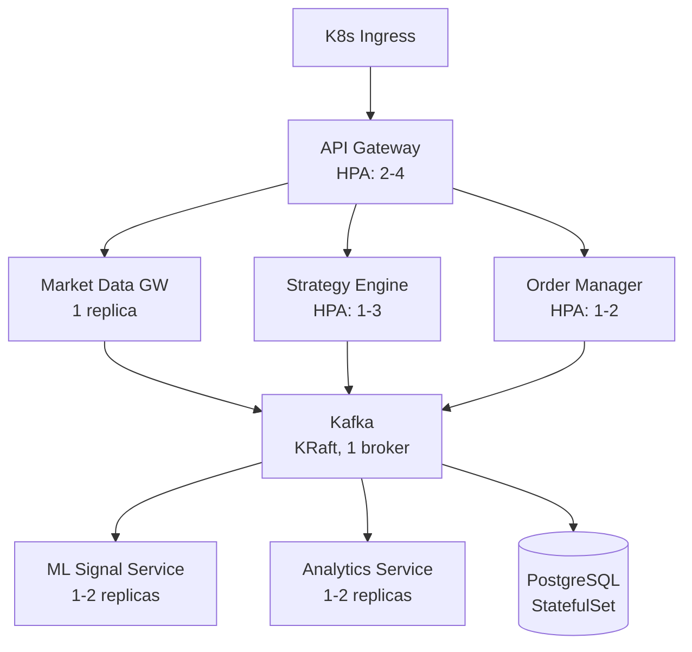

### 6.2 Bottleneck Analysis

| Component | Bottleneck | Mitigation |
| --- | --- | --- |
| Market Data Gateway | Alpaca allows 1 WebSocket connection per account | Single instance for MVP |
| Strategy Engine | CPU-bound evaluation per tick | Kafka partitioning by symbol distributes across replicas |
| ML Signal Service | Inference latency under high tick volume | Incremental feature computation. HPA scaling. |
| Execution Engine | Alpaca: 200 req/min rate limit | Order queuing with rate limiter |
| PostgreSQL | Write throughput under high fill volume | Batch inserts. Single instance sufficient for MVP |

---

## 7. Resilience

### 7.1 Resilience Patterns

The system uses **Resilience4j** (Java services) for structured resilience patterns. Each pattern is applied at specific integration points:

| Pattern | Where Applied | Configuration |
| --- | --- | --- |
| **Circuit Breaker** | Strategy Engine → ML Signal Service (gRPC) | Failure threshold: 5 calls. Open duration: 30s. Half-open permits: 2. On open: strategy proceeds without ML signal. |
| **Circuit Breaker** | Execution Engine → Alpaca Order API | Failure threshold: 3 calls. Open duration: 60s. On open: orders queued, CRITICAL alert published. |
| **Retry (exponential backoff)** | Market Data Gateway → Alpaca WebSocket reconnect | Max attempts: 5. Initial interval: 1s. Multiplier: 2×. Max interval: 30s. |
| **Retry (exponential backoff)** | Execution Engine → Alpaca order submission | Max attempts: 3. Initial interval: 500ms. Multiplier: 2×. |
| **Retry (exponential backoff)** | All services → PostgreSQL connection | Max attempts: 3. Handled by HikariCP pool configuration. |
| **Timeout** | Strategy Engine → ML Signal Service (gRPC) | Deadline: 100ms. On timeout: proceed without ML signal. |
| **Timeout** | Execution Engine → Alpaca REST API | 5 seconds. On timeout: mark order submission failed, retry. |
| **Timeout** | All services → PostgreSQL queries | 2 seconds. On timeout: log, return error to caller. |
| **Bulkhead** | Execution Engine thread pools | Separate thread pools for: order submission (10 threads), fill processing (5 threads), risk checks (5 threads). Prevents a slow Alpaca API from starving risk check processing. |
| **Rate Limiter** | Execution Engine → Alpaca REST API | 200 requests/minute (Alpaca's limit). Guava `RateLimiter`. |
| **Rate Limiter** | API Gateway → inbound requests | 60 requests/minute per API key. Spring Cloud Gateway filter. |

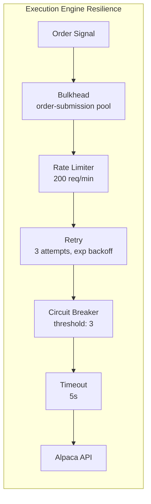

### 7.2 Failure Modes and Mitigations

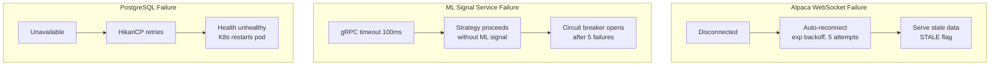

### 7.3 Idempotency

| Component | Mechanism |
| --- | --- |
| Order Manager | `client_order_id` UNIQUE constraint rejects duplicate submissions |
| Fill Processing | `exchange_fill_id` checked before persisting — duplicates ignored |
| Reconciliation | Keyed by `recon_date` — re-running overwrites previous results |
| Market Data | `(symbol, bar_date)` composite PK — re-fetch is an upsert |

### 7.4 Dead Letter Queue

Failed orders (after 3 retries) published to `orders.dlq` with error details, 30-day retention for manual inspection.

### 7.5 Graceful Degradation

| Failure | Behavior |
| --- | --- |
| ML Signal Service unavailable | Strategy operates on signals alone. Logged as degraded. |
| Alpaca WebSocket disconnected | Last-known prices with STALE flag. Strategy pauses signal generation. |
| Analytics Service unavailable | UI shows cached analytics. No trading impact. |
| PostgreSQL unavailable | Order submission paused. Market data continues in-memory. K8s restarts pods. |

### 7.6 Daily Loss Limit Enforcement

On breach of `max-loss-per-day`: (1) Strategy Engine halts signal generation, (2) open orders cancelled, (3) CRITICAL alert published, (4) UI shows halt banner, (5) resumes next trading day or via manual override.

---

## 8. Observability

### 8.1 Observability Stack (Grafana LGTM)

| Component | Role |
| --- | --- |
| **Prometheus** | Metrics collection and storage |
| **Loki** | Log aggregation (structured JSON logs) |
| **Tempo** | Distributed tracing (OpenTelemetry traces) |
| **Grafana** | Unified dashboards with metrics↔logs↔traces cross-linking |
| **Alloy** | Unified telemetry collector (DaemonSet) — replaces separate agents |

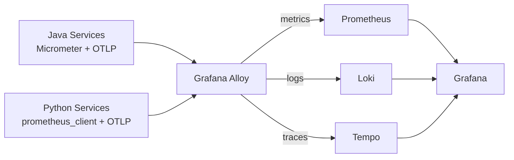

### 8.2 Metrics

#### Built-in Metrics (provided automatically by Spring Boot Actuator + Micrometer)

These require **no custom code** — they are available out of the box for all Java services:

| Category | Examples |
| --- | --- |
| JVM | `jvm_memory_used_bytes`, `jvm_gc_pause_seconds`, `jvm_threads_live` |
| HTTP | `http_server_requests_seconds` (count, sum, max — per endpoint, status, method) |
| Kafka Consumer | `kafka_consumer_records_consumed_total`, `kafka_consumer_records_lag` (consumer lag) |
| HikariCP (DB pool) | `hikaricp_connections_active`, `hikaricp_connections_pending` |
| System | `system_cpu_usage`, `process_cpu_usage`, `disk_free_bytes` |

> **Note:** Kafka consumer lag (`kafka_consumer_records_lag`) is critical for detecting if a service is falling behind on event processing. This metric is available automatically via Spring Kafka's Micrometer integration.

#### Custom Application Metrics

These are instrumented explicitly in application code:

| Metric Name | Type | Labels | Description |
| --- | --- | --- | --- |
| `mariaalpha_md_ticks_received_total` | Counter | `symbol`, `event_type` | Ticks received from exchange |
| `mariaalpha_md_tick_latency_ms` | Histogram | `symbol` | Exchange timestamp to Kafka publish |
| `mariaalpha_md_websocket_reconnects_total` | Counter | — | WebSocket reconnection attempts |
| `mariaalpha_strategy_signals_total` | Counter | `strategy`, `direction` | Signals emitted |
| `mariaalpha_strategy_ml_latency_ms` | Histogram | — | gRPC round-trip to ML Signal Service |
| `mariaalpha_strategy_ml_circuit_breaker_state` | Gauge | — | 0=closed, 1=half-open, 2=open |
| `mariaalpha_exec_orders_submitted_total` | Counter | `symbol`, `side`, `type` | Orders submitted |
| `mariaalpha_exec_order_latency_ms` | Histogram | — | Signal to exchange ack |
| `mariaalpha_exec_risk_rejections_total` | Counter | `reason` | Risk check rejections |
| `mariaalpha_exec_sor_routing_total` | Counter | `venue`, `venue_type` | SOR routing by venue (Phase 2) |
| `mariaalpha_positions_count` | Gauge | — | Open positions |
| `mariaalpha_portfolio_total_pnl` | Gauge | — | Total P&L |
| `mariaalpha_portfolio_gross_exposure` | Gauge | — | Gross exposure |
| `mariaalpha_ml_inference_duration_ms` | Histogram | `model` | Model inference latency |
| `mariaalpha_recon_breaks_total` | Counter | `break_type`, `severity` | Reconciliation breaks |
| `mariaalpha_tca_slippage_bps` | Histogram | `strategy` | Slippage distribution |

### 8.3 Grafana Dashboards

**Dashboard 1: Trading Pipeline** — Tick rate, WebSocket status, strategy signals, ML latency and circuit breaker, order/fill rates, risk rejections, SOR routing (Phase 2).

**Dashboard 2: Portfolio & Risk** — Total P&L gauge, daily P&L series, PnL attribution (Phase 2), gross/net exposure, sector heatmap (Phase 2), beta (Phase 2), risk alerts, flow toxicity (Phase 2).

**Dashboard 3: Post-Trade & Quality** — Recon match rate, TCA slippage by strategy, implementation shortfall trend, VWAP benchmark, internalization rate (Phase 2).

### 8.4 Structured Logging and Distributed Tracing

All services emit structured JSON logs (Logback for Java, structlog for Python) with `traceId` for cross-service correlation. Logs collected by Alloy → Loki. OpenTelemetry traces exported via Alloy → Tempo. Grafana provides trace-to-log and trace-to-metric cross-linking.

---

## 9. Security

### 9.1 Authentication and Authorization

| Mechanism | Implementation |
| --- | --- |
| API Gateway Auth | `X-API-Key` header. Keys stored as K8s Secret. HTTP 401 without valid key. |
| Internal Services | Kafka + gRPC within cluster network. No external exposure. |
| Alpaca API Key | K8s Secret. Only Market Data GW and Execution Engine have access. |
| React UI | No separate auth in MVP (single-user). JWT/OAuth2 in Phase 4. |

### 9.2 Rate Limiting

| Target | Limit | Implementation |
| --- | --- | --- |
| API Gateway (inbound) | 60 req/min per key | Spring Cloud Gateway `RequestRateLimiter` |
| Alpaca REST API | 200 req/min | Guava `RateLimiter` in `AlpacaExchangeAdapter` |
| Alpaca WebSocket | 1 connection per account | Single Market Data GW instance |

### 9.3 Dependency Management

Java: Gradle with dependency locking + OWASP Dependency-Check + Snyk in CI. Python: pinned `requirements.txt` via `pip-compile` + `pip-audit` + Snyk in CI. Docker base images: `eclipse-temurin:21-jre-alpine` (Java), `python:3.12-slim` (Python). Infrastructure images pinned to specific versions.

---

## 10. Deployment

### 10.1 CI/CD Pipeline (GitHub Actions)

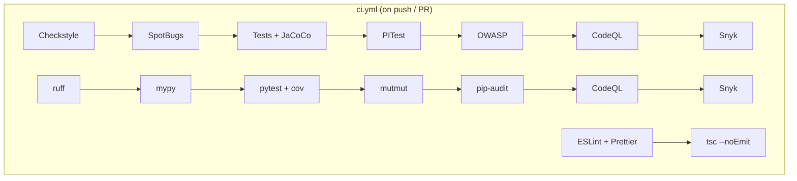

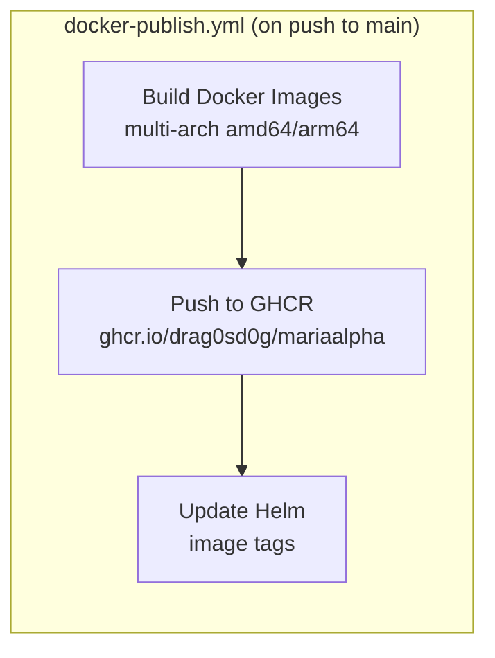

### 10.2 Kubernetes Deployment (Helm)

> **Note:** Resource values below are initial estimates. They MUST be profiled and adjusted under realistic load.

| Component | Replicas | CPU Req | CPU Limit | Mem Req | Mem Limit |
| --- | --- | --- | --- | --- | --- |
| API Gateway | 2 (HPA: 2-4) | 250m | 500m | 256Mi | 512Mi |
| Market Data GW | 1 | 500m | 1000m | 512Mi | 1Gi |
| Strategy Engine | 1 (HPA: 1-3) | 500m | 1000m | 512Mi | 1Gi |
| Execution Engine | 1 | 250m | 500m | 256Mi | 512Mi |
| Order Manager | 1 (HPA: 1-2) | 250m | 500m | 256Mi | 512Mi |
| Post-Trade | 1 | 250m | 500m | 256Mi | 512Mi |
| ML Signal Service | 1 | 500m | 1000m | 1Gi | 2Gi |
| Analytics Service | 1 | 250m | 500m | 512Mi | 1Gi |
| React UI | 1 | 100m | 250m | 128Mi | 256Mi |
| PostgreSQL | 1 (StatefulSet) | 500m | 2000m | 1Gi | 4Gi |
| Kafka (KRaft) | 1 | 500m | 1000m | 1Gi | 2Gi |
| Prometheus | 1 | 250m | 500m | 512Mi | 1Gi |
| Loki | 1 | 250m | 500m | 256Mi | 512Mi |
| Tempo | 1 | 250m | 500m | 256Mi | 512Mi |
| Alloy | DaemonSet | 100m | 250m | 128Mi | 256Mi |
| Grafana | 1 | 100m | 250m | 256Mi | 512Mi |

**Kubernetes orchestration:** Docker Desktop includes a built-in single-node Kubernetes cluster (enable via Settings → Kubernetes → Enable Kubernetes). This is the simplest option for local development — no separate VM or CLI. Alternatives: minikube (lightweight VM-based) or kind (Kubernetes in Docker containers).

---

## 11. Iteration Roadmap

Each item below is scoped to be a single GitHub Issue with specific acceptance criteria. Issues are organized by milestone (phase) and labeled by component.

### Phase 1: MVP (Happy Path)

#### 1.1 Project Scaffolding & Infrastructure

| # | Issue Title | Acceptance Criteria |
| --- | --- | --- |
| 1.1.1 | Initialize monorepo with Gradle multi-project build | Root `build.gradle.kts` and `settings.gradle.kts` with shared dependency versions, Java 21 toolchain, Checkstyle/SpotBugs/JaCoCo plugins. All Java sub-projects compile. |
| 1.1.2 | Create `justfile` with core command recipes | `justfile` with recipes: `run` (docker compose up), `stop`, `clean`, `test`, `test-java`, `test-python`, `lint`, `docker-build`, `proto` (gRPC codegen), `migrate`. All recipes documented with `just --list`. |
| 1.1.3 | Set up Docker Compose with PostgreSQL and Kafka (KRaft) | `docker-compose.yml` starts PostgreSQL 16 and Kafka in KRaft mode. Health checks pass. `just run` brings up infrastructure. |
| 1.1.4 | Create database migration (Liquibase) with initial schema | Liquibase changelog creates all tables from §5.4. Migration runs automatically on Spring Boot startup. Verified via `psql`. |
| 1.1.5 | Set up Grafana LGTM observability stack in Docker Compose | Prometheus, Loki, Tempo, Alloy, Grafana containers start. Alloy scrapes Prometheus metrics. Grafana accessible at `:3001`. |
| 1.1.6 | Configure GitHub Actions CI pipeline (lint + test) | `ci.yml` runs Checkstyle, SpotBugs, JaCoCo (Java), ruff, mypy, pytest (Python). Fails on violations. Coverage uploaded as artifact. |
| 1.1.7 | Add CodeQL and Snyk to CI pipeline | CodeQL analysis runs for Java, Python, TypeScript. Snyk scans dependencies. Both block merge on critical findings. |
| 1.1.8 | Create Kafka topics init container | Docker Compose init service creates all topics from §5.4 with 1 partition and configured retention before any consumer starts. |
| 1.1.9 | Set up shared proto module and gRPC code generation | `proto/signal.proto` defined. Gradle task generates Java stubs. Python script generates Python stubs. Both compile successfully. |

#### 1.2 Market Data Gateway

| # | Issue Title | Acceptance Criteria |
| --- | --- | --- |
| 1.2.1 | Implement `MarketDataAdapter` interface and `SimulatedMarketDataAdapter` | Interface defined per §5.2.1. Simulated adapter replays a CSV file at configurable speed. Unit tests pass with >80% coverage. |
| 1.2.2 | Implement `AlpacaMarketDataAdapter` with WebSocket connection | Connects to Alpaca paper trading WebSocket. Subscribes to configurable symbols from `config/symbols.yml`. Receives and deserializes ticks. Integration test with Alpaca sandbox. |
| 1.2.3 | Implement MarketTick normalization and Kafka publishing | Incoming Alpaca ticks normalized to `MarketTick` schema. Published to `market-data.ticks` topic. Verified via Kafka console consumer. Testcontainers integration test with real Kafka. |
| 1.2.4 | Implement in-memory order book per symbol | Maintains best bid/ask, last price, cumulative volume per symbol. Updated on every tick. Accessible via gRPC streaming API. Unit tests for concurrent updates. |
| 1.2.5 | Implement historical bar backfill from Alpaca REST API | Fetches daily bars from Alpaca REST API for configured symbols and date range. Persists to `market_data_daily` table. Idempotent on re-fetch. |
| 1.2.6 | Add Prometheus metrics and health/ready endpoints | Metrics from §8.2 exposed on `/actuator/prometheus`. Health endpoint checks Kafka and Alpaca connectivity. Ready endpoint confirms subscription is active. |
| 1.2.7 | Add WebSocket auto-reconnect with exponential backoff | On disconnect: retries with 1s, 2s, 4s, 8s, 16s delays. Max 5 attempts. Serves stale data with STALE flag during reconnect. Reconnect counter metric increments. |

#### 1.3 Strategy Engine

| # | Issue Title | Acceptance Criteria |
| --- | --- | --- |
| 1.3.1 | Implement `TradingStrategy` interface and `StrategyRegistry` | Interface defined per §5.3.1. Registry auto-discovers Spring `@Component` strategies. REST endpoint lists available strategies. Unit tests for registry. |
| 1.3.2 | Implement VWAP strategy | Accepts `targetQuantity`, `startTime`, `endTime`, `volumeProfile`. Slices orders proportional to volume curve. Emits child `OrderSignal`s at correct intervals. Unit tests with mock market data covering full trading day. |
| 1.3.3 | Implement Kafka tick consumer and strategy evaluation loop | Consumes ticks from `market-data.ticks`. Routes to active strategy per symbol. Emits order signals to Execution Engine. Testcontainers integration test. |
| 1.3.4 | Implement ML Signal Service gRPC client with circuit breaker | Calls `GetSignal` before acting on strategy signals. Resilience4j circuit breaker (threshold: 5, open: 30s). On timeout/open: proceeds without ML signal. Metrics for call count, latency, circuit breaker state. |
| 1.3.5 | Implement runtime strategy switching via REST API | `PUT /api/strategies/{symbol}` changes active strategy. No restart required. Strategy registry queried dynamically. |
| 1.3.6 | Add Prometheus metrics and health/ready endpoints | Strategy signals counter, evaluation duration histogram, ML call metrics per §8.2. |

#### 1.4 ML Signal Service

| # | Issue Title | Acceptance Criteria |
| --- | --- | --- |
| 1.4.1 | Set up Python service scaffold with FastAPI and gRPC server | FastAPI sidecar running on port 8090 with `/health`, `/ready`, `/metrics`. gRPC server on port 50051. Dockerfile builds and runs. |
| 1.4.2 | Implement feature computation engine | Consumes ticks from Kafka. Computes EMA(20), EMA(50), RSI(14), MACD, ATR(14), volume ratios per symbol. Maintains rolling window. Unit tests with known input/output pairs. |
| 1.4.3 | Implement LightGBM signal model inference | Loads pre-trained `.joblib` model at startup. `GetSignal` gRPC endpoint returns direction + confidence. Unit test with mock features. |
| 1.4.4 | Implement `StreamSignals` gRPC endpoint | Server-streaming RPC pushes signal updates to connected clients on every feature window update. Integration test with gRPC client. |
| 1.4.5 | Implement model hot-reload endpoint | `POST /v1/models/reload` loads new model artifacts from disk without restart. Currently loaded model version exposed as metric. |
| 1.4.6 | Train and bundle initial signal model | Python script trains LightGBM on Alpaca historical 1-min bars (freely available). Model artifact saved as `ml-models/signal_model.joblib`. Training script documented in README. |

#### 1.5 Execution Engine

| # | Issue Title | Acceptance Criteria |
| --- | --- | --- |
| 1.5.1 | Implement `ExchangeAdapter` interface and `SimulatedExchangeAdapter` | Interface defined per §5.2.4. Simulated adapter fills orders against current market data with configurable latency. Supports MARKET, LIMIT, STOP. Unit tests. |
| 1.5.2 | Implement `AlpacaExchangeAdapter` | Submits orders via Alpaca REST API. Receives fills via WebSocket `trade_updates` stream. Rate limited to 200 req/min. Integration test with Alpaca paper account. |
| 1.5.3 | Implement `OrderTypeHandler` interface and MVP handlers | Interface defined per §5.3.2. `MarketOrderHandler`, `LimitOrderHandler`, `StopOrderHandler` implemented. Validation logic per order type. Unit tests. |
| 1.5.4 | Implement composable `RiskCheck` chain | Interface defined per §5.3.3. MVP checks: `MaxOrderNotionalCheck`, `MaxPositionPerSymbolCheck`, `MaxPortfolioExposureCheck`, `MaxOpenOrdersCheck`, `DailyLossLimitCheck`. Chain short-circuits on first failure. Config loaded from `config/risk-limits.yml`. Unit tests for each check and the chain. |
| 1.5.5 | Implement order lifecycle state machine and Kafka publishing | State transitions per §5.2.4 diagram. All transitions published to `orders.lifecycle`. Invalid transitions rejected with error. Unit tests for all state paths. |
| 1.5.6 | Implement `DirectRouter` (SOR stub) | Pass-through router that forwards all orders to the configured exchange adapter. `SmartOrderRouter` interface defined. Routing decisions published to `routing.decisions`. |
| 1.5.7 | Implement daily loss limit enforcement with trading halt | On breach: halt signal generation, cancel open orders, publish CRITICAL alert. Resume via `POST /api/strategies/resume` or next trading day. Integration test. |
| 1.5.8 | Add Resilience4j configuration for Alpaca API calls | Circuit breaker (threshold: 3, open: 60s), retry (3 attempts, exp backoff), timeout (5s), bulkhead (separate thread pools per §7.1). Verified under simulated failure conditions. |

#### 1.6 Order Manager

| # | Issue Title | Acceptance Criteria |
| --- | --- | --- |
| 1.6.1 | Implement order and fill persistence with Spring Data JPA | JPA entities for `orders`, `fills` tables. Repository interfaces. Orders persisted on creation, updated on state change. Fills persisted with foreign key to order. Testcontainers integration test with real PostgreSQL. |
| 1.6.2 | Implement position tracking and P&L computation | Position book updates on every fill per §5.2.5. Realized P&L computed on position-reducing fills. Unrealized P&L mark-to-market against latest tick. Unit tests for long/short/flat transitions. |
| 1.6.3 | Implement portfolio-level aggregates | Total P&L, gross/net exposure, open position count, cash balance. Computed in real time. Exposed via REST API. |
| 1.6.4 | Implement Kafka publishing of position updates | Position snapshots published to `positions.updates` on every fill. Includes all fields from position table + portfolio totals. Testcontainers integration test. |
| 1.6.5 | Add REST API for order and position queries | `GET /api/orders` (with filters), `GET /api/orders/{id}`, `GET /api/positions`, `GET /api/positions/{symbol}`, `GET /api/portfolio/summary`. OpenAPI spec auto-generated. |

#### 1.7 Post-Trade

| # | Issue Title | Acceptance Criteria |
| --- | --- | --- |
| 1.7.1 | Implement TCA computation | Computes slippage, implementation shortfall, VWAP benchmark, spread cost per completed order. Persisted to `tca_results`. Published to `analytics.tca`. Unit tests with known benchmarks. |

#### 1.8 API Gateway

| # | Issue Title | Acceptance Criteria |
| --- | --- | --- |
| 1.8.1 | Implement Spring Cloud Gateway with route configuration | Routes per §5.2.8 configured. Requests proxied to correct backend services. Health check aggregates downstream service health. |
| 1.8.2 | Implement API key authentication filter | `X-API-Key` header required. Keys loaded from environment variable. HTTP 401 on missing/invalid key. Key not logged. |
| 1.8.3 | Implement WebSocket proxy for real-time streams | WebSocket endpoints for market data, positions, orders. Proxied to respective backend services. Verified with `wscat`. |

#### 1.9 React UI (MVP)

| # | Issue Title | Acceptance Criteria |
| --- | --- | --- |
| 1.9.1 | Initialize React app with Vite, TypeScript, TailwindCSS | `npm create vite` scaffold. TypeScript configured. TailwindCSS + Recharts installed. ESLint + Prettier configured. App renders. |
| 1.9.2 | Implement Dashboard page | Portfolio summary cards (P&L, exposure, cash). Position blotter table with live P&L column. Daily P&L chart (Recharts). Data fetched from Order Manager REST API. |
| 1.9.3 | Implement Order Entry page | Order form (symbol, side, quantity, type, limit price). Submit via API Gateway. Active orders blotter with cancel button. Fill history table. WebSocket for real-time order status updates. |
| 1.9.4 | Implement WebSocket hook for real-time updates | `useWebSocket` hook connects to API Gateway WebSocket endpoints. Auto-reconnect with visual indicator. State updates trigger re-renders. |

#### 1.10 End-to-End Integration

| # | Issue Title | Acceptance Criteria |
| --- | --- | --- |
| 1.10.1 | End-to-end integration test with simulated exchange | Full pipeline test: simulated market data → VWAP strategy → ML signal → risk check → simulated exchange → fill → position update → P&L. All services running via Docker Compose. Test passes with assertions on final position and P&L. |
| 1.10.2 | End-to-end smoke test with Alpaca paper trading | Full pipeline with Alpaca paper trading. Place a LIMIT order, receive fill, verify position and P&L. Manual verification documented with screenshots. |
| 1.10.3 | Docker Compose full stack documentation | README.md with quickstart: prerequisites, `just run`, expected output, UI URL, API examples. Verified on clean checkout. |

### Phase 2: Full Desk Workflows + SOR + Rich Analytics

_(Each row below is a GitHub Issue — descriptions follow the same pattern as Phase 1)_

| # | Issue Title | Component |
| --- | --- | --- |
| 2.1.1 | Implement full Smart Order Router with venue scoring | Execution Engine |
| 2.1.2 | Implement simulated dark pool and internal crossing venues | Execution Engine |
| 2.1.3 | Implement IOC and FOK order type handlers | Execution Engine |
| 2.1.4 | Implement GTC and Iceberg order type handlers | Execution Engine |
| 2.1.5 | Implement TWAP strategy | Strategy Engine |
| 2.1.6 | Implement Momentum/Trend-following strategy | Strategy Engine |
| 2.1.7 | Implement Implementation Shortfall algorithm | Strategy Engine |
| 2.1.8 | Implement POV (Participation Rate) algorithm | Strategy Engine |
| 2.1.9 | Implement Close algorithm (targeting closing auction) | Strategy Engine |
| 2.1.10 | Implement internalization / crossing engine | Execution Engine |
| 2.2.1 | Implement sector exposure risk check | Execution Engine |
| 2.2.2 | Implement beta exposure risk check | Execution Engine |
| 2.2.3 | Implement ADV-relative sizing risk check | Execution Engine |
| 2.2.4 | Implement flow toxicity / adverse selection detector | Analytics Service |
| 2.2.5 | Implement PnL attribution (spread, hedging, market, timing) | Analytics Service |
| 2.2.6 | Implement client interest / axe matching model | Analytics Service |
| 2.3.1 | Implement regime classifier (Random Forest) | ML Signal Service |
| 2.3.2 | Implement ML signal confirmation/veto logic in Strategy Engine | Strategy Engine |
| 2.4.1 | Implement inventory-aware RFQ pricing | Strategy Engine |
| 2.4.2 | Implement volatility-adjusted and ADV-relative spread pricing | Strategy Engine |
| 2.5.1 | Implement RFQ page in React UI | React UI |
| 2.5.2 | Implement Strategy Control page with regime display | React UI |
| 2.5.3 | Implement Analytics page (TCA, PnL attribution, performance) | React UI |
| 2.5.4 | Implement Reconciliation page | React UI |
| 2.5.5 | Implement WebSocket streaming for positions, orders, alerts | React UI |
| 2.6.1 | Implement end-of-day reconciliation engine | Post-Trade |
| 2.6.2 | Create Grafana Trading Pipeline dashboard | Observability |
| 2.6.3 | Create Grafana Portfolio & Risk dashboard | Observability |
| 2.6.4 | Create Grafana Post-Trade & Quality dashboard | Observability |
| 2.7.1 | Create Helm charts for full Kubernetes deployment | Deployment |
| 2.7.2 | Implement Docker image publish workflow | CI/CD |
| 2.7.3 | Add mutation testing (PITest + mutmut) to CI | CI/CD |
| 2.7.4 | Introduce Redis for distributed position cache | Infrastructure |
| 2.7.5 | Create Bruno API collection with example requests | Developer Experience |

### Phase 3: Derivatives + Tokyo Market + Program Trading

| # | Issue Title | Component |
| --- | --- | --- |
| 3.1.1 | Implement IBKR `MarketDataAdapter` (TWS API) | Market Data GW |
| 3.1.2 | Implement IBKR `ExchangeAdapter` (TWS API) | Execution Engine |
| 3.1.3 | Implement multi-market trading hours support | Strategy Engine |
| 3.2.1 | Implement options pricing model (Black-Scholes) | Strategy Engine |
| 3.2.2 | Implement Greeks computation (delta, gamma, vega, theta) | Strategy Engine |
| 3.2.3 | Implement Pegged order type handler | Execution Engine |
| 3.3.1 | Implement TSE tick size table and validation | Execution Engine |
| 3.3.2 | Implement auction session handling (Itayose, closing) | Market Data GW |
| 3.3.3 | Implement daily price limit enforcement | Execution Engine |
| 3.3.4 | Implement short-selling uptick rule | Execution Engine |
| 3.4.1 | Implement program / basket trading engine | Execution Engine |
| 3.4.2 | Implement trade allocation | Post-Trade |
| 3.4.3 | Implement FIX protocol gateway (QuickFIX/J) for inbound algo orders | API Gateway |
| 3.4.4 | Implement Electronic Trading REST API for programmatic algo execution | API Gateway |
| 3.4.5 | Implement algo execution tracking and progress reporting via WebSocket | API Gateway |
| 3.5.1 | Implement intraday VaR risk check | Execution Engine |
| 3.5.2 | Implement correlated position limits | Execution Engine |
| 3.5.3 | Implement currency exposure tracking | Order Manager |

### Phase 4: Advanced Features

| # | Issue Title | Component |
| --- | --- | --- |
| 4.1.1 | Implement backtesting engine (historical replay) | Strategy Engine |
| 4.2.1 | Implement JWT/OAuth2 authentication | API Gateway |
| 4.2.2 | Implement role-based access control | API Gateway |
| 4.3.1 | Implement warrant trading via IBKR | Execution Engine |
| 4.4.1 | Implement model retraining pipeline | ML Signal Service |
| 4.4.2 | Implement A/B testing (shadow mode) for signal models | ML Signal Service |
| 4.5.1 | Implement Terraform/IaC for cloud deployment | Deployment |
| 4.6.1 | Implement portfolio optimization (mean-variance) | Analytics Service |
| 4.7.1 | Implement client tiering for RFQ pricing | Strategy Engine |
| 4.8.1 | Implement ML-based adaptive SOR | Execution Engine |
| 4.9.1 | Evaluate Apache Flink for complex event processing | Infrastructure |

